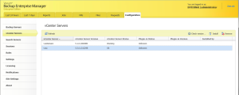
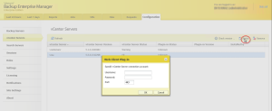
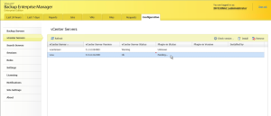
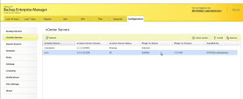
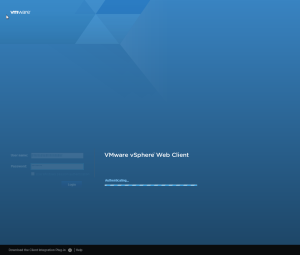
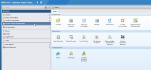
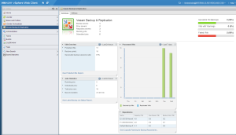
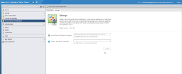

As I have been testing out vSphere 5.5 and Veeam v7 the past week or so.
I wanted to go ahead and check out the new vCenter webui plugin for
Veeam v7 so I figured I would throw this together for others in case you
are looking for this info. Overall this plugin is fairly easy to install
and use which is great.

This plugin is actually installed from Veeam Backup Enterprise Manager
so you will need to make sure that you have this installed first. The
reason for this is that the vCenter webui plugin for Veeam links and
integrates with Veeam Backup Enterprise Manager.

So launch your browser of choice and connect to
<https://{enterprisemanagerhostname/ip}:9443> and go to the configuration
tab and vCenter Servers.

Select your vCenter server that you want to install the plugin to and
click the install button and then enter your account information that
has administrative permissions in vCenter.

Now click OK and off it goes.

All done.

Now using your browser of choice and connect to your vCenter webui
<https://{vcenterhostname/ip:9443}> and login using an account that has
access to vCenter and also a member of the Administrators group on your
Veeam Enterprise Manager Server otherwise you will not be able to view
the plugin.

Once logged in you should see the Veeam Backup & Replication plugin
listed on the left.

So there you have it. The new Veeam Backup & Replication v7 plugin for
vCenter webui is now installed and usable. Unless you have Veeam One
installed as well the capacity planning link will not work for you.
However the other links for Protected VMs Report and Latest Backup Job
Status Report will work. This will link back to your Veeam Enterprise
Manager server which provides a ton of information as well as being able
to restore VMs.

Enjoy!
