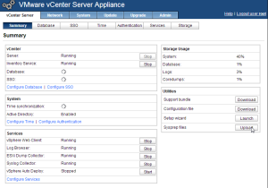
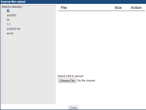
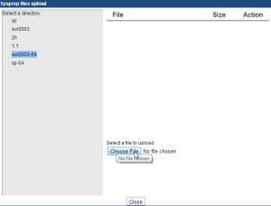
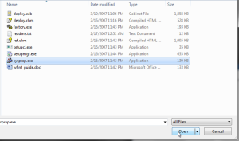
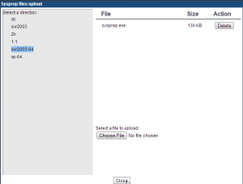

In case you are using the vCSA and need to upload sysprep files this
should get you going.

First off download the relevant sysprep files that you may need by using
the links below.

[Windows XP PRO SP2](http://www.microsoft.com/downloads/details.aspx?FamilyId=3E90DC91-AC56-4665-949B-BEDA3080E0F6)

[Windows 2003 Server SP1](http://www.microsoft.com/downloads/details.aspx?familyid=A34EDCF2-EBFD-4F99-BBC4-E93154C332D6)

[Windows 2003 Server SP2](http://www.microsoft.com/downloads/details.aspx?FamilyID=93f20bb1-97aa-4356-8b43-9584b7e72556)

[Windows 2003 Server R2](http://www.microsoft.com/downloads/details.aspx?FamilyID=93f20bb1-97aa-4356-8b43-9584b7e72556&displaylang=en)

[Windows 2003 Server x64](http://www.microsoft.com/downloads/details.aspx?familyid=C2684C95-6864-4091-BC9A-52AEC5491AF7&displaylang=en)

Extract the files using the command below for Windows 2003 x64. This is
what I am using in this example.

```powershell
WindowsServer2003.WindowsXP-KB926028-v3-x64-ENU.exe /x
```

[Windows XP x64](http://www.microsoft.com/downloads/details.aspx?familyid=C2684C95-6864-4091-BC9A-52AEC5491AF7&displaylang=en)

[Windows XP Pro SP3](http://www.microsoft.com/downloads/details.aspx?familyid=673a1019-8e3e-4be0-ac31-70dd21b5afa7&displaylang=en)

Now connect to your vCSA using your browser of choice.
<https://{vcsahostname/ip}:5480>

Once logged in on the main page you will see under utilities a button to
upload Sysprep files. Click upload.



Now select the Windows sysprep version you would like to upload.



Select choose file.



Now browse to the location of the sysprep.exe file that you extracted
from the downloaded file from above.



Click close.



All done. As you can see it is pretty easy. Easier than using a Windows
vCenter Server IMHO. But YMMV. :)

Enjoy!
