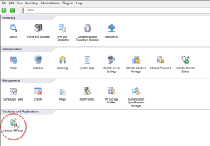
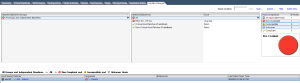
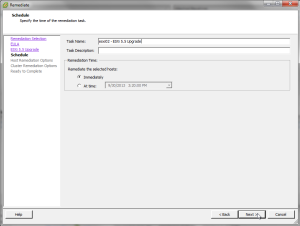

I am currently going through and upgrading all of my lab environment
components to vSphere 5.5 so I figured I would capture a few things as I
have been going through this. I installed the vCSA (vCenter Server
Appliance) 5.5 a few days ago and finally got around to migrating my
hosts over from the Windows vCenter Server 5.1 to the vCSA 5.5 (read
[here](http://everythingshouldbevirtual.com/vsphere-5-5-using-vcenter-server-appliance "http\://everythingshouldbevirtual.com/vsphere-5-5-using-vcenter-server-appliance")).
So now the next step was getting my hosts upgraded from 5.1 to 5.5 and I
wanted to use the vSphere Update Manager (VUM) for this. This is a great
way to upgrade your vSphere hosts if you have never used it before by
the way. Now seeing as I went with the vCSA (vCenter Server Appliance) I
had to deploy the VUM bits onto a Windows server as there is not a VUM
solution for Linux and not able to be installed onto the vCSA. So once I
had installed VUM on an existing Windows server and integrated the VUM
plugin into my vCSA I was ready to proceed.

I will be using the viClient for this but in vSphere 5.5 VUM also
integrates into the vCenter webUI.

After enabling the VUM plugin I now have the icon visible in my home
screen. Start by selecting the Update Manager icon.

In order to add an ISO image you must right click in this view and
select Import ESXi Image.

Now browse to the location that you saved your ESXi 5.5 ISO image and
select it. In my case I am using an HP specific ESXi 5.5 ISO.

Now click Next...

You will now see a progress bar of the ISO being uploaded. Now wait for
this to complete.

Once the ISO upload completes select Next..

Now give this image a name that is descriptive enough so you know which
image this is for.

You will now see your new ISO image in the inventory screen.

Now switch over to Update Manager view for a Datacenter/Cluster/Host or
whichever you choose and scan for updates.

Now right click one of your hosts and remediate and then select
UpgradeBaselines and select your ISO image that you just uploaded.

Follow through the next few screens and select the options appropriate
for your environment.

Depending on your cluster capacity you may want to disable High
Availability Admission Control.

Now click finish and sit back and wait for the upgrade to automatically
run and complete.

All done. As you can see ESXi 5.5.0 is now running on the host that was
just upgraded.

Now you can proceed on to your other hosts that you want to upgrade
using this same process. As you can see this is a very easy automated
way of upgrading your hosts to the latest version of ESXi.

Enjoy!
