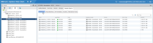
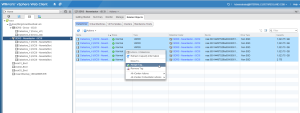
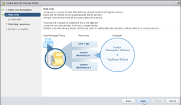
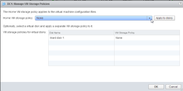

I had previously used storage profiles in previous versions of vSphere
and went digging for them again after getting my new vSphere 5.5
environment running and could not locate them. Well that is because they
have been renamed to VM Storage Policies in vSphere 5.5. So I wanted to
go through what and how these are configured and I figured that I would
share it with everyone else too in case you find yourself looking for
storage profiles as well.

So how do you go about setting up the new storage polices in vSphere
5.5? First thing you must do is open up your favorite web browser and
head over to the vCenter web ui. Once you are logged in and on the home
page you will see a new icon called VM Storage Policies.

Now that you found that go ahead and click on the icon and it will take
you to the next screen. You will then click on the icon which enables
storage policies per compute resource.

After clicking on enable storage policies you will see the next screen.
Within this screen you will click Enable.

Storage policies have now been enabled for the cluster.

One thing to note is that storage policies work from tags that you have
created or that you will create. These tags are what associate
datastores to storage policies.

Now head over to your storage view and find your datastore(s) that you
would like to attach a storage policy to. In the following screenshot I
created the tag from an SDRS cluster but later disabled it from here and
attached the policy to the actual datastores which made up this SDRS
cluster. But this will still represent how you would create a new tag
for storage. So click the icon to add a new tag.

Now fill in all of the details for which you would like to describe your
tag and make sure to select datastore if you did like me and selected to
create the tag from the datastore cluster. And then select category,
select new category and then fill in the remaining details. I spelled
mine in out the name fields so that I would know which was a tag and
which was a category.

Now click OK. You will now see your newly created tag that you created
for storage.

Now you will need to associate this newly created tag to the
datastore(s) that you want to include in your new storage policy.

In my case I am selecting all six datastores within my datastore
cluster. Now you must right click on the datastore(s) and select assign
tag.

Now go ahead and assign the tag that you just created.

Now that you have the tag assigned to your datastore(s) head back to the
home view and click on the VM Storage Policies icon.

You will now see this screen. And now we will create a new VM Storage
Policy.

Now that you clicked add you will presented with the following screen.
And again fill in the details that make sense for your implementation.
In my case I am again spelling out in the name what this is for.

Click Next.

Now you will see some information explaining what we are actually doing.

Click next.

Now on the next screen we are going to select add tag-based rule...

Now select the dropdown under categories and select the storage category
that we created earlier.

Now click next on the next screen after you verify that everything looks
correct. You could also assign additional tag-based rules for this
policy if you wanted to but for now we are just creating the one.

On the next screen you will be presented with resources that match the
tag that we just associated with this policy. In our case it will be the
datastore(s) that we attached the tag to previously. So if everything
looks correct select next.

Now we are on the summary screen which should be good to go so go ahead
and click finish.

We have just now completed the steps on creating the tag for our
datastore(s) and then used that same tag to create a our new VM Storage
Policy.

So now let's put this policy to use and assign it to an actual VM. So
browse to one of your VMs that want to associate this policy with and
select the VM.

Now right click on the VM, All vCenter Actions, VM Storage Policies and
select Manage VM Storage Policies..

Click the dropdown for Home VM Storage Policy, select the policy that we
just created and then click apply to disks. (The Home VM Storage Policy
is where the configuration files are located for the actual VM).

Click OK.

Now to verify that the policy has been applied and also check the
compliancy click on VM Storage Policies.

You have now just successfully created a new tag for a datastore(s),
created a new VM Storage Policy using this tag and then associated a VM
with this new storage policy. Now you can assign this storage policy to
other VMs if you want to as well.

Now that the policy has been created, it is ready for use the next time
you create a new VM as well. The following screens will show this.

Here is our new storage policy.

Here are our compatible datastore(s) associated with the policy.

So there you have it. The new VM Storage Policies in vSphere 5.5 that
were previously called Storage Profiles.

Enjoy!
