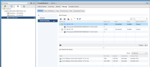

As you may or may not know VMware announced the new vSAN with vSphere
5.5. vSAN is currently in public beta but it is very easy to get started
testing it out in your new vSphere 5.5 environment. First thing you
should do is head over
[here](http://www.vmware.com/vsan-beta-register.html "http\://www.vmware.com/vsan-beta-register.html")
and get signed up to get your license key which is required to use vSAN.
All functionality is already built into vSphere 5.5 but you will need to
enter a license key.

So to get you started I wanted to throw this post together so you can
start testing vSAN out. There are a few things you must do in order to
get vSAN running properly which I will go over in this post. Just an
FYI, all vSAN options and functionality are only visible in the web ui
so the traditional C# viclient will not work.

Now head over to your vCenter web ui using your browser of choice and
let's get started.

First thing you must do is head over to your HA settings for your
cluster and disable HA. You will not be able to enable vSAN when HA is
enabled and will get an error stating so.

Next you will need to create a new VMKernel port for vSAN
communications. After creating this port all HA communications within
your cluster will function over this same VMKernel port once HA is
enabled again.

I am using VDS (vSphere Distributed Switch) in my setup so these are
what screenshots will represent this setup.

Create a new VDS Portgroup in my case it will be called vSAN Network.

Now create new VMKernel ports for each of your hosts in your cluster
using this new Portgroup.

Select an existing distributed port group and choose the vSAN Network.

Make sure to select Virtual SAN Traffic.

You will now see your new VMKernel port which is VMK4 in my case.

Now after doing this for each of your hosts in your cluster we will now
enable vSAN. Make sure you have your license key handy as well for the
next step.

Browse to your cluster settings and add your license key for vSAN under
Virtual SAN Licensing.

Now let's enable vSAN.

Select Auto or Manual for adding disks per host. I selected Automatic
but went ahead and manually assigned at the end of this so you can see
that as well.

vSAN is now enabled for your cluster.

Now go to Disk Management and we will now claim the disks to be used in
our vSAN setup.

Now if you browse to your Datastores view you will now see a new
Datastore called vsanDatastore.

So now the last thing to do before using your new vSAN setup is to
enable HA for your cluster seeing as we disabled it at the very
beginning.

And there you have it. vSAN is up and running and has presented us with
a new Datastore that you can start using just as any other Datastore.
You can call also get into different VM Storage Policies as well once
you start getting familiar with vSAN in order to set different policies
for each scenario. If you need info on the new VM Storage Policies in
vSphere 5.5 head over [here](https://everythingshouldbevirtual.com/vsphere-5-5-storage-profiles-now-storage-policies "http\://everythingshouldbevirtual.com/vsphere-5-5-storage-profiles-now-storage-policies").

Enjoy!
