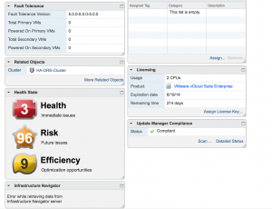
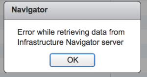
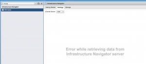

I was just poking around in my vCenter WebUI and happened to run into
something wrong with vCenter Infrastructure Navigator. I was getting an
error stating the following "Error while retrieving data from
Infrastructure Navigator server."

So I figured I could just reboot the VIN server and all would be good
again. Well not quite, as that did not work as I had thought. So off to
Google I went and sure enough came across
[this](http://kb.vmware.com/selfservice/microsites/search.do?language=en_US&cmd=displayKC&externalId=2044117 "http\://kb.vmware.com/selfservice/microsites/search.do?language=en_US&cmd=displayKC&externalId=2044117")
VMware KB article. So I followed everything that it mentioned and sure
enough everything came back as it should. So at least that was a fairly
easy fix.

Enjoy!
