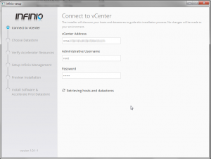

Recently I had the opportunity to speak with [Infinio](http://www.infinio.com/ "http\://www.infinio.com/") at VMWorld and then again at the Atlanta VMUG about
their new product which at the time was Pre-GA but it was a very interesting
concept from what I understood. So we discussed going into more depth on their
product at some point but I had been extremely busy and did not get any free time
until this week to explore their product. Just from the initial demo
that I was able to squeeze in I could definitely see the potential of
this product and was eager to dig in further. Infinio also went GA this
past week as well with v1.0.

Infinio is a server side read cache accelerator which utilizes 8GB of
memory from each vSphere host that you want to accelerate I/O to your
backend NAS. Infinio only accelerates NFS backed datastores so it will
not work on any block level backed datastores at this time. Read more
about what Infinio is about [here](http://www.infinio.com/about-our-product/what-is-it "http\://www.infinio.com/about-our-product/what-is-it").

So now that I have been able to get my hands on a copy of Infinio I
wanted to dig in and do some testing to get an idea of what it can
really do. I figured I would go ahead and configure an NFS datastore
from my Nexentastor NAS. Now this should make for some interesting
testing I thought. I currently have 12TB (Raid-1) usable storage which
also has SSD for ZIL (Write Cache)/L2ARC (Read Cache). So I thought what
would this testing scenario look like if I ran some VMware IO Analyzer
tests without SSD, with SSD, with Infinio without SSD and then finally
Infinio with SSD. I felt this would be a good test because ZFS
filesystem really utilizes SSD for ZIL when using NFS vs. iSCSI.

**Testing setup**

-   (3) HP DL360 G5 - (2) Quad-Core - 32GB Ram - (6) 1GBE NICS
-   24TB (12TB Usable - Raid-1) Nexentastor NAS (iSCSI/NFS) - Intel Core
    i5 - 32GB Ram - (3) Supermicro SAS Controllers - (2) Intel 520 SSD
-   vSphere 5.5 (Not officially supported at the time of writing this)
-   VMware IO Analyzer (IOMeter) configured with a 100GB vmdk for
    testing to make sure that all IO was from disk and not from cache
    only. Also making sure to only put the 100GB vmdk on the NFS
    datastore that I was going to test and keeping the IO Analyzer OS
    vmdk on another datastore.

I will also be going over all of the little gotchas that I ran into
during setup and testing. These will not likely pertain to your setup
therefore you may not run into any of these but I figured that I would
share my experience with others in case you do. I would also like to add
that Infinio support is top notch as they were a great deal of help
during my testing deployment. Also note that at the time of writing this
vSphere 5.5 is not officially supported so these results may not truly
represent what may be seen when it is. I should also note that there was
a lot of other activity going on with my Nexenta array during these
tests but I figure real world would be represented, at least in my lab.
There were numerous Veeam backup jobs running during this time as well
so even though some of my results may not be great you can still see
where the differences were. I also started out testing each scenario
separately but that was not working out so well. So I ended up starting
a test and ran it for 4 hours starting with Nexenta/SSD/Infinio,
Nexenta/Infinio, Nexenta/SSD and then finally just Nexenta alone. I
injected each change every hour which is clear in the charts. Also
seeing as Infinio is a read cache accelerator I used a IO load that was
100% Read and 100% Random to get an idea of what it could do.

So let's get started.

**Installing Infinio**

Overall the installation is very simple and straight forward which is
great. However I ran into some snags up front in regards to my current
configuration of my vSphere design. I will go into this as well in case
you have a similar design. Before starting have a look at the
requirements statement provided by Infinio and make sure that you are in
scope with it. The below is copied directly from Infinio.

**_Resource Requirements_**

**_When opting to accelerate a datastore, each host connected to that
datastore will receive an "accelerator VM". Additionally, a single
management VM will be installed any desired host._**

-   **_Each accelerator VM requires 12 GB of local storage, 2 vCPUs,
    and at least 6 GB of available memory (4 GB for the VM plus a 2 GB
    buffer to prevent extreme memory contention)._**
-   **_The management VM requires 30 GB of storage on any datastore, 2
    vCPUs, and 4 GB of memory._**

**_Networking Requirements_**

-   **_Distributed vSwitches - are not fully supported at the moment. It
    is okay to use dvSwitches for VM traffic; however, the software
    requires that all other traffic (VMKernel ports for vMotion, storage
    traffic, and management) goes through standard vSwitches._**
-   **_VMkernel Port for NFS Traffic - should be separate from the
    VMkernel port used for management traffic. Additionally, it should
    be on a separate subnet and/or VLAN from other VMkernel ports,
    ensuring there's only one path for NFS traffic to travel. Lastly,
    the IP address for this port should be static._**
-   **_Virtualized vCenter - if vCenter is run as a VM and
    vSphere 4.1 is being used, the datastore vCenter resides upon cannot
    be accelerated. Additionally, any other datastore that uses the same
    VMkernel port as the vCenter datastore cannot be accelerated either.
    This limitation will be removed before the GA release. vSphere 5.x
    is not affected by this limitation._**

Now after you have read the above I would like to point out a few key
areas which will save you some time. Make sure that all of your
networking components are configured correctly in regards to the above
requirements. My lab was setup in a pure
[VDS](http://www.vmware.com/products/vsphere/features/distributed-switch.html "http\://www.vmware.com/products/vsphere/features/distributed-switch.html")
(vSphere Distributed Switch) implementation which meant I had to make
some changes before proceeding. The first thing I had to do was move my
Management, vMotion and NFS VMKernel Ports over to a VSS (vSphere
Standard Switch). You will also need to create a portgroup on your VSS
for the management connection of the Infinio console vm. It will not
work on a VDS porgroup. Another thing to point out is that you should
only have one VMKernel port for your NFS traffic. I had two configured
for multipathing (RR DNS :) ). What happens is that if you have two
VMKernel ports, Infinio will only attach itself to one of those
therefore if one of your hosts connects to your NFS datastore using the
other VMKernel port you will not see any activity within your Infinio
dashboard as well as not be accelerating anything. One last thing is
that if you have more than one vMotion VMKernel ports then they both
must reside on a VSS. I initially only moved one of mine over and during
the install it would fail because they were both not in the VSS.

So now that all of that is out of the way let's actually install
Infinio. First you will need to download it which you can get from
[here](http://stats.buysellads.com/click.go?z=1284264&b=4075249&g=&s=&sw=1440&sh=900&br=firefox,25,mac&r=0.9886611132230337&link=http://www.infinio.com/?utm_campaign=GA+Release&utm_medium=Everything+Should+Be+Virtual+Blog&utm_source=Referral)
and then extract it.

Now launch infinio-setup.exe agree to the terms and click Begin.

Fill in all info for the vCenter that you want to connect to and then
click Connect. (Make sure to enter IP or FQDN for vCenter Address or you
will get an error)

Now select the NFS Datastore that you want to accelerate and click Next.

Now click on Validate Hosts (This will discover each host that is
connected to the NFS Datastore to accelerate in the cluster)

If you happen to see the error below verify that you have your vMotion
VMKernel ports configured correctly in a VSS. (I hit this error because
I had one vMotion VMKernel Port in a VSS and another one in a VDS.)

So if you do see this error you should fix the issue and then click
Retry Validation.

Now select a Host to deploy the Management VM to.

Select the Datastore to deploy the Management VM to.

Now select the network to connect the Management VM to. (You will have
to select a VSS Portgroup as all VDS Portgroups are unselectable.)

Confirm all looks correct and click Next.

Now enter a hostname and select DHCP or Static for IP assignment for the
Management VM.

Enter a username and password for a web login into the Management VM.

Now finally confirm everything looks good and then click Install Infinio
Accelerator.

A little peek at what was going on in the background if you were to look
at vCenter while everything is being deployed.

Now after a successful deployment open your web browser of choice and
head over to the address or FQDN of the Management VM and login using
the username/password that you entered during the install.

And if you ever run into an issue you may see the following screen which
I thought was pretty funny.

**Testing Infinio with Nexenta NFS Datastore**

So now for the testing. I want to set the stage here as I had a lot of
other things going on in my environment and also ran different scenarios
of testing which lead me to these testing results. Being that Infinio is
a read cache accelerator I ended up running a 4 hour test using VMware
IO Analyzer using two instances on two different hosts and the tests
were setup as 100% read and 100% random. My results showed significant
high write latency which was unusual being that on a normal load it is
well below 20ms with NFS with and average of 5-7ms. The graphs below do
not represent too well if you ask me being that the overall results
showed peaking around 100ms. The read latency across all tests stayed
extremely low under 10ms. The result that did stand out was the actual
number of IOPS generated and throughput. The other thing to note was
that for some reason one host generated about 3x the amount of IOPS so
my guess is that the slower host was much busier. However this could
represent what I may see in real world workloads based on many factors.
Overall I feel that Infinio will definitely benefit your environment
especially over time. I will obviously be conducting many more tests as
time goes on to get a better sense of how Infinio can benefit. I should
also note that I was informed that there was an issue with Nexenta NFS
that was fixed in the latest code level that I used for this test so
YMMV.

I tried to break out the graph in the 1 hour increments which show where
change was made during the test. Those increments go as follows.

-   Hour 1 - Nexenta with SSD for ZIL/L2ARC and Infinio acceleration
-   Hour 2 - Nexenta with Infinio acceleration (SSD for ZIL/L2ARC removed)
-   Hour 3 - Nexenta with SSD for ZIL/L2ARC (Infinio acceleration disabled)
-   Hour 4 - Nexenta only (SSD for ZIL/L2ARC Removed and Infinio
    acceleration disabled

So as you can see my write latency was through the roof. But it is easy
to see where change occurred as expected.

So that is it for now. Please feel free to provide feedback.

Enjoy!
