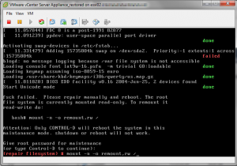
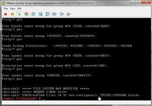

So I woke up to all sorts of fun today. Several VMs were reporting to be
down in my lab so when trying to connect to vCenter I was getting an
error which lead me to looking at the vcsa management to make sure
vCenter was running and here is what I found.

Well that is a new one for me. So I connected to my hosts using the
viClient until I found my vcsa and rebooted it. I then opened up a
console window. Here is what I was presented with next.

Oh this is going to be a fun morning I thought. So I proceeded to repair
the file system and reboot.

After rebooting all was good with the vcsa. Now to figure out what
exactly happened. So after digging for a few minutes I figured out that
my Nexenta SAN/NAS decided to crash earlier in the morning which ended
up corrupting several VMs which had to be repaired. After an hour or so
all is back to normal.

Happy Monday to you!

Enjoy!
