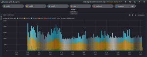

I have been using Graylog2 and VMware Log Insight for some time now and
wanted to try out Logstash finally. So the first thing that I wanted to
do was create an automated script to do most of the install and
configuration to get everything running. I figured that as I am going
through this I would share with everyone and start building on this
script more based on feedback. I created a [Graylog2](http://graylog2.org "http\://graylog2.org") script (located [here](http://everythingshouldbevirtual.com/ubuntu-12-04-graylog2-installation "http\://everythingshouldbevirtual.com/ubuntu-12-04-graylog2-installation"))
that has proven to be of great help to the community and figured I might
be able to do the same with the [Logstash](http://logstash.net "http\://logstash.net")
community, but even if it didn't I would learn a great deal about Logstash in the
meantime. There is a great community around Logstash so getting support
should be very easy. As well as, I am just starting to learn Logstash
now so this should be a lot of fun. Which also means that there will be
a good amount of change around this post.

First off I will be keeping this script updated and available on Github
located [here](https://github.com/mrlesmithjr/Logstash_Kibana3 "https\://github.com/mrlesmithjr/Logstash_Kibana3").
This will be the only location that I will be keeping up with it.

I would recommend using a clean install of Ubuntu 12.04 or 14.04 to
install onto. However; if you decide to install on an existing server I
am not responsible for anything that may get broken. :)

So here is how we get started and get everything up and running. Open up
a terminal session on your server that you will be installing to and run
the following commands.

For Logstash 1.3.x version: **(OUTDATED!!)**

```bash
sudo apt-get update
sudo apt-get -y install git
cd ~
git clone https://github.com/mrlesmithjr/Logstash_Kibana3
chmod +x ./Logstash_Kibana3/install_logstash_kibana_ubuntu.sh
sudo ./Logstash_Kibana3/install_logstash_kibana_ubuntu.sh
```

For Logstash 1.4.x version: **(CURRENT)**

```bash
sudo apt-get update
sudo apt-get -y install git
cd ~
git clone https://github.com/mrlesmithjr/Logstash_Kibana3
chmod +x ./Logstash_Kibana3/install_logstash_1.4_kibana_ubuntu.sh
sudo ./Logstash_Kibana3/install_logstash_1.4_kibana_ubuntu.sh
```

You will be prompted during the script to enter your domain name,
~~vSphere naming convention~~ and
[PFSense](https://www.pfsense.org/ "https\://www.pfsense.org/")Firewall
hostname. These will be used to configure logstash filtering for your
~~ESXi hosts~~ and PFSense Firewall. If you do not monitor any ~~vSphere
hosts~~ or use PFSense just enter some random info into these. These are
purely just collecting info to pass into a filtering rule for Logstash.

Once complete open your browser of choice and connect to
<http://logstashservername/kibana> or <http://ipaddress/kibana>.

You will see the following screen once connected. Seeing as we are
setting up Logstash with Kibana go ahead and select the link on the
left.


Now here is a screenshot of some actual ESXi logging. Notice the tag
called VMware, that is created by the filtering rule that we created
with the installer which, is based off of the naming convention we
passed to the installer.


You can grab my VMware dashboard from [here](https://gist.github.com/mrlesmithjr/8f8ff8e2e8e6f43cb701 "https\://gist.github.com/mrlesmithjr/8f8ff8e2e8e6f43cb701").

Here is another screenshot of logging graphs by adding different search
criteria items.



So what we have done with this script is installed ~~Apache2~~, Nginx,
Elasticsearch, Logstash and Kibana3. ~~Logstash has been configured to
listen on UDP/514 (PFsense, SYSLOG and VMware), TCP/514 (recommended),
UDP/514 (syslog devices that cannot be sent to TCP/514) TCP/3515
(Windows Event Logs) and TCP/3525 (Windows IIS Logging).~~

Now setup your network devices to start sending their syslogs to the
HAProxy VIP and if your device supports sending via TCP, use it.
Reference the port list below on setting up some of the devices that are
pre-configured during the setup.

**Port List**

-   TCP/514 Syslog (Devices supporting TCP)
-   UDP/514 Syslog (Devices that do not support TCP)
-   TCP/1514 VMware ESXi
-   TCP/1515 VMware vCenter (Windows install or appliance) (For Windows
    install use NXLog from below in device setup) (For appliance reference
    device setup below)
-   TCP/3515 Windows Eventlog (Use NXLog from below in device setup)
-   TCP/3525 Windows IIS Logs (Use NXLog from below in device setup)

Below is a decent /etc/logstash/logstash.conf file that I am using and
will be updating periodically. Some of these settings will be included
in the install script but not all of them. You will need to change the
naming for ESXi and PFSense for your environment. (Or just use the
auto-install script).

<https://gist.github.com/mrlesmithjr/43b4e97bf16a7423bbd2>

For Windows Event Log's I highly recommend using NXLog for Windows. I
am including a fuctional nxlog.conf file for you to use as well with the
above logstash.conf configuration.

<https://gist.github.com/mrlesmithjr/cf212836b9ce162373ed>

Here is a screenshot of the Windows Logging if you want use the
dashboard view for Windows from
[here](https://gist.github.com/mrlesmithjr/42db96d077f4d1035186 "https\://gist.github.com/mrlesmithjr/42db96d077f4d1035186").


** (OLD)**

~~If you want to purge and expire old logs have a look
[here](https://github.com/logstash/expire-logs "https\://github.com/logstash/expire-logs").
Jordan Sissel (creator of Logstash) has provided a python script to do
this.~~

~~Here is how you setup the script. Open a terminal on your Logstash
server and execute the following.~~

```bash
cd ~
sudo apt-get install python-pip
sudo apt-get install git
git clone https://github.com/logstash/expire-logs
cd expire-logs
sudo pip install -r requirements.txt
```

~~Now that you have this setup read the examples on the github link on
different scenarios.~~

~~After you purge your logs using the above method you will need to
restart elasticsearch.~~

```bash
sudo service elasticsearch restart
```

That should be it.

Enjoy!

All comments and feedback are very much welcomed and encouraged.

Interested in a highly available setup? Go
[here](http://everythingshouldbevirtual.com/highly-available-elk-elasticsearch-logstash-kibana-setup "Highly Available ELK (Elasticsearch, Logstash and Kibana) Setup") and
checkout the Highly Available ELK (Elasticsearch, Logstash and Kibana)
setup.
