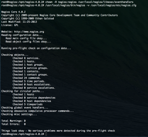
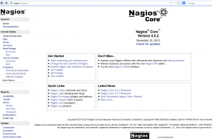

In [this](https://everythingshouldbevirtual.com/installing-nagios-on-ubuntu-12-04 "http\://everythingshouldbevirtual.com/installing-nagios-on-ubuntu-12-04")
previous post we installed Nagios 3.5.0 from source. Now that the
current version of Nagios is 4.0.2 I wanted to walk through upgrading
the previous version to the latest.

```bash
sudo bash
apt-get update && apt-get ugprade
cd /opt
wget http://prdownloads.sourceforge.net/sourceforge/nagios/nagios-4.0.2.tar.gz
wget https://www.nagios-plugins.org/download/nagios-plugins-1.5.tar.gz
tar zxvf nagios-4.0.2.tar.gz
tar zxvf nagios-plugins-1.5.tar.gz
cd nagios-4.0.2
./configure --with-nagios-group=nagios --with-command-group=nagcmd --with-mail=/usr/bin/sendmail
make all
make install
make install-init
make install-config
make install-commandmode
make install-webconf
cp -R contrib/eventhandlers/ /usr/local/nagios/libexec/
chown -R nagios:nagios /usr/local/nagios/libexec/eventhandlers
/usr/local/nagios/bin/nagios -v /usr/local/nagios/etc/nagios.cfg
```

If all ran successfully you should see the following.



Now let's setup the new Nagios plugins.

```bash
sudo bash
apt-get install daemon
cd /opt/nagios-plugins-1.5
./configure --with-nagios-user=nagios --with-nagios-group=nagios
make
make install
```

The new init script installed does not work on Ubuntu so we will remove
it and create a new one to run under /etc/init

```bash
rm /etc/init.d/nagios
rm /etc/rcS.d/S99nagios
```

Create /etc/init/nagios.conf \*\*Thanks to [raymii.org](http://raymii.org "http\://raymii.org")

```bash
# nagios - monitoriong system
# by https://raymii.org

description     "nagios monitoring system"

start on virtual-filesystems
stop on runlevel [06]

respawn
respawn limit 5 30
limit nofile 65550 65550

chdir /usr/local/nagios/
setuid nagios
setgid nagios
console log

script
        exec bin/nagios etc/nagios.cfg
end script
```

Now you will need to reload the init config to enable nagios

```bash
sudo initctl reload-configuration
sudo start nagios
```

So now if all went well and you connect to <http://IP|FQDN/nagios> and
login you should be presented with the following page.



So there you have it. A few snags in the process but it works.

Enjoy!
