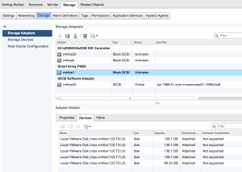
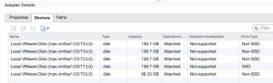

So I was sitting around over the weekend and decided I wanted to mess
around with vSAN in a non nested environment for a bit and started going
over some options I had without a big expense for now and this is what I
came up with. Now I am using some HP DL360 G5 vSphere 5.5 hosts and had
a handful of 146GB SAS drives laying around so I figured why not give
this a shot. Overall it worked just fine for theory testing but not for
any real IO performance by any means.

Launch the HP Smart Storage Administrator CLI

```bash
./opt/hp/hpssacli/bin/hpssacli
```

List all controllers and disks configurations

```raw
=> ctrl all show config

Smart Array P400i in Slot 0 (Embedded)    (sn: PH8AMQ2553     )

   array A (SAS, Unused Space: 0  MB)

      logicaldrive 1 (68.3 GB, RAID 1, OK)

      physicaldrive 1I:1:1 (port 1I:box 1:bay 1, SAS, 72 GB, OK)
      physicaldrive 1I:1:2 (port 1I:box 1:bay 2, SAS, 72 GB, OK)

   unassigned

      physicaldrive 1I:1:3 (port 1I:box 1:bay 3, SAS, 146 GB, OK)
      physicaldrive 1I:1:4 (port 1I:box 1:bay 4, SAS, 146 GB, OK)
      physicaldrive 2I:1:5 (port 2I:box 1:bay 5, SAS, 146 GB, OK)
      physicaldrive 2I:1:6 (port 2I:box 1:bay 6, SAS, 146 GB, OK)

Create individual Raid-0 disks using the unassigned drives.

=> ctrl slot=0 create type=ld drives=1I:1:3 raid=0 ss=64 size=max aa=disable"
```

List all controllers and disks once again

```raw
=> ctrl all show config

Smart Array P400i in Slot 0 (Embedded)    (sn: PH8AMQ2553     )

   array A (SAS, Unused Space: 0  MB)

      logicaldrive 1 (68.3 GB, RAID 1, OK)

      physicaldrive 1I:1:1 (port 1I:box 1:bay 1, SAS, 72 GB, OK)
      physicaldrive 1I:1:2 (port 1I:box 1:bay 2, SAS, 72 GB, OK)

   array B (SAS, Unused Space: 0  MB)

      logicaldrive 2 (136.7 GB, RAID 0, OK)

      physicaldrive 1I:1:3 (port 1I:box 1:bay 3, SAS, 146 GB, OK)

   unassigned

      physicaldrive 1I:1:4 (port 1I:box 1:bay 4, SAS, 146 GB, OK)
      physicaldrive 2I:1:5 (port 2I:box 1:bay 5, SAS, 146 GB, OK)
      physicaldrive 2I:1:6 (port 2I:box 1:bay 6, SAS, 146 GB, OK)
```

You should now see array B which is the Raid-0 logical drive we just
created. We will now create additional Raid-0 logical drives with our remaining
phyiscal drives that are unassigned.

```raw
=> ctrl slot=0 create type=ld drives=1I:1:4 raid=0 ss=64 size=max aa=disable"
=> ctrl slot=0 create type=ld drives=2I:1:5 raid=0 ss=64 size=max aa=disable"
=> ctrl slot=0 create type=ld drives=2I:1:6 raid=0 ss=64 size=max aa=disable"
```

List all controllers and disks once again.

```raw
=> ctrl all show config

Smart Array P400i in Slot 0 (Embedded)    (sn: PH8AMQ2553     )

   array A (SAS, Unused Space: 0  MB)

      logicaldrive 1 (68.3 GB, RAID 1, OK)

      physicaldrive 1I:1:1 (port 1I:box 1:bay 1, SAS, 72 GB, OK)
      physicaldrive 1I:1:2 (port 1I:box 1:bay 2, SAS, 72 GB, OK)

   array B (SAS, Unused Space: 0  MB)

      logicaldrive 2 (136.7 GB, RAID 0, OK)

      physicaldrive 1I:1:3 (port 1I:box 1:bay 3, SAS, 146 GB, OK)

   array C (SAS, Unused Space: 0  MB)

      logicaldrive 3 (136.7 GB, RAID 0, OK)

      physicaldrive 1I:1:4 (port 1I:box 1:bay 4, SAS, 146 GB, OK)

   array D (SAS, Unused Space: 0  MB)

      logicaldrive 4 (136.7 GB, RAID 0, OK)

      physicaldrive 2I:1:5 (port 2I:box 1:bay 5, SAS, 146 GB, OK)

   array E (SAS, Unused Space: 0  MB)

      logicaldrive 5 (136.7 GB, RAID 0, OK)

      physicaldrive 2I:1:6 (port 2I:box 1:bay 6, SAS, 146 GB, OK)
```

Unfortunately I am using an HP P400i controller so a reboot is still
required. :(

Now that we have rebooted our host we are now going to emulate one of
these newly created Raid-0 logicaldrives as an SSD.

Now you will need to identify the one that you want to use for our
emulated SSD and we can do this by listing all of our local devices
using the following command. You should also verify using the webui to
make sure we identify the correct device.



```bash
    # esxcli storage core device list | grep mpx
    mpx.vmhba1:C0:T2:L0
       Display Name: Local VMware Disk (mpx.vmhba1:C0:T2:L0)
       Devfs Path: /vmfs/devices/disks/mpx.vmhba1:C0:T2:L0
    mpx.vmhba1:C0:T1:L0
       Display Name: Local VMware Disk (mpx.vmhba1:C0:T1:L0)
       Devfs Path: /vmfs/devices/disks/mpx.vmhba1:C0:T1:L0
    mpx.vmhba1:C0:T0:L0
       Display Name: Local VMware Disk (mpx.vmhba1:C0:T0:L0)
       Devfs Path: /vmfs/devices/disks/mpx.vmhba1:C0:T0:L0
    mpx.vmhba1:C0:T4:L0
       Display Name: Local VMware Disk (mpx.vmhba1:C0:T4:L0)
       Devfs Path: /vmfs/devices/disks/mpx.vmhba1:C0:T4:L0
    mpx.vmhba0:C0:T0:L0
       Display Name: Local HL-DT-ST CD-ROM (mpx.vmhba0:C0:T0:L0)
       Devfs Path: /vmfs/devices/cdrom/mpx.vmhba0:C0:T0:L0
    mpx.vmhba1:C0:T3:L0
       Display Name: Local VMware Disk (mpx.vmhba1:C0:T3:L0)
       Devfs Path: /vmfs/devices/disks/mpx.vmhba1:C0:T3:L0
```

We are going to use mpx.vmhba1:C0:T1:L0 as the logicaldrive to emulate
as an SSD. In order to emulate an SSD we need to create a SATP rule. Run
the following commands to do so.

```bash
esxcli storage nmp satp rule add --satp VMW_SATP_LOCAL --device mpx.vmhba1:C0:T1:L0 --option=enable_ssd
esxcli storage core claiming reclaim -d mpx.vmhba1:C0:T1:L0
```

Now rescan your devices on your array controller and you will see that
the device is now listed as an SSD device.



If you want to remove this SATP rule you can run the following commands
to do so.

```bash
esxcli storage nmp satp rule remove --satp VMW_SATP_LOCAL --device mpx.vmhba1:C0:T1:L0 --option=enable_ssd
esxcli storage core claiming reclaim -d mpx.vmhba1:C0:T1:L0
```

Now it will no longer show the device as SSD.

Congratulations you now have an emulated SSD drive and some additional
Raid-0 devices so you can test vSAN, vSphere Flash Read Cache,
PernixData or anything else as well. But of course do not expect great
performance from this method as this will not even compare to the
performance of a true SSD drive. However, you will be able to test some
of these products without the need of purchasing an expensive SSD drive.
And by no means is this method at all recommended for a production
environment. And my initial testing of vSAN has proven to be terrible
performance using this method. So keep that in mind!

Enjoy!
