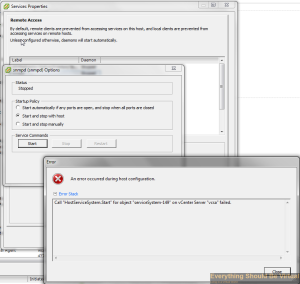

I am going through setting up Solarwinds Virtual Manager and needed to
enable SNMP on my vSphere 5.5 hosts. So the service set to automatically
start but it will not start without generating an error when attempting
to start the service as seen below.



So in case you run into the same thing it is as simple as running the
following commands on your individual hosts from a console session.
Replace YOUR_STRING with the community string that you would like to
use. The last command sets the firewall to allow all to poll SNMP.

```bash
esxcli system snmp set --communities YOUR_STRING
esxcli system snmp set --enable true
esxcli network firewall ruleset set --ruleset-id snmp --allowed-all true
esxcli network firewall ruleset set --ruleset-id snmp --enabled true
/etc/init.d/snmpd restart
```

You can change the firewall rule to only allow a specific subnet or host
if you would like to.

```bash
esxcli network firewall ruleset set --ruleset-id snmp --allowed-all false
esxcli network firewall ruleset allowedip add --ruleset-id snmp --ip-address 10.0.101.0/24
esxcli network firewall ruleset set --ruleset-id snmp --enabled true
/etc/init.d/snmpd restart
```

So you are thinking well that is great but I have more than just a few
hosts and would like to run this using PowerCLI. So here you go, a bit
of PowerCLI to set your SNMP up on each of your hosts in vCenter.

```powershell
# PowerCLI Script for adding syslogserver to hosts
# @mrlesmithjr
# EverythingShouldBeVirtual.com
# Change the following to match your environment
# vi_server is your vCenter
$vi_server = “vcenterservername”
$vcuser = "vcenterserverusername"
$vcpass = "vcenterserverpassword"
$communities = "public"
$syslocation = "Atlanta"

Connect-VIServer -Server $vi_server -User $vcuser -Password $vcpass

# Setup variable to use in script for all hosts in vCenter
$vmhosts = @(Get-VMHost)

# Configure syslog on each host in vCenter
foreach ($vmhost in $vmhosts) {
Write-Host ‘$vmhost = ‘ $vmhost
$esxcli = Get-EsxCli -VMHost $vmhost
$esxcli.system.snmp.set($null,$communities,"true",$null,$null,$null,$null,$null,$null,$null,$null,$null,$syslocation)
$esxcli.system.snmp.get()
}

Disconnect-VIServer * -Confirm:$false
```

So there you have it. You are good to go now. Have fun SNMP'ing away!

Enjoy!
