If you are interested in collecting, viewing and inspecting
[Netflow](http://en.wikipedia.org/wiki/NetFlow "http\://en.wikipedia.org/wiki/NetFlow")
data like I am, then you will be interested in this. Netflow gives you
deep level inspection into your network traffic such as source and
destination of traffic, protocols and types of service, plus much more.
Why is this valuable information? Maybe you are interested in the
different types of traffic that are floating around on your network or
possibly you are getting reports of slow network connectivity by users.
So how do we get this Netflow data? First off your network devices must
support exporting Netflow data to begin with, sort of anyways! This goes
for any network switches, firewalls and even vSphere. The second part of
gathering Netflow data is that you must have a Netflow collector
installed on your network, [NTOP](http://ntop.org "http\://ntop.org") is
a good open-source Netflow collector but it loses all of it's data when
rebooted; however, lately I have been doing some deep level testing with
several of Solarwinds products
([SAM](http://www.solarwinds.com/server-application-monitor-b.aspx "http\://www.solarwinds.com/server-application-monitor-b.aspx"),
[NPM](http://www.solarwinds.com/network-performance-monitor.aspx "http\://www.solarwinds.com/network-performance-monitor.aspx"),
[Virtualization
Manager](http://www.solarwinds.com/virtualization-manager.aspx "http\://www.solarwinds.com/virtualization-manager.aspx"),
[NTA](http://www.solarwinds.com/netflow-traffic-analyzer.aspx "http\://www.solarwinds.com/netflow-traffic-analyzer.aspx")
and [Storage Manager](http://www.solarwinds.com/storage-manager.aspx "http\://www.solarwinds.com/storage-manager.aspx"));
in particular, Solarwinds NTA (Netflow Traffic Analyzer). This product
provides an unbelievable level of detail and is visually pleasing as
well. One other thing about this product is the integration between
their other products which provides a seamless view into your
environment. Instead of jumping between different products that you may
use and not having any sense of correlation between different elements
in your environment.

So assuming that you are running a physical and virtual environment like
I am, setting all of this up can be somewhat of a challenge. In my lab I
am running a Cisco 3750G 48TS switch stack, physical PFSense firewall
and three vSphere 5.5 hosts running between 30-40 VMs at any given time.
So with my setup the first challenge is that my Cisco switches do not
support exporting Netflow, obviously your environment may be different.
So in order for me to collect netflow data from my switches you can take
a look
[here](http://everythingshouldbevirtual.com/vmware-vds-rspan-port-mirroring "http\://everythingshouldbevirtual.com/vmware-vds-rspan-port-mirroring")
on how to create a RSPAN port mirror and send that data to a vDS
(vSphere Distributed Switch) port. The difference in this article
compared to the link above will be that we will not be installing or
using NTOP but instead on our VM we will be using
[nProbe](http://www.ntop.org/products/nprobe/ "http\://www.ntop.org/products/nprobe/")
(created by the same people who create NTOP). nProbe will be acting as a
Netflow proxy in our setup for each device that we will be collecting
Netflow data from and then forwarding onto our Solarwinds NTA. nProbe is
not a free product but so far it is well worth it. There are several
linux open-source
([fprobe](http://sourceforge.net/projects/fprobe/ "http\://sourceforge.net/projects/fprobe/"),
[ipt-netflow](http://sourceforge.net/projects/ipt-netflow/ "http\://sourceforge.net/projects/ipt-netflow/")
and
[pflow](http://www.openbsd.org/cgi-bin/man.cgi?query=pflow&sektion=4&manpath=OpenBSD+Current "http\://www.openbsd.org/cgi-bin/man.cgi?query=pflow&sektion=4&manpath=OpenBSD+Current"))
Netflow forwarders but I have not had good success yet using with
Solarwinds but I will be doing some additional testing on those as well
in the near future.

Installing nProbe is fairly straight forward but configuring it is a
little bit tricky. I chose to install nbox as well to have a good web
interface to configure nProbe but you can also run it from command line
if you would like to as well. Seeing as I set mine up on Ubunutu 12.04
x64 I followed the process
[here](http://www.nmon.net/apt/ "http\://www.nmon.net/apt/") to add the
apt repository to simplify the installation. However I did not install
everything as the link above specified. Below are the commands that I
ran.

```bash
sudo bash
/bin/echo -e "deb http://www.nmon.net/apt x64/ndeb http://www.nmon.net/apt all/" > /etc/apt/sources.list.d/ntop.list
apt-get update
apt-get install pfring nbox nprobe
```

Now you should have a working web ui for nbox and you can connect by
using your browser of choice and connect to <https://ip.or.dns.name>.


Click Log In (The default username/password is nbox/nbox.)

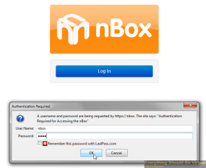

You will now be presented with the following UI.

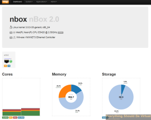

We will now enable [PF_Ring](http://www.ntop.org/products/pf_ring/ "http\://www.ntop.org/products/pf_ring/").

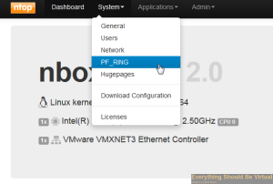

Set to enabled (We will reboot after we configure nProbe).

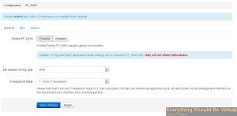

Now on to configuring nProbe.

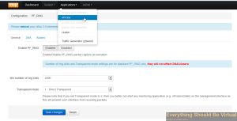

Do not turn the Proxy on at this point.

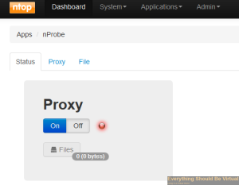

We will be configuring as a Proxy so click on Proxy.

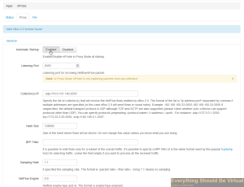

Click Enable to enable automatic startup.
Enter 2055 for the Listening Port. (This is what will be capturing from
our other devices on the network)
Enter your Solarwinds NTA address and port (default is 2055) for the
collector(s) IP: x.x.x.x:2055

Now under Flow Export Format choose v5.

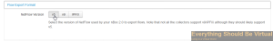

Now click on Flow Export Policy and scroll down and change the Input
SNMP Interface ID from "Auto" to "lo" and also change the Output
SNMP Interface ID from "Auto" to "eth0". (These are very important!)

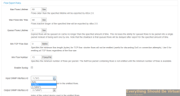

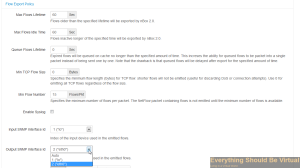

Now scroll to the bottom and click "Save Changes".

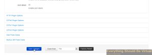

We are now done configuring nProbe and need to enable it and then
reboot. So click on Status and click "On".

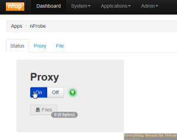

Now select the Admin dropdown and click "Reboot".

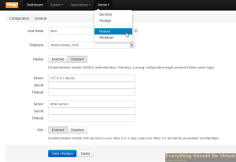

Now you can head over to your Solarwinds NTA and setup your netflow
node.

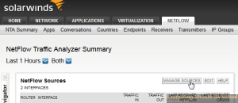

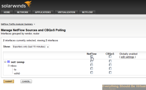

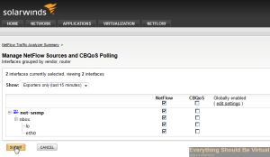

And if you followed the link above about setting up RSPAN Port Mirroring
you will likely start seeing some data flowing in.

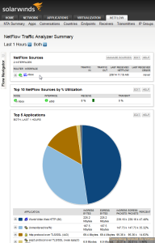

Now we will head over to our vCenter WebUI and configure netflow on our
vDS port groups.

Go to the networking view, select your vDS dvSwitch and right-click and
click Manage Distributed Port Groups..

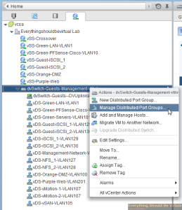

Select Monitoring and then click Next..

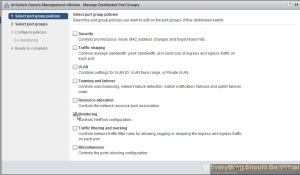

Now select the port groups that you want to collect netflow on and then
click Next..

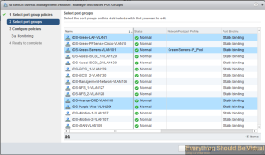

Select the drop-down and choose enabled..

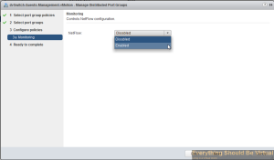

Click Next..

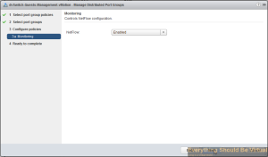

Click Finish..

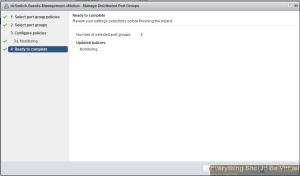

Now click on the manage tab within your vDS dvSwitch and select Netflow..

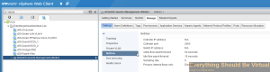

Click edit..

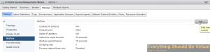

Enter the IP of your nBox server that we just setup above and leave the
default port 2055. Enter an unused IP on your network preferably on your
management subnet for the Switch IP address (This is the source your
nBox server will see).

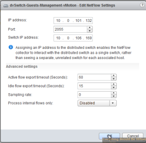

Complete..

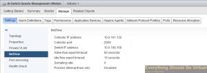

Now your configuration should be complete for gathering netflow from
your Cisco switches and your vSphere vDS setup. Now nProbe will be
forwarding all netflow data over to your Solarwinds NTA and after a bit
of time you should now start seeing some nice graphs and data of traffic
on your network.

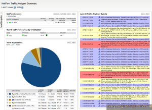

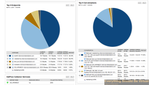

Now you can also add other devices on your network that export Netflow,
just point them to your nProbe server and let nProbe do it's job!

That's it...Happy Netflow'n...

Enjoy!
