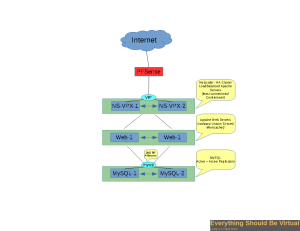
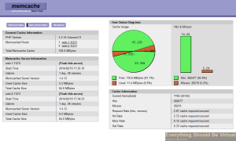

So after running this blog on a single server running within an
[ISPConfig](http://www.ispconfig.org/ "http\://www.ispconfig.org/") setup
for quite some time I have finally redesigned the back-end (it has taken
a good week getting it to where it is now). This was basically due to
the fact that I have started getting a lot more traffic and I needed the
ability to scale better. So far this new setup has proven to be very
good, even though there have been a few gotchas along the way. And there
will be many things I will still be stumbling across as I get more
traffic. I do appreciate those who have let me know when something is
not working correctly which I have corrected along the way.

-   For the edge I am still using a
    [PFSense](http://pfsense.org/ "http\://pfsense.org/") dedicated server
    as my firewall.
-   For load balancing I am using a pair of [Citrix VPX Express Netscaler's](https://www.citrix.com/downloads/netscaler-adc/virtual-appliances/netscaler-vpx-express.html "https\://www.citrix.com/downloads/netscaler-adc/virtual-appliances/netscaler-vpx-express.html")
    HA clustered. I am using LeastConnection policy and CookieInsert for
    persistence.
-   For my web server's I am using a pair of Apache Web Servers running
    on Ubuntu 12.04 x64. All /var/www content is being synced between
    them by using a
    [Unison](http://www.cis.upenn.edu/~bcpierce/unison/ "http\://www.cis.upenn.edu/~bcpierce/unison/")
    replication that runs every minute. I have also setup each server
    with a 64MB
    [Memcached](http://memcached.org/ "http\://memcached.org/") Cache
    which is shared between each server. I also installed the [PECL memcached extension](http://pecl.php.net/package/memcached "http\://pecl.php.net/package/memcached").
    For Wordpress to utilize this I used this
    [drop-in](http://svn.wp-plugins.org/memcached/trunk/ "http\://svn.wp-plugins.org/memcached/trunk/")
    and then setup
    [batcache](http://wordpress.org/plugins/batcache/installation/ "http\://wordpress.org/plugins/batcache/installation/")
    drop-in.
-   For my MySQL DB Server's I am running a pair of MySQL Server's
    running on Ubuntu 12.04 x64. These are setup in an Active/Active
    Master-Master mode. Make sure to setup the following in your my.cnf
    when doing this or you will get duplicate entries in your DB and it
    sucks.
    [Here](https://www.digitalocean.com/community/articles/how-to-set-up-mysql-master-master-replication "https\://www.digitalocean.com/community/articles/how-to-set-up-mysql-master-master-replication")
    is a great writeup on doing this.

```bash
    Node-1

        server-id      = 1
        auto-increment-offset   = 1
        auto-increment-increment    = 4

    Node-2

        server-id      = 2
        auto-increment-offset   = 2
        auto-increment-increment    = 4
```

Below is a quick drawing of what this all looks like.



And here are some memcached stats after running for a day.



Enjoy!
