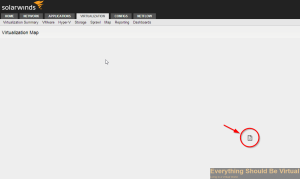
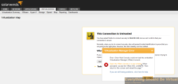
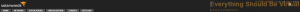
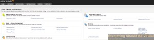
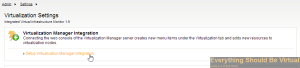
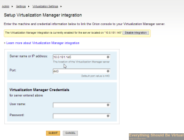
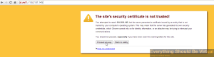
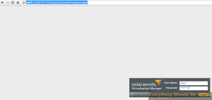
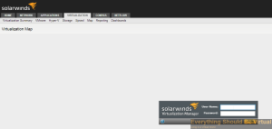

So in the past few days, I have witnessed on two different environments
when trying to connect to certain components of Solarwinds using Google
Chrome you will see the following.

Obviously this is a pain because the page will not display. So after
opening the same page using Firefox, you will see the following.

So it appears that the issue is with the SSL cert connecting back into
these components. In this case I am trying to view Virtualization
Manager maps. So in order to get around this we need to find the IP
address of the Virtualization Manager appliance so we can accept the
untrusted SSL certificate.

In order to find the Virtualization Manager IP address you can go the
_settings_ link at the top of your Solarwinds Web UI page.

Now click on _Virtualization settings_.

Now click on _setup virtualization manager integration_.

The IP address for Virtualization manager will be listed as below.

Now go to <https://virtualizationmanagerIPorFQDN> and select proceed
anyway.

You should now see the following.

Now head back to your Solarwinds Web UI and go to Virtualization maps
(this example) and you should now be presented with a login window now
instead of the very first screenshot in this post.

That's it...You should be good to go now.

Enjoy!
