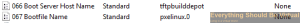

So it has been a while since I have built a TFTP server and the
opportunity came up to do this again to do some ESXi deployments. I
wanted the ability to do interactive installations as well as fully
automated by using kickstart scripts. So with this all being said here
is what I have come up with. Hopefully it will help someone out if they
need to do the same.

First of all I will be deploying the TFTP server on a Ubuntu 12.04
server and not a Windows server.

So let's get started.

Install Apache2 for serving kickstart configuration files and VIB files
out to your hosts during deployment.

```bash
sudo apt-get -y install apache2
```

Install the TFTP Server

```bash
sudo apt-get install tftpd-hpa
```

The TFTP Service should now be running and listening on UDP/69\
In order for the tftpd-hpa service to start on bootup you will need to
add the following to your _/etc/rc.local_ file.

```bash
sudo nano /etc/rc.local
```

Now past the following code at the end of rc.local before the last line
which is _exit 0_.

```bash
sleep 30
service tftpd-hpa restart
```

Install SYSLINUX (This will provide us with the bootstraps for PXE, ISO
and etc.)

```bash
sudo apt-get -y install syslinux
```

Copy the PXELINUX Bootstrap to the TFTP server root folder

```bash
sudo cp /usr/lib/syslinux/pxelinux.0 /var/lib/tftpboot
```

Create the pxelinux.cfg folder.

```bash
sudo mkdir /var/lib/tftpboot/pxelinux.cfg
```

Create default pxe configuration file.

```bash
sudo touch /var/lib/tftpboot/pxelinux.cfg/default
```

Now we need to put some information into our default pxe config file.

```bash
sudo nano /var/lib/tftpboot/pxelinux.cfg/default
```

You can copy and paste from below to get you started or create your own.

```bash
DEFAULT vesamenu.c32
TIMEOUT 600
ONTIMEOUT BootLocal
PROMPT 1
MENU INCLUDE pxelinux.cfg/pxe.conf
NOESCAPE 1

LABEL BootLocal
        localboot 0
        TEXT HELP
        Boot to local hard disk
        ENDTEXT

# Menus

#FreeDOS
LABEL FreeDOS
        MENU LABEL FreeDOS
        KERNEL memdisk bigraw
        APPEND initrd=Images/FreeDOS/fdboot.img

# ESXi
LABEL ESXi Interactive Installs
        MENU LABEL ESXi Interactive Installs
        KERNEL vesamenu.c32
        APPEND pxelinux.cfg/pxe.conf pxelinux.cfg/conf/ESXi_Interactive.menu

LABEL ESXi Scripted Installs
        MENU LABEL ESXi Scripted Installs
        KERNEL vesamenu.c32
        APPEND pxelinux.cfg/pxe.conf pxelinux.cfg/conf/ESXi_Scripted.menu

# SystemRescueCD
LABEL SRCD
        MENU LABEL SystemRescueCD
        KERNEL Images/SystemRescueCD/rescue64
        APPEND initrd=Images/SystemRescueCD/initram.igz netboot=tftp://tftpbuilddepot/Images/SystemRescueCD/sysrcd.dat
```

Now let's create our pxe.conf file which includes backgrounds and menu
box options.

```bash
sudo nano /var/lib/tftpboot/pxelinux.cfg/pxe.conf
```

Below is a sample pxe.conf file that you can use so you can just copy
and paste the following into your pxe.conf file. (Replace background.jpg
with an image of your choice)

```bash
MENU TITLE PXE Server
MENU BACKGROUND pxelinux.cfg/background.jpg
NOESCAPE 1
ALLOWOPTIONS 1
PROMPT 0
menu width 80
menu rows 14
MENU TABMSGROW 24
MENU MARGIN 10
menu color border               30;44      #ffffffff #00000000 std
```

Now let's create the kickstart configuration folder (This is where we
will be storing our various ESXi kickstart script files).

```bash
sudo mkdir /var/lib/tftpboot/KS
```

Now we need to create a symlink for apache to point to our kickstart
configuration folder (This will allow our deployments to point to
<http://tftpserver/KS>)

```bash
sudo ln -s /var/lib/tftpboot/KS/ /var/www/KS
```

Create each folder for the ESXi versions that you will be copying from
the ESXi media to serve out.

```bash
sudo mkdir /var/lib/tftpboot/Images/ESXi5.1
sudo mkdir /var/lib/tftpboot/Images/ESXi5.1U1
sudo mkdir /var/lib/tftpboot/Images/ESXi5.1U2
sudo mkdir /var/lib/tftpboot/Images/ESXi5.5
sudo mkdir /var/lib/tftpboot/Images/ESXi5.5U1
```

Mount the ESXi ISO to your TFTP server and copy the media to the
appropriate folder or create the appropriate folder if it does not
currently exist (The assumption here with these instructions is that
your TFTP server is a VM and we are copying the ESXi5.5 installer).

```bash
sudo mount /dev/cdrom /mnt
sudo cp -r /mnt/* /var/lib/tftpboot/Images/ESXi5.5
```

Now we need to modify the boot.cfg within each ESXi installer version to
remove some unnecessary context. This is required because we are not
booting from the ISO image(s).

```bash
sudo sed -e "s#/##g" -e "3s#^#prefix=/`basename $PWD`/\n#" -i.bak boot.cfg
```

Now let's create our menus for our ESXi Interactive and ESXi Scripted
installs. (These are the menus that we referenced in our default pxe
configuration file up above.)\
Let's create our Interactive (Requires user intervention) menu first.

```bash
sudo nano /var/lib/tftpboot/pxelinux.cfg/conf/ESXi_Interactive.menu
```

Now paste the following contents into this menu file. (You will need to
tailor to your specific needs in regards to the versions of ESXi to
install.)

```bash
DEFAULT vesamenu.c32
TIMEOUT 600
ONTIMEOUT BootLocal
PROMPT 0
MENU INCLUDE pxelinux.cfg/pxe.conf
NOESCAPE 1
LABEL MainMenu
        MENU LABEL ^Return to Main Menu
        KERNEL vesamenu.c32
        APPEND pxelinux.cfg/default
LABEL ESXi 5.1 Installer
        KERNEL /Images/ESXi5.1/mboot.c32
        APPEND -c /Images/ESXi5.1/boot.cfg
 MENU LABEL ESXi-5.1 Installer
        TEXT HELP
        Install ESXi5.1
        ENDTEXT
LABEL ESXi 5.1U1 Installer
        KERNEL /Images/ESXi5.1U1/mboot.c32
        APPEND -c /Images/ESXi5.1U1/boot.cfg
        MENU LABEL ESXi-5.1U1 Installer
        TEXT HELP
        Install ESXi5.1U1
        ENDTEXT
LABEL ESXi 5.1U2 Installer
        KERNEL /Images/ESXi5.1U2/mboot.c32
        APPEND -c /Images/ESXi5.1U2/boot.cfg
        MENU LABEL ESXi-5.1U2 Installer
        TEXT HELP
        Install ESXi5.1U2
        ENDTEXT
LABEL ESXi 5.5 Installer
        KERNEL /Images/ESXi5.5/mboot.c32
        APPEND -c /Images/ESXi5.5/boot.cfg
        MENU LABEL ESXi-5.5 Installer
        TEXT HELP
        Install ESXi5.5
        ENDTEXT
LABEL ESXi 5.5U1 Installer
        KERNEL /Images/ESXi5.5U1/mboot.c32
        APPEND -c /Images/ESXi5.5U1/boot.cfg
        MENU LABEL ESXi-5.5U1 Installer
        TEXT HELP
        Install ESXi5.5U1
        ENDTEXT
LABEL Dell Branded ESXi 5.5U1 Installer
        KERNEL /Images/Dell_ESXi5.5U1/mboot.c32
        APPEND -c /Images/Dell_ESXi5.5U1/boot.cfg
        MENU LABEL Dell Branded ESXi-5.5U1 Installer
        TEXT HELP
        Install ESXi5.5U1
        ENDTEXT
```

Now we are ready to create our Scripted (No user intervention required)
menu.

```bash
sudo nano /var/lib/tftpboot/pxelinux.cfg/conf/ESXi_Scripted.menu
```

Now paste the following contents into this menu file. (You will need to
tailor to your specific needs in regards to the versions of ESXi to
install.)

```bash
DEFAULT vesamenu.c32
TIMEOUT 600
ONTIMEOUT BootLocal
PROMPT 0
MENU INCLUDE pxelinux.cfg/pxe.conf
NOESCAPE 1
LABEL MainMenu
        MENU LABEL ^Return to Main Menu
        KERNEL vesamenu.c32
        APPEND pxelinux.cfg/default
LABEL ESXi 5.1 Installer
        KERNEL /Images/ESXi5.1/mboot.c32
        APPEND -c /Images/ESXi5.1/boot.cfg ks=http://tftpbuilddepot/KS/ESX_KS.CFG
        MENU LABEL ESXi-5.1 Installer
        TEXT HELP
        Install ESXi5.1
        ENDTEXT
LABEL ESXi 5.1U1 Installer
        KERNEL /Images/ESXi5.1U1/mboot.c32
        APPEND -c /Images/ESXi5.1U1/boot.cfg ks=http://tftpbuilddepot/KS/ESX_KS.CFG
        MENU LABEL ESXi-5.1U1 Installer
        TEXT HELP
        Install ESXi5.1U1
        ENDTEXT
LABEL ESXi 5.1U2 Installer
        KERNEL /Images/ESXi5.1U2/mboot.c32
        APPEND -c /Images/ESXi5.1U2/boot.cfg ks=http://tftpbuilddepot/KS/ESX_KS.CFG
        MENU LABEL ESXi-5.1U2 Installer
        TEXT HELP
        Install ESXi5.1U2
        ENDTEXT
LABEL ESXi 5.5 Installer
        KERNEL /Images/ESXi5.5/mboot.c32
        APPEND -c /Images/ESXi5.5/boot.cfg ks=http://tftpbuilddepot/KS/ESX_KS.CFG
        MENU LABEL ESXi-5.5 Installer
        TEXT HELP
        Install ESXi5.5
        ENDTEXT
LABEL ESXi 5.5U1 Installer
        KERNEL /Images/ESXi5.5U1/mboot.c32
        APPEND -c /Images/ESXi5.5U1/boot.cfg ks=http://tftpbuilddepot/KS/ESX_KS.CFG
        MENU LABEL ESXi-5.5U1 Installer
        TEXT HELP
        Install ESXi5.5U1
        ENDTEXT
LABEL Dell Branded ESXi 5.5U1 Installer
        KERNEL /Images/Dell_ESXi5.5U1/mboot.c32
        APPEND -c /Images/Dell_ESXi5.5U1/boot.cfg ks=http://tftpbuilddepot/KS/ESX_KS.CFG
        MENU LABEL Dell Branded ESXi-5.5U1 Installer
        TEXT HELP
        Install ESXi5.5U1
        ENDTEXT
```

Now the last thing to finish is our actual kickstart script
configuration file. (You will want to tailor this to your specific needs
but this should get your started.)

```bash
sudo nano /var/lib/tftpboot/KS/ESX_KS.CFG
```

Now copy and paste the following contents into your ESX_KS.CFG file.

```bash
# Sample scripted installation file
# Accept the VMware End User License Agreement
vmaccepteula
# Set the root password for the DCUI and ESXi Shell
rootpw vmware1
# Install on the first local disk available on machine
install --firstdisk --overwritevmfs
# Set the network to DHCP on the first network adapater, use the specified hostname and do not create a portgroup for the VMs
network --bootproto=dhcp --device=vmnic0 --addvmportgroup=0
# reboots the host after the scripted installation is completed
reboot

%firstboot --interpreter=busybox
# Enable SSH and the ESXi Shell
vim-cmd hostsvc/enable_ssh
vim-cmd hostsvc/start_ssh
vim-cmd hostsvc/enable_esx_shell
vim-cmd hostsvc/start_esx_shell
# Enable SNMP and configure SNMP
esxcli system snmp set --communities YOUR_STRING
esxcli system snmp set --enable true
```

Now if you want to get a bit more creative with your deployments and
install some VIBS during the automated install you can do something like
below for your ESX_KS.CFG file. This is actually installing Dell VIBS,
Pernixdata FVP VIBS and installing to an SD Card.

```bash
# Sample scripted installation file
# Accept the VMware End User License Agreement
vmaccepteula
# Set the root password for the DCUI and ESXi Shell
rootpw password1
# Install on the first local disk available on machine
install --firstdisk=usb --overwritevmfs --novmfsondisk
# Set the network to DHCP on the first network adapater, use the specified hostname and do not create a portgroup for the VMs
# network --bootproto=dhcp --device=vmnic0 --addvmportgroup=0
network --bootproto=static --device=vmnic0 --ip=10.0.106.11 --gateway=10.0.106.1 --nameserver=10.0.101.111,10.0.101.112 --netmask=255.255.255.0 --hostname=esxi01.everythingshouldbevirtual.local --addvmportgroup=0
# reboots the host after the scripted installation is completed
reboot

%firstboot --interpreter=busybox
# Enable SSH and the ESXi Shell
vim-cmd hostsvc/enable_ssh
vim-cmd hostsvc/start_ssh
vim-cmd hostsvc/enable_esx_shell
vim-cmd hostsvc/start_esx_shell
# Suppress Shell Warning in Host
esxcli system settings advanced set -o /UserVars/SuppressShellWarning -i 1
esxcli system settings advanced set -o /UserVars/ESXiShellTimeOut -i 1
# Enable SNMP and configure SNMP
esxcli system snmp set --communities COMMUNITYSTRING
esxcli system snmp set --enable true
# Enter Maintenance Mode
vim-cmd hostsvc/maintenance_mode_enter
# Install Dell OMSA and iSM Modules
esxcli software vib install -v http://tftpbuilddepot.everythingshouldbevirtual.local/ESXi_VIBS/Dell/cross_oem-dell-openmanage-esxi_7.3.0.2.ESXi550-0000.vib
esxcli software vib install -v http://tftpbuilddepot.everythingshouldbevirtual.local/ESXi_VIBS/Dell/cross_oem-dell-iSM-esxi_1.0.ESXi550-0000.vib

# Configure Firewall to allow SNMP
esxcli network firewall ruleset set --ruleset-id snmp --allowed-all false
esxcli network firewall ruleset allowedip add --ruleset-id snmp --ip-address 10.0.101.0/24
esxcli network firewall ruleset set --ruleset-id snmp --enabled true
/etc/init.d/snmpd restart
# Install PernixData FVP
esxcli software vib install -v http://tftpbuilddepot.everythingshouldbevirtual.local/ESXi_VIBS/PernixData/PernixData_bootbank_pernixcore-vSphere5.5.0_1.5.0.2-25498.vib
# Backup PernixData FVP Configuration
/sbin/auto-backup.sh
# Exit Maintenance Mode
vim-cmd hostsvc/maintenance_mode_exit
# Add vmnic3 to vSwitch0
esxcli network vswitch standard uplink add --uplink-name vmnic3 --vswitch-name vSwitch0
# Reboot host one last time
reboot
```

You will need to make sure that you have your DHCP server setup to
provide the tftp boot information. In my environment I am using a
Windows DHCP server so you will need to set the following scope options.



That's it and we are now ready to test our PXE boot installations. So
let's see it in motion!

<https://youtu.be/hfDfxHS0MCE>

So there you have it!

Enjoy!
