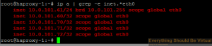
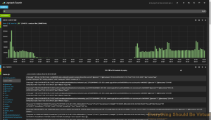
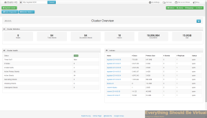
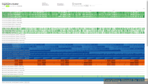
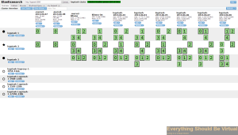
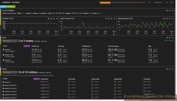
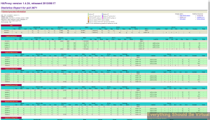
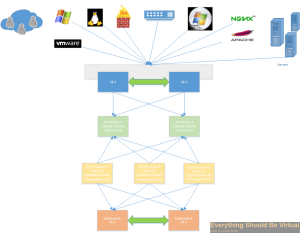

In this post I will be going over how to setup a complete ELK
(Elasticsearch, Logstash and Kibana) stack with clustered elasticsearch
and all ELK components load balanced using HAProxy. I will be setting up
a total of four six servers (2-HAProxy, 2-ELK frontends and
2-Elasticsearch master/data nodes) in this setup however you can scale
the ELK stack by adding additional nodes identical to
logstash-1/logstash-2 for logstash processing and Kibana web interfaces
and adding the additional node info to the HAProxy configuration files
to load balance. You can also scale the Elasticsearch Master/Data nodes
by building out addtional nodes and they will join the cluster.

**Acronyms throughout article**
ELK - Elasticsearch Logstash Kibana
ES - Elasticsearch

**Requirements:**
In order for all logstash-elasticsearch clustering to work correctly all
HAProxy nodes and ELK nodes should be on the same subnet (If not you
will need to configure unicast mode for Elasticsearch as multicast is
enabled using these scripts).
Two Ubuntu (12.04LTS/14.04LTS) HAProxy nodes with two NICS each.
_(1vCPU and 512MB memory will work)_
Two or more Ubuntu (12.04LTS/14.04LTS) nodes to install the ELK stack
frontends. _(2vCPU and 2GB memory will work)_
Two or more Ubuntu (12.04LTS/14.04LTS) nodes to install the ES
Master/Data nodes. _(2vCPU and 4GB of memory will work)_

IP Addresses required to set all of this up. (Change to fit your
environment.)
DNS A Record: **_logstash_ **(with the LB VIP address) (If you use
something other than this name update in each location that logstash is
configured for. I will be providing a script to do this in the near
future.)

-   LB VIP 10.0.101.60
-   haproxy-1 10.0.101.61
-   haproxy-2 10.0.101.62
-   logstash-1 10.0.101.185
-   logstash-1 172.16.0.1 (Cluster Heartbeat)
-   logstash-2 10.0.101.180
-   logstash-2 172.16.0.2 (Cluster Heartbeat)
-   es-1 10.0.101.131
-   es-2 10.0.101.179

If you decide to use different node names than the above list then you
will need to make sure to make changes to the configurations to reflect
these changes.

**HAProxy Nodes (haproxy-1, haproxy-2):**
Setup both HAProxy nodes identical all the way down to the ELK stack
setup section. The below instructions which have been crossed out are no
longer valid but will remain in the off chance that you would like to
use heartbeat instead of keepalived for your cluster setup.

First thing we need to do is install all of the packages needed.

```bash
sudo apt-get install haproxy heartbeat watchdog
```

Now we will need to configure networking on each nodes as follows.
(Again modify to fit your environment.)

```bash
sudo apt-get install haproxy keepalived
```

**HAProxy-1 (Primary)**

```bash
sudo nano /etc/network/interfaces
```

Overwrite the contents with the code from below.
<https://gist.github.com/mrlesmithjr/1a52e824f22ced8e6758>

**HAProxy-2 (Failover)**

```bash
sudo nano /etc/network/interfaces
```

Overwrite the contents with the code from below.
<https://gist.github.com/mrlesmithjr/c8d756fb927af7f0927d>

We need to allow an interface to be brought online that is not part of
the _/etc/network/interfaces_ configuration so we need to run the
following. This will allow all of our VIP's to come up.

```bash
echo "net.ipv4.ip_nonlocal_bind=1" >> /etc/sysctl.conf
```

Verify that the above setting has been set by running the following on
each node. You should get back the
following `net.ipv4.ip_nonlocal_bind = 1`

```bash
sysctl -p
```

Now you will need to restart networking on each node or reboot for the
IP settings from above to be set.
sudo service networking restart
Now we are ready to configure our heartbeat service on each node. We
will do that by setting up the following configuration files on each
node.

```bash
sudo nano /etc/ha.d/ha.cf
```

Copy the following into ha.cf file.

<https://gist.github.com/mrlesmithjr/1e9a5072b668fb5ea839>

```bash
sudo nano /etc/ha.d/authkeys
```

Copy the following into authkeys (change password to something else).

```bash
auth 3
1 crc
2 sha1 password
3 md5 password
```

Now change the permissions of the authkeys as follows.

```bash
sudo chmod 600 /etc/ha.d/authkeys
```

Now we will create the haresources file to complete the heartbeat
service setup.

```bash
sudo nano /etc/ha.d/haresources
```

Copy the following into haresources.

```bash
haproxy-1 IPaddr::10.0.101.60/24/eth0 logstash
```

Now we need to configure the keepalived cluster service. All that we
need to do is create _/etc/keepalived/keepalived.conf_

```bash
sudo nano /etc/keepalived/keepalived.conf
```

And copy the contents from below and save the file. Make sure to modify
the IP addresses to match your environment.

<https://gist.github.com/mrlesmithjr/9b11490f45c602726f81>

Now you need to start the _keepalived_ service

```bash
sudo service keepalived start
```

You can check and make sure that all of your VIP's came up by running
the following. A normal ifconfig will not show them.

```bash
sudo ip a | grep -e inet.*eth0
```

You should see something similar to below.



Now we are ready to setup HAProxy for our ELK stack. The final piece of
our setup for frontend load balancer cluster.

```bash
sudo nano /etc/haproxy/haproxy.cfg
```

Replace all contents in haproxy.cfg with the following code.

<https://gist.github.com/mrlesmithjr/5ee958df9c9ad941ac2d>

Now we need to set HAProxy to enabled so it will start.

```bash
sudo nano /etc/default/haproxy
```

Change

```bash
ENABLED=0
```

to

```bash
ENABLED=1
```

Now we should be able to start HAProxy up.

```bash
sudo service haproxy start
```

If you see errors similar to below these can be ignored.

```bash
[WARNING] 153/132650 (4054) : config : 'option httplog' not usable with proxy 'logstash-syslog-514' (needs 'mode http'). Falling back to 'option tcplog'.
[WARNING] 153/132650 (4054) : config : 'option httplog' not usable with proxy 'logstash-syslog-1514' (needs 'mode http'). Falling back to 'option tcplog'.
[WARNING] 153/132650 (4054) : config : 'option httplog' not usable with proxy 'logstash-eventlog' (needs 'mode http'). Falling back to 'option tcplog'.
[WARNING] 153/132650 (4054) : config : 'option httplog' not usable with proxy 'logstash-iis' (needs 'mode http'). Falling back to 'option tcplog'.
[WARNING] 153/132650 (4054) : config : 'option httplog' not usable with proxy 'logstash-redis' (needs 'mode http'). Falling back to 'option tcplog'.
[WARNING] 153/132650 (4054) : config : 'option httplog' not usable with proxy 'elasticsearch' (needs 'mode http'). Falling back to 'option tcplog'.
[ OK ]
```

Now one last thing to do based on the fact that HAProxy cannot load
balance UDP ports and not all network devices have the option to send
their syslog data to a TCP port. We will install an instance of Logstash
and setup rsyslog forwarding on each HAProxy node. This instance will
only listen for syslog on the standard UDP/514 port, do some filtering
and join the logstash-elasticsearch cluster as a client and output to
this cluster. be configured to monitor the nginx logs and forward them
back to the logstash cluster using redis. We will be configuring rsyslog
to listen on UDP/514 and forward to the logstash cluster over TCP/514. I
have made this extremely easy by running a script. **However do not
run this until after you have setup your ELK stack nodes below. If you
do set this up prior to building out your ELK nodes then you will need
to restart the logstash service on each of your haproxy nodes.**
If for some reason you need to restart the logstash service you can do
so by running.

```bash
sudo service logstash restart
```

So let's setup our logstash instance and configure rsyslog forwarding.
To do so run the following commands in a terminal session on each of
your HAProxy nodes.

```bash
sudo apt-get install git
cd ~
git clone https://github.com/mrlesmithjr/Logstash_Kibana3
chmod +x ./Logstash_Kibana3/Cluster_Setup/Logstash-HAProxy-Node.sh
sudo ./Logstash_Kibana3/Cluster_Setup/Logstash-HAProxy-Node.sh
```

If you copied the haresources file exactly from above then Logstash
will only be running on the active cluster node and will start on the
failover node when a failover occurs.

Now HAProxy node1 is complete make sure to do all of the above on your
HAProxy node2 and make sure to change the priority as noted in the
_keepalived.conf_ file. Once you have completed HAProxy node2 continue
onto the next section of setting up your ELK stack. You could also clone
the first node to create the second node but if you do; make sure to
make the proper change in keepalived.conf and haproxy.cfg as above.

**ES (Elasticsearch Master/Data Nodes (es-1, es-2):**
Now we will be setting up our two nodes to build our Elasticsearch
cluster and again I have a script to do this. These nodes will only be
Master/Data nodes. They will not be doing any logstash processing. They
will purely be used to maintain the cluster and provide redundancy.
These nodes will not be exposed to the HAProxy Load Balancers; Only our
ELK nodes below will be. These nodes will process all of the data that
our frontend ELK nodes send back to be ingested, indexed and etc. For
now we will only be setting up two ES Master/Data nodes; however you can
build out as many as you like and use this same script each time for
each additional node (If you add more than two you will want to adjust
the following parameter in /etc/elasticsearch/elasticsearch.yml to
ensure you do not experience a split-brain ES cluster. You will set the
value to n/2+1 where n=number of nodes. So for example with just two
nodes it would be 1 (or not set); whereas with 3 the value would be 2
(3/2+1=2)). Just make sure that every node-name is unique and has a DNS
record associated with it.

_discovery.zen.minimum_master_nodes: 2_

So let's get these nodes up and running.
On your new ES nodes run the following script on each to get them
running.

```bash
sudo apt-get install git
cd ~
git clone https://github.com/mrlesmithjr/Logstash_Kibana3
chmod +x ./Logstash_Kibana3/Cluster_Setup/Logstash-ES-Cluster-Master-data-node.sh
sudo ./Logstash_Kibana3/Cluster_Setup/Logstash-ES-Cluster-Master-data-node.sh
```

Once these are up and running your new ES cluster (logstash-cluster)
should be ready to go. However you will want to modify your Java Heap
Size to 50% of the installed memory. So if you installed per the
requirements you will want to adjust the ES_HEAP_SIZE to 2g because by
default it will be at 1g. And it is commented out by default.

```bash
sudo nano /etc/init.d/elasticsearch
```

change

```bash
#ES_HEAP_SIZE=1g
```

to

```bash
ES_HEAP_SIZE=2g
```

Now proceed onto setting up the frontend ELK nodes.

**ELK (Elasticsearch, Logstash and Kibana) Nodes (logstash-1, logstash-2):**

Now we are ready to set up our ELK frontend nodes and again I have a
script to make this process repeatable and simple. For now we will only
be setting up two ELK nodes; however you can build out as many as you
like and use this same script each time for each additional node. Just
make sure that every node-name is unique and has a DNS record associated
with it.

So to get started all you need to do is run the following on a fresh
Ubuntu 12.04LTS/14.04LTS server. And let the script setup your ELK node.
Again this script will install Elasticsearch and join the
"logstash-cluster" with master capabilities and as a data node as
a client node, install Logstash with many different filtering patterns
and inputs; as well as join the "logstash-cluster" as a client node
(From logstash output - so yes; 2 instances per ELK node will show as
clients in the ES cluster) to output all logs to and install the Kibana3
webUI configured to read from the "logstash-cluster". These ELK nodes
will do all of the heavy lifting for logstash processing as well as
servicing Kibana requests meanwhile keeping that load off of the ES
Master/Data nodes from above (allowing them to do nothing more than
churn data).

So all that is left to do once this is done is to start pointing your
network devices to the HAProxy VIP **_(10.0.101.60 or logstash)_** for
syslog and watch the data start flowing in.

```bash
sudo apt-get install git
cd ~
git clone https://github.com/mrlesmithjr/Logstash_Kibana3
chmod +x ./Logstash_Kibana3/Cluster_Setup/Logstash-ELK-ES-Cluster-client-node.sh
sudo ./Logstash_Kibana3/Cluster_Setup/Logstash-ELK-ES-Cluster-client-node.sh
```

Once this has been completed make sure to go back up at the end of the
HAProxy setup and install the logstash instance on each node. Once
that has been completed you can begin to test out with only one ELK node
or you can build out a few more ELK nodes if you like. I would at least
start with two to get the full benefit of this setup.

**\*\***NOTE\*\*
If you used different naming for your VIP hostname other than logstash
you will need to modify the following file on on each of your ELK Client
nodes for the Kibana web interface to connect to ES correctly.
You can do that by doing the following and replacing logstash with your
viphostname used for your setup...(example myloghostname)
Edit /usr/share/nginx/html/kibana/config.js and change
<http://logstash:9200> to <http://yourviphostname:9200>

```bash
sudo nano /usr/share/nginx/html/kibana/config.js
```

Or you can do the following but replace yourviphostname with the actual
VIP hostname used for your setup

```bash
sed -i -e 's|^elasticsearch: "http://logstash:9200",|elasticsearch: "http://yourviphostname:9200",|' /usr/share/nginx/html/kibana/config.js
```

Now all that is left to do is configure your network devices to start
sending their syslogs to the HAProxy VIP and if your device supports
sending via TCP, **_use it_**. Why use it? Because you will benefit from
the load balancing of the TCP connections and there will not be any lost
events (UDP - Best effort, fast!, TCP - Guaranteed, slower; but this
type of setup will bring great results!)

Reference the port list below on configuring some of the devices that
are pre-configured during the setup.

**Port List**
_TCP/514_ Syslog (Devices supporting TCP)
_UDP/514_ Syslog (Devices that do not support TCP - These are captured
on the HAProxy nodes and shipped to logstash using redis)
_TCP/1514_ VMware ESXi
_TCP/1515_ VMware vCenter (Windows install or appliance) (For Windows
install use NXLog from below in device setup) (For appliance reference
device setup below)
_TCP/3515_ Windows Eventlog (Use NXLog setup from below in device
setup)
_TCP/3525_ Windows IIS Logs (Use NXLog setup from below in device setup)

**Device Setup**
For _Windows_ (IIS,Eventlog and VMware vCenter logging)
install [nxlog ](http://nxlog.org/ "http\://nxlog.org/")and use the
following nxlog.conf file below to replace everything in C:\\Program
Files (x86)\\nxlog\\conf\\nxlog.conf\
<https://gist.github.com/mrlesmithjr/cf212836b9ce162373ed>

For _VMware vCenter appliance_ do the following from the appliance
console.

```bash
vi /etc/syslog-ng/syslog-ng.conf
```

Now add the following to the end of the syslog-ng.conf file

```bash
source vpxd {
       file("/var/log/vmware/vpx/vpxd.log" follow_freq(1) flags(no-parse));
       file("/var/log/vmware/vpx/vpxd-alert.log" follow_freq(1) flags(no-parse));
       file("/var/log/vmware/vpx/vws.log" follow_freq(1) flags(no-parse));
       file("/var/log/vmware/vpx/vmware-vpxd.log" follow_freq(1) flags(no-parse));
       file("/var/log/vmware/vpx/inventoryservice/ds.log" follow_freq(1) flags(no-parse));
};

# Remote Syslog Host
destination remote_syslog {
       tcp("logstash" port (1515));
};
#
# Log vCenter Server vpxd log remotely
log {
        source(vpxd);
        destination(remote_syslog);
};
```

Now restart syslog-ng

```bash
/etc/init.d/syslog restart
```

For _Linux_ (Ubuntu, etc.) I prefer rsyslog as it is installed by
default on most.

```bash
sudo nano /etc/rsyslog.d/50-default.conf
```

Now add the following to the end of this file

```bash
*.* @@logstash
```

Note the _"@@"_ this means use TCP; whereas "@" means use UDP.

Now that your setup is complete you can browse to the Kibana webUI by
using your browser of choice
and go [here](http://logstash/kibana "http\://logstash/kibana").



You should see some logs showing up here now but the view is not that
great or usable so you will need to start building how you want your
dashboard to look. Or you can use some of the dashboards I have created
by clicking the load folder at the top right and go to advanced and
enter the gist number or url by using the gist url's below (copy and
paste the <https://url>). Once you load the dashboard make sure to save it
or it will be gone once you browse away.
Apache _<https://gist.github.com/mrlesmithjr/32affb2316d38500f7e5>_
Windows IIS _<https://gist.github.com/mrlesmithjr/4c20dd5ffc79c47474a2>_
Nginx _<https://gist.github.com/mrlesmithjr/cf8cb356b05765bd764d>_
PFsense
Firewall _<https://gist.github.com/mrlesmithjr/f4c9945e04de3211d076>_
Syslog _<https://gist.github.com/mrlesmithjr/b0c8f9d8495c8dbefba7>_
VMware _<https://gist.github.com/mrlesmithjr/3f7c937cbefe83dafc60>_
Windows _<https://gist.github.com/mrlesmithjr/a9847a369c7d92bbac1d>_

To view your Elasticsearch [Elastic HQ](http://www.elastichq.org/ "http\://www.elastichq.org/") plugin
go [here](http://logstash:9200/_plugin/HQ/ "http\://logstash:9200/\_plugin/HQ/").



To view the Elasticsearch [Paramedic](https://github.com/karmi/elasticsearch-paramedic "https\://github.com/karmi/elasticsearch-paramedic") plugin
go [here](http://logstash:9200/_plugin/paramedic/index.html "http\://logstash:9200/\_plugin/paramedic/index.html").



To view the
Elasticsearch [Head](http://mobz.github.io/elasticsearch-head/ "http\://mobz.github.io/elasticsearch-head/") plugin
go [here](http://logstash:9200/_plugin/paramedic/index.html "http\://logstash:9200/\_plugin/paramedic/index.html").



To view the Elasticsearch [Marvel](http://www.elasticsearch.org/overview/marvel/ "http\://www.elasticsearch.org/overview/marvel/") plugin
go [here](http://logstash:9200/_plugin/marvel/ "http\://logstash:9200/\_plugin/marvel/").



To view your HAProxy stats
go [here](http://logstash:9090/haproxy?stats "http\://logstash:9090/haproxy?stats").
(Login with admin/admin)



So there you have it. A highly available ELK setup which also allows us
to scale out extremely easy and is repeatable.

While I have been going through this setup and testing out different
components brought to light many other options for HAProxy and the ideas
behind this post so stay tuned to more soon. As well as I will be
providing a visio drawing of the layout. I am also working on some
scripts to setup a proxy (nginx) in front of kibana for ssl password
protection to login and to redirect ES queries through the proxy; as
well as some scripts to do IPTables firewall configurations to tighten
down access into the ES nodes forcing access through the nginx proxy and
HAProxy Load Balancers mitigating access directly to an ES node. This
will all be in a follow up post very soon.

**Follow up posts**

[Setup all ELK components to work in unicast mode instead of mutlicast discovery mode.](https://everythingshouldbevirtual.com/highly-available-elk-elasticsearch-logstash-kibana-unicast-mode "Highly Available ELK (Elasticsearch, Logstash and Kibana) Unicast Mode")

Here is a quick screenshot of performance from the marvel plugin just
for reference. Only processing about 6GB/Day right now.


And the Visio drawing to represent the components.



Enjoy!

Need help with your ELK Stack deployments? Head over
[here](http://monster-solutions.net/ "http\://monster-solutions.net/") and
see how we can help.

> **NEW !!!!**
>
> **If you are looking for a way of deploying this using Ansible head
> over
> [here](https://everythingshouldbevirtual.com/ansible-highly-available-elk-stack).**
