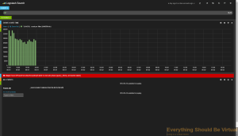
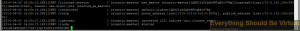

In the past few days I have come across the following error on two
different instances of Logstash.



On the first instance I came across the mount point that elasticsearch
was writing to became full. In this case I had to do the following to
get everything back on it.

```bash
curl -XDELETE http://localhost:9200/\_all
sudo service elasticsearch restart
```

Keep in mind the above will delete all data from elasticsearch. There
may be a more graceful way of doing some cleanup but for this one it
worked as I did not care about retaining any previous data.

On the second instance I saw this there was still plenty of available
space on the mountpoint for elasticsearch so I just restarted
elasticsearch and all was fine. Looking at the elasticsearch log file
this is what it contained.



Enjoy!
