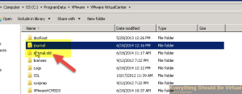

I ran into this today and thought I would share with anyone else who
runs into this.

I had an issue where the vcenter server service would not start and
would continually try to start but would keep restarting itself. I
started digging around and began looking at the vpxd.log file(s) (they
were spitting out too quick and were compressing themselves). I finally
grabbed one of the vpxd.log.gz files and extracted it to inspect it and
here is what I finally found in the log.

So after finding this I started googling around and came across
[this](http://kb.vmware.com/selfservice/microsites/search.do?language=en_US&cmd=displayKC&externalId=2075295d=2075295 "http\://kb.vmware.com/selfservice/microsites/search.do?language=en_US&cmd=displayKC&externalId=2075295")
VMware KB article.

So after following that article I renamed the journal folder as it
stated.

Restarted the vCenter service and sure enough it started working again.
So from what it looks like the vCenter heartbeat service actually caused
the journal lock which took a bit to figure out.

Enjoy!
