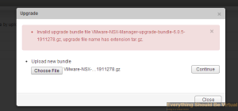
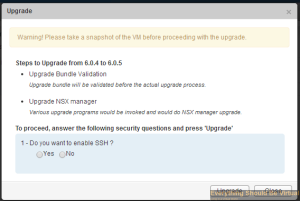
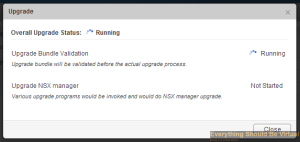
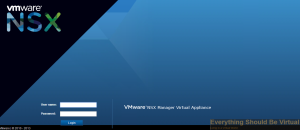
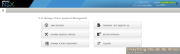
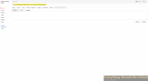

So I performed my first NSX upgrade today which overall was not too bad
but it did take quite a long time. I ran into a few gotchas along the
way and figured that I would share those. Now if you follow
[this](http://pubs.vmware.com/NSX-6/topic/com.vmware.ICbase/PDF/nsx_6_install.pdf "http\://pubs.vmware.com/NSX-6/topic/com.vmware.ICbase/PDF/nsx_6_install.pdf")
guide and the release notes
[here](https://www.vmware.com/support/nsx/doc/releasenotes_nsx_vsphere_605.html "https\://www.vmware.com/support/nsx/doc/releasenotes_nsx_vsphere_605.html") you
should be in good shape. However you may run into a few snags as below.

The first thing you may run into is when uploading the upgrade package
to the NSX Manager is the following error.

What this error is telling you is that you need to rename the downloaded
upgrade package. Your browser saved the file
as _VMware-NSX-Manager-upgrade-bundle-6.0.5-1911278.gz_ and you need to
rename the file
to _VMware-NSX-Manager-upgrade-bundle-6.0.5-1911278.tar.gz_ and upload
the upgrade package again. Now it will proceed.

The next thing you will want to do is take a snapshot of NSX Manager VM
if you did not do it before uploading the upgrade package.

You will now the see the upgrade proceeding.

Once the upgrade completes you will be logged out of the web interface
for the NSX Manager so you will want to log back in and verify that the
version reflects the version you just upgraded to.

Now you will be ready to upgrade your controllers. Starting on step 3 in
the release notes from the link above you need to find the controller
ids of each and every one of your controllers before proceeding. Then on
step 4 in the release notes they recommend taking a snapshot of each
controller using the REST API and curl. I chose to use the Chrome
Advanced REST client
[here](https://chrome.google.com/webstore/detail/advanced-rest-client/hgmloofddffdnphfgcellkdfbfbjeloo?hl=en-US "https\://chrome.google.com/webstore/detail/advanced-rest-client/hgmloofddffdnphfgcellkdfbfbjeloo?hl=en-US").
The trick is that you will need to login to your NSX manager using
Chrome prior to using the Advanced REST client or you will get access
denied errors when attempting to create a snapshot. So login to your NSX
manager and then launch the Chrome Advanced REST client.

Once all of your controllers are upgraded you can then proceed to
upgrading your hosts clusters which is step 7. One word of caution which
I ran into. If for some reason you have created DRS rules to pin your
controllers to specific hosts your upgrade on those hosts will fail. I
kept attempting to resolve the upgrade for the cluster in which my
controllers were located and it kept failing without any visible errors.
I stumbled across the DRS rules and disabled them and sure enough the
upgrade completed for that host cluster.

Now you can proceed and upgrade your edge routers and logical routers.
The process during the upgrade is actually deploying a new appliance,
renaming the original router, renaming the new deployed appliance as the
original one being upgraded and then it deletes the original router.
Make sure that all of your routes are still visible on your routers and
force a sync if needed.

That's all for now. I will be sharing much more around NSX very soon so
stay tuned. NSX is definitely very cool especially in a large
environment. :)

Enjoy!
