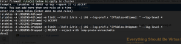

I have been working on some interesting virtualized networking setups
(More on this in another post soon) and needed a way to
configure IPTables rules on all nodes which are to be considered part of
a cluster (HA) setup. What I wanted was the ability to take a rule or a
set of rules and apply them to any number of nodes so they were all
consistent and the rules to be saved and not have to login to each node
individually. Now I know that I can do this with an automated solution
(Puppet, Chef, Ansible or Salt) but I instead wanted to do this using a
very simple shell script. So here is what I came up with and it works
perfectly therefore I wanted to share this in the odd chance that maybe
someone else may benefit from it as well.

If you do not want to be prompted each time for a password when running
the script (SSH login prompts) you should setup passwordless ssh
sessions between your servers and the central server that you plan on
running the script from. The account used to execute the script will
also need to be root or have sudo permissions.

```bash
ssh-keygen
ssh-copy-id remote-user@hostname
```

Now we need to create the following files.

```bash
sudo nano /opt/nodes.txt
```

Add all of the nodes that you would like to be part of your cluster and
save the file.

```bash
sudo nano /opt/iptables_cluster.sh
```

Now paste the following code into this file and save it.

<https://gist.github.com/mrlesmithjr/b4d1c4d7df2c9d2c1e20>

Now make the script executable

```bash
sudo chmod +x /opt/iptables_cluster.sh
```

Now you are ready to deploy out your IPTables rule(s) to all of your
nodes. When you run the script it will prompt for you to enter the rule
or rules that you would like to apply. You can copy and paste your rules
or type them all out. You will need to enter the rules exactly as you
would from the CLI and then type done and press enter on the very last
line of your rules.

```bash
/opt/iptables_cluster.sh
```

Below is what you will see when executing the script.


Now just enter your rule or rules like below and type done and enter at
the end. (If you are using sudo instead of root you will need to prepend
the iptables rules with sudo)



And off you go. I will be adding more functionality to this as time goes
on but for now this is what I was needing.

Enjoy!
