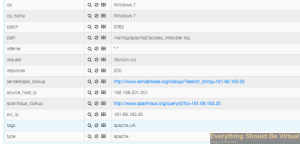

I had a great question yesterday about how to configure Logstash to
integrate IP reputation lookups within Logstash and Kibana without
having to copy and paste an IP address and etc. I thought this was a
great idea and one that I had not myself thought about so I gave it a
shot to see what I could come up with. And believe it or not it was
actually quite simple to put in place and I figured I may as well share
with everyone as well.

So in this setup I wanted to add IP reputation links for Apache type
events which added a new field and provided the url to click on within
Kibana. I will be setting up [senderbase](http://senderbase.org "http\://senderbase.org")
and [spamhaus](http://spamhaus.org "http\://spamhaus.org") for now to provide
this info. (I apologize if your IP address is the one used in this
but....)

Within your logstash.conf file you would add the following snippet of
code under your Apache parsing to do this.

```json
mutate {
    add_field => [ "senderbase_lookup", "http://www.senderbase.org/lookup/?search_string=%{src_ip}" ]
    add_field => [ "spamhaus_lookup", "http://www.spamhaus.org/query/bl?ip=%{src_ip}" ]
}
```

A complete Apache parsing setup that I use including this looks like
this.

```json
# Setting up Apache web server parsing
filter {
        if [type] =~ "apache" {
                grok {
                        pattern => "%{COMBINEDAPACHELOG}"
                }
                geoip {
                        source => "clientip"
                        target => "geoip"
                        add_field => [ "[geoip][coordinates]", "%{[geoip][longitude]}" ]
                        add_field => [ "[geoip][coordinates]", "%{[geoip][latitude]}"  ]
                }
                date {
                        match => [ "timestamp" , "dd/MMM/yyyy:HH:mm:ss Z" ]
                }
                mutate {
                        add_field => [ "src_ip", "%{clientip}" ]
                        convert => [ "[geoip][coordinates]", "float" ]
                        rename => [ "verb" , "method" ]
                }
                grok {
                        match => [
                                "message", "%{DATA:apache_vhost} "
                        ]
                }
                useragent {
                        add_tag => [ "UA" ]
                        source => "agent"
                }
                if "UA" in [tags] {
                        mutate {
                                rename => [ "name", "browser_name" ]
                        }
                }
        mutate {
            add_field => [ "senderbase_lookup", "http://www.senderbase.org/lookup/?search_string=%{src_ip}" ]
            add_field => [ "spamhaus_lookup", "http://www.spamhaus.org/query/bl?ip=%{src_ip}" ]
        }
        }
}
```

With this setup you will get the following bit of info in your events
now.



As you can from the image above you now have clickable URL's for each
of these including the original src_ip from the source.

So that is it and you should be able to apply this same method to other
types of parsing as you see fit.

Enjoy!
