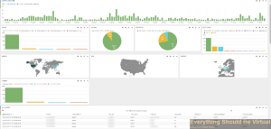

So the past day or so I have been working on getting some good detail
from my NSX Edge's (ESG and DLR) and I have been able to get them
working very well. The Kibana dashboard looks great too. :) So I wanted
to share this out with anyone else who may be looking at doing the same
thing or just needing a way to get useful information out of NSX in
regards to firewall activity. I am also working on some of the other
logging facilities within NSX and will share those once I get those
tidied up.

Below is the code you will need to get started in setting up your
logstash.conf file.

<https://gist.github.com/mrlesmithjr/8a018d57f79dc4f451e6>

And here is a quick dashboard view for now.

Enjoy!
