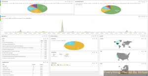
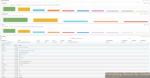

I have been working on getting some detailed logging from Snort logs
generated through PFSense and thought I would share them. This can also
be modified to work with a Snort setup not running on PFSense as well.
Can also modify for Suricata if needed.

In order to send your Snort logs you will need an instance of logstash
running on your Snort node with the following added to your
logstash.conf file. Modify to suit your specific log location.

```json
input {
  file {
    path => "/var/log/snort/alert"
    type => "snort"
    sincedb_path => "/var/log/.snortsincedb"
  }
}
```



Here are some sample Kibana dashboards.





Enjoy!
