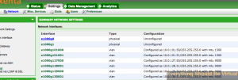

I Wanted to go through and enable jumbo frames for my lab iSCSI storage
which is running on Nexenta CE (For about 4 years now). So how do you do
this? Login to your Nexenta WEBUI and head over to setting and network
and change the MTU from 1500 to 9000. Easy enough right? Well not quite
in my case. I attempted to do this and was immediately presented with an
error stating that I could not change the MTU in a bright red error at
the top of the screen. (I forgot to capture this screenshot) So how do
you get around this? Actually pretty easy but it will require a reboot
of your storage. Note the detail of your interface naming as this should
represent the driver that your network adapter is using. In my case I am
using the E1000G driver.



SSH to your Nexenta array and then execute the following.

```bash
option expert_mode =1
!bash
```

Hit "y" to enter the actual shell.\
Now modify the following file using vi or nano.

```bash
nano /kernel/drv/e1000g.conf
```

Look for the following line

```bash
MaxFrameSize=0,0,0,0,0,0,0,0,0,0,0,0,0,0,0,0;
```

Underneath that line you will see what the different values represent.

```bash
# 0 is for normal ethernet frames.\\

# 1 is for upto 4k size frames.\\

# 2 is for upto 8k size frames.\\

# 3 is for upto 16k size frames.
```

So based on this information we will need to use 3 so that we can use an
MTU value of 9000.
Now comment out the existing line (Safety Net) by adding a # in front
of MaxFrameSize

```bash
#MaxFrameSize=0,0,0,0,0,0,0,0,0,0,0,0,0,0,0,0;
```

Now add a new line with the following

```bash
MaxFrameSize=3,3,3,3,3,3,3,3,3,3,3,3,3,3,3,3;
```

Save the file and exit. Now reboot your Nexenta box.

Once the box is back up you should be able to back into the WEBUI and
change MTU from 1500 to 9000 now. Make sure that your switch has jumbo
frames enabled as well as your hypervisors or device that is connecting
to your Nexenta box.

Good luck!

Enjoy!
