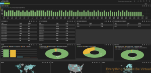
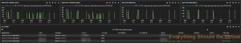

I recently had an opportunity to get around to creating some Cisco ASA
parsing for logstash to detect some abnormal activity on the network. So
now that I have created the parsing and have to say it works pretty
good; I figured I would share it with anyone else that may have a need
for this as well. I will also share the dashboard that I created in case
you want that as well.

You will need to add the following to your current logstash.conf file..
I placed this at the top of my config below all inputs before standard
syslog parsing to make sure it was processed first, tagged and passed
the next level of syslog parsing.


That's it!

Here are some screenshots of what the dashboard looks like.

Below is the dashboard code:


Enjoy!
