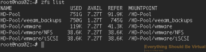
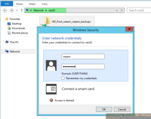

So for the past 4 years or so I have been running Nexenta 3.x for my lab
NAS; which has been working great, but I was at a point of having to
rebuild my latest build to get the new 4.x Nexenta. With that I finally
started kicking around some ideas on going a different route instead
(knowing that ZFS was still going to be part of the new solution). I
have two NAS servers that I have built for Nexenta over the years
([First build](https://everythingshouldbevirtual.com/my-home-lab-nexentastor-ce-nas)
and [second build](https://everythingshouldbevirtual.com/new-nexenta-server-coming-soon)
) so I started on this journey and figured that I would share it with everyone.

I first set out to an idea of running a GlusterFS cluster utilizing both
NAS servers. This began to look very promising as I stood up the first
node (Ubuntu 14.04LTS) and installed and configured ZFS for Linux (ZOL).
ZOL runs currently in userland instead of kernel but I am not too
worried about that at this point. So I began storage vMotioning all of
my VMs over to it. GlusterFS also includes it's own NFS server to
provide access to your vSphere hosts (can still use NFSD but can get a
little clunky IMHO). GlusterFS uses what are called bricks; bricks are
basically nodes with storage provided to be added to a virtual volume.
You can replicate (mirror) these volumes as well as distribute (stripe)
and you can also mix the two replicate+distribute. After running just a
single node with bricks assigned from itself only it seemed to be a
rocking solution with plenty of opportunity. So I then rebuilt my other
NAS server (Ubuntu 14.04LTS) then installed and configured ZOL as well
as GlusterFS. I peered both nodes and created the cluster. I also
planned on using KeepaliveD for VRRP to provide a single VIP as an entry
point into the NFS mounts which would be presented from Gluster as well
as provide failover for my vSphere NFS datastores. I started with some
of the low hanging; not so important VMs and began creating my
replication bricks. It was looking great until I started getting some
disconnected datastores and eventually a few VMs were crashing. After
looking into this after a few times it appeared that what was happening
was that the replica bricks were overloading the CPU on the primary node
and basically causing an APD (All Paths Down). So I then began to search
the internet for a possible solution but in the short time and many late
nights trying to figure this out I finally decided to postpone the
GlusterFS implementation phase at this point. It does look like other
Linux distros may perform better than Ubuntu but I did not want to
continue to look into this any further at this time. I did however
implement a GlusterFS setup between some Apache web servers to house the
web content and synchronize between the nodes and this has been working
much better than using unison previously.

#### NIC Redundancy

This being a very critical part of the solution I decided to create a
network bond between the two interfaces and create virtual interfaces on
top of the bonded ports using VLAN tagging. I chose to go with
[ifenslave](https://help.ubuntu.com/community/UbuntuBonding)
to accomplish the nic bonding.

First you need to install the actual ifenslave package.

```bash
sudo apt-get install ifenslave-2.6
sudo modprobe bonding
```

And for vlan tagging support.

```bash
sudo apt-get install vlan
sudo modprobe 8021q
```

Now all you need to do is modify your /etc/network/interfaces to look
like below (Change to suit your requirements)

```bash
sudo nano /etc/network/interfaces
```

Below is what my setup looks like (I chose balance-alb for my bonding
mode)

```bash
# This file describes the network interfaces available on your system
# and how to activate them. For more information, see interfaces(5).

# The loopback network interface
auto lo
iface lo inet loopback

# The primary network interface
#auto p5p1
#iface p5p1 inet dhcp

auto p5p1
iface p5p1 inet manual
bond-master bond0

auto p6p1
iface p6p1 inet manual
bond-master bond0

auto bond0
iface bond0 inet manual
slaves p5p1 p6p1
bond-mode balance-alb
bond-miimon 100

auto vlan101
iface vlan101 inet static
address 10.0.101.50
netmask 255.255.255.0
broadcast 10.0.101.255
up route add default gw 10.0.101.1
dns-search      everythingshouldbevirtual.local
dns-nameservers 10.0.101.110 10.0.101.111 10.0.110.112
vlan-raw-device bond0

auto vlan127
iface vlan127 inet static
address 10.0.127.50
netmask 255.255.255.0
broadcast 10.0.127.255
vlan-raw-device bond0

auto vlan128
iface vlan128 inet static
address 10.0.128.50
netmask 255.255.255.0
broadcast 10.0.128.255
vlan-raw-device bond0

auto vlan129
iface vlan129 inet static
address 10.0.129.50
netmask 255.255.255.0
broadcast 10.0.129.255
vlan-raw-device bond0

auto vlan130
iface vlan130 inet static
address 10.0.130.50
netmask 255.255.255.0
broadcast 10.0.130.255
vlan-raw-device bond0
```

Now let's make some network tweaks to get the best performance we can.

```bash
sudo bash
# Tweak network settings
echo "# reuse TIME-WAIT sockets" >> /etc/sysctl.conf
echo "net.ipv4.tcp_tw_reuse=1" >> /etc/sysctl.conf
echo "# increase max num of ports" >> /etc/sysctl.conf
echo "net.ipv4.ip_local_port_range=1024 65023" >> /etc/sysctl.conf
echo "# increase the number of outstanding syn requests" >> /etc/sysctl.conf
echo "net.ipv4.tcp_max_syn_backlog=40000" >> /etc/sysctl.conf
echo "# maximal number of timewait sockets" >> /etc/sysctl.conf
echo "net.ipv4.tcp_max_tw_buckets=400000" >> /etc/sysctl.conf
echo "net.ipv4.tcp_max_orphans=60000" >> /etc/sysctl.conf
echo "# tcp syn flood protection" >> /etc/sysctl.conf
echo "net.ipv4.tcp_syncookies=1" >> /etc/sysctl.conf
echo "# tcp syn flood protection" >> /etc/sysctl.conf
echo "net.ipv4.tcp_synack_retries=3" >> /etc/sysctl.conf
echo "# burst connection rate" >> /etc/sysctl.conf
echo "net.core.somaxconn=40000" >> /etc/sysctl.conf
echo "# how long to keep sockets in fin-wait-2" >> /etc/sysctl.conf
echo "net.ipv4.tcp_fin_timeout=5" >> /etc/sysctl.conf
sysctl -p
```

#### ZFS

Now before we forget let's go ahead and install NTP on our server to
keep time in sync as well.

```bash
sudo apt-get install ntp
```

We now need to build our ZFS storage pool and create some datasets.
So let's assume that you have 2-2TB drives you want to use for your ZFS
pool initially (I will be showing a ZPOOL using 12-2TB disks). We can
always grow the pool on the fly as we go forward. (\*\*Note - If you are
using Advanced Format drives with 4K blocks instead of 512 bytes..Green
drives and a lot of newer non-green drives use 4K blocks...we will
setup our pool in advance to accommodate for this from the beginning as
the option is only available upon creation of the ZPOOL (ashift=12).)
But first we need to install ZFS on our Ubuntu 14.04LTS server (ZOL =
ZFS on Linux).
Add the PPA for ZFS

```bash
sudo apt-get install python-software-properties
sudo apt-add-repository ppa:zfs-native/stable
sudo apt-get update
sudo apt-get install ubuntu-zfs
```

So now before we go too much further let's get some initial tweaks out
of the way that specifically deal with SATA drives and memory.
If you are only using SATA drives for your ZPOOL we need to limit the
number of pending requests to these drives from ZFS to minimize disk
time wait and etc. And we do that by creating and adding the following
to /etc/modprobe.d/zfs.conf and a reboot is in order before these
settings are active as well (You can also do this without a reboot by
echoing these settings to the respective files in
/sys/module/zfs/parameters folder, but let's not go into that for now).

```bash
sudo nano /etc/modprobe.d/zfs.conf
```

Add the following

```bash
# My tweaks for ZFS Performance
options zfs zfs_prefetch_disable=1
options zfs zfs_txg_timeout=5
options zfs zfs_vdev_async_write_max_active=1
options zfs zfs_vdev_async_write_min_active=1
options zfs zfs_vdev_async_read_max_active=1
options zfs zfs_vdev_async_read_min_active=1
options zfs zfs_vdev_sync_write_max_active=1
options zfs zfs_vdev_sync_write_min_active=1
options zfs zfs_vdev_sync_read_min_active=1
options zfs zfs_vdev_sync_read_max_active=1
```

Do not close and save this file yet until we do our memory tuning.
Now let's touch on memory here. ZFS is memory hungry and the more
memory you add to your server the better your performance will be. But
we want to make sure that we don't starve the system for memory so we
will limit the ZFS_ARC_MAX by allocating only 50% of our installed
memory to begin with (You will want to tune this as you go forward). In
this example I have 16GB installed in my server so I am going to limit
ZFS_ARC_MAX to 8GB. We need to add this in bytes.
For 8GB I would add the following to the still open
/etc/modprobe.d/zfs.conf. You can always tweak this up as you start to
see how things perform.

```bash
#### Memory tuning - entered in bytes
# zfs_zrc_max (1/2 or 3/4 of system memory)
options zfs zfs_arc_max=8589934592
# zfs zfs_arc_meta_limit (1/4 of zfs_arc_max)
options zfs zfs_arc_meta_limit=2147483648
# zfs_arc_min (1/2 of zfs_arc_meta_limit)
options zfs zfs_arc_min=1073741824
```

Now save and close this file and go ahead and reboot your server.

If you want to adjust these settings on the fly you can do the
following.

```bash
sudo bash
echo 1073741824 > /sys/module/zfs/parameters/zfs_arc_min
echo 8589934592 > /sys/module/zfs/parameters/zfs_arc_max
echo 2147483648 > /sys/module/zfs/parameters/zfs_arc_meta_limit
```

To see what the arcstats are currently set to run the following.

```bash
cat /proc/spl/kstat/zfs/arcstats
```

Example output of mine.

```bash
root@nas02:/sys/module/zfs/parameters# cat /proc/spl/kstat/zfs/arcstats
5 1 0x01 85 4080 28525565526 7155039732857
name                            type data
hits                            4    1571965
misses                          4    19791
demand_data_hits                4    34847
demand_data_misses              4    297
demand_metadata_hits            4    1537093
demand_metadata_misses          4    19450
prefetch_data_hits              4    0
prefetch_data_misses            4    0
prefetch_metadata_hits          4    25
prefetch_metadata_misses        4    44
mru_hits                        4    35969
mru_ghost_hits                  4    291
mfu_hits                        4    1535989
mfu_ghost_hits                  4    16313
deleted                         4    668
recycle_miss                    4    0
mutex_miss                      4    0
evict_skip                      4    0
evict_l2_cached                 4    0
evict_l2_eligible               4    0
evict_l2_ineligible             4    4096
hash_elements                   4    34010
hash_elements_max               4    34012
hash_collisions                 4    11197
hash_chains                     4    1985
hash_chain_max                  4    3
p                               4    2095867904
c                               4    8589934592
c_min                           4    1073741824
c_max                           4    8589934592
size                            4    50592752
hdr_size                        4    10285680
data_size                       4    4342272
meta_size                       4    30484480
other_size                      4    4164200
anon_size                       4    425984
anon_evict_data                 4    0
anon_evict_metadata             4    0
mru_size                        4    17643008
mru_evict_data                  4    2562560
mru_evict_metadata              4    8500224
mru_ghost_size                  4    133391360
mru_ghost_evict_data            4    5120
mru_ghost_evict_metadata        4    133386240
mfu_size                        4    16757760
mfu_evict_data                  4    1763328
mfu_evict_metadata              4    14265344
mfu_ghost_size                  4    11125248
mfu_ghost_evict_data            4    512
mfu_ghost_evict_metadata        4    11124736
l2_hits                         4    20
l2_misses                       4    19729
l2_feeds                        4    7112
l2_rw_clash                     4    0
l2_read_bytes                   4    6656
l2_write_bytes                  4    97245696
l2_writes_sent                  4    1449
l2_writes_done                  4    1449
l2_writes_error                 4    0
l2_writes_hdr_miss              4    0
l2_evict_lock_retry             4    0
l2_evict_reading                4    0
l2_free_on_write                4    46
l2_abort_lowmem                 4    0
l2_cksum_bad                    4    0
l2_io_error                     4    0
l2_size                         4    160479232
l2_asize                        4    83066880
l2_hdr_size                     4    1316120
l2_compress_successes           4    41190
l2_compress_zeros               4    131
l2_compress_failures            4    838
memory_throttle_count           4    0
duplicate_buffers               4    0
duplicate_buffers_size          4    0
duplicate_reads                 4    0
memory_direct_count             4    0
memory_indirect_count           4    0
arc_no_grow                     4    0
arc_tempreserve                 4    0
arc_loaned_bytes                4    0
arc_prune                       4    0
arc_meta_used                   4    46250480
arc_meta_limit                  4    2147483648
arc_meta_max                    4    46255392
```

Now that your server is back online let's go ahead and create our ZPOOL.

Assuming you have SDA and SDB as your 2-TB drives we will create our
pool as the following.

```bash
sudo zpool create -o ashift=12 HD-Pool mirror sda sdb
```

Before we go further we really want to get away from using sda, sdb and
etc. for our ZPOOL and use either disk-id or WWN naming as our sd naming
can change between reboots and etc. This can be done upon creating of
the ZPOOL but you can also change this after creating the ZPOOL by doing
the following.

```bash
sudo zpool export HD-POOL
sudo zpool import -d /dev/disk/by-id HD-POOL
```

Now we are ready to create our ZFS Datasets. I like organization in
doing this so I will be creating the following datasets (vmware and
veeam) along with datasets for NFS and iSCSI for the vmware dataset.

```bash
sudo zfs create -p HD-Pool/vmware/NFS
sudo zfs create HD-Pool/vmware/iSCSI
```

To validate that our datasets have been created

```bash
sudo zfs list
```



A few more tweaks we should make for our NFS access for vSphere is
disabling atime and setting sync=disabled. Without sync=disabled for NFS
your performance will be terrible. Setting sync=disabled disables ZIL
(ZFS Intent Logging). Doing this is not always recommended but it will
increase your NFS performance and data corruption will not occur. By
default ZIL is written across all of your VDEVS but SSD drives can be
added as logging devices to increase performance. One final tweak to
adjust below is the default recordsize (128K) to 16K for our NFS dataset
for vSphere. You will want to test this for your environment though
either 8K-16K or default 128K. I find that 16K seems to be the sweet
spot for my environment. And finally enable compression for the entire
ZPOOL.

```bash
zfs set sync=disabled HD-Pool/vmware/NFS
zfs set atime=off HD-Pool/vmware/NFS
zfs set recordsize=16K HD-Pool/vmware/NFS
zfs set compression=lz4 HD-Pool
```

This is where organization for your datasets makes life much easier
because we can set different options based on our needs/requirements.

So now let's create a few more datasets for our NFS dataset in
preparation of setting different options or quotas.

```bash
sudo zfs create HD-Pool/vmware/NFS/tier_1
sudo zfs create HD-Pool/vmware/NFS/tier_2
sudo zfs create HD-Pool/vmware/NFS/tier_3
```

And if we do another zfs list to show our datasets we will see something
similar to below.

```bash
sudo zfs list
```


So now that we have those new datasets created; by default they will
inherit the settings that we have added to the HD-Pool/vmware/NFS
dataset; which at this point is disabling atime and sync.

Pretty cool isn't it? :)

#### NFS

For NFS access we will be using the nfs-kernel-server package for Ubuntu
and exporting our NFS mounts using ZFS. So let's install our NFS Server.

```bash
sudo apt-get install nfs-kernel-server
```

And before we go any further let's increase our number of NFS servers
from the default of 8 to 16. This will spawn additional NFSD processes
to increase performance for more than just a few vSphere hosts.

```bash
sudo nano /etc/default/nfs-kernel-server
```

At the top change the following from 8

```bash
# Number of servers to start up

RPCNFSDCOUNT=8
```

To 16

```bash
# Number of servers to start up

RPCNFSDCOUNT=16
```

Save and exit.

Now we need to add one more thing to our NFS server on Ubuntu for the
NFS server to actual start. Without doing this the NFS server will not
start. You can change this to any mountpoint on your server. All it is
doing is creating a dummy export to get the server to start. In this
case we are exporting /mnt on localhost with read-only permissions.

```bash
sudo nano /etc/exports
```

And paste the following

```bash
  /mnt   localhost (ro)
```

Now save, exit and start the NFS server.

```bash
sudo service nfs-kernel-server start
```

You will see the following error message but it can be safely ignored.


Now to validate that NFS is exporting run the following.

```bash
sudo showmount -e
```

You should see the following.


Now it is time to begin exporting our ZFS datasets over NFS. One thing
we need to do before we forget is to make sure that our NFS shares are
exported upon boot-up is make the following change to /etc/default/zfs

```bash
sudo nano /etc/default/zfs
```

And change the following line

```bash
# Run `zfs share -a` during system start?
# nb: The shareiscsi, sharenfs, and sharesmb dataset properties.
ZFS_SHARE='no'
```

To

```bash
ZFS_SHARE='yes'
```

Now that is out of the way let's go ahead and export some of our ZFS
datasets. First I want to limit the access to these exports to specific subnets
which only require NFS mounts from our NAS. We will do this upon enabling NFS
sharing for our datasets. In my case these subnets are 10.0.127.0/24 and 10.0.128.0/24.

```bash
sudo zfs set sharenfs='rw=@10.0.127.0/24,rw=@10.0.128.0/24,no_root_squash,no_all_squash' HD-Pool/vmware/NFS/tier_1
sudo zfs set sharenfs='rw=@10.0.127.0/24,rw=@10.0.128.0/24,no_root_squash,no_all_squash' HD-Pool/vmware/NFS/tier_2
sudo zfs set sharenfs='rw=@10.0.127.0/24,rw=@10.0.128.0/24,no_root_squash,no_all_squash' HD-Pool/vmware/NFS/tier_3
```

Now let's validate that our datasets are exports to the NFS server.

```bash
showmount -e
```

And you should see the following.


That's it for NFS. You should be able to mount up your respective NFS
datastores from your vSphere hosts now at this point.

One additional important note here. If for some reason you restart or
reload the nfs-kernel-server service you WILL lose access to your NFS
mountpoints (Not a good thing). So if you do restart or reload the
service you will need to run the following as well.

```bash
sudo zfs share -a
```

Or you can create shell scripts for restarting or reloading the NFS
server.

```bash
nano reload_nfs.sh
```

```bash
#!/bin/bash
service nfs-kernel-server reload
zfs share -a

chmod +x reload_nfs.sh

nano restart_nfs.sh
#!/bin/bash
service nfs-kernel-server restart
zfs share -a

chmod +x restart_nfs.sh
```

Now to run them execute the following:

To reload

```bash
sudo reload_nfs.sh
```

To restart

```bash
sudo restart_nfs.sh
```

#### iSCSI

We will be using
[LIO](http://linux-iscsi.org/wiki/Main_Page)
(Linux-IO Target). This iSCSI target implementation is kernel based and supports
many [VAAI](http://linux-iscsi.org/wiki/VStorage_APIs_for_Array_Integration)
primitives for vSphere, which is what I want.

```bash
sudo apt-get install lio-utils
sudo apt-get install --no-install-recommends targetcli python-urwid
```

First we will create a block device to use for our iSCSI target device.
(The -s tells it to create a sparse volume "thin")

```bash
sudo zfs create -sp -V 100GB HD-Pool/vmware/iSCSI/datastore_1
```

Now if we list our ZFS datasets we should have the following.


Now if you do an sudo fdisk -l we can see that a new block device has
been created.

```bash
sudo fdisk -l
```

This created a new block device at /dev/zd0 that we can use for our
iSCSI target setup.


Now we will setup iSCSI so we can present storage to our vSphere hosts.

```bash
sudo targetcli
```

We are now within the configuration utility to start creating our iSCSI
targets and volumes.


If you type

```bash
ls
```

you will get a listing of each type of configuration we can setup.


Let's first setup our new ZVOL as an iblock.

```bash
backstores/iblock create name=hd-pool_vmware_datastore_1 dev=/dev/zd0
```


Now let's create our iSCSI Target (TPG)

```bash
iscsi/ create
```


And let's create another one seeing as we have two IP addresses
assigned (One on VLAN129 and the other on VLAN130)

```bash
iscsi/ create
```


Now let's attach our ZVOL (ssd-pool_vmware_datastore_1 (/dev/zd0))
to our TPGS

```bash
iscsi/iqn.2003-01.org.linux-iscsi.nas01.x8664:sn.65e50d149946/tpgt1/luns create /backstores/iblock/hd-pool_vmware_datastore_1
iscsi/iqn.2003-01.org.linux-iscsi.nas01.x8664:sn.8091c98a173d/tpgt1/luns create /backstores/iblock/hd-pool_vmware_datastore_1
```


Now we need to assign an IP interface to each portal group for each TPG
that we created above.

```bash
iscsi/iqn.2003-01.org.linux-iscsi.nas01.x8664:sn.65e50d149946/tpgt1/portals create 10.0.129.50
iscsi/iqn.2003-01.org.linux-iscsi.nas01.x8664:sn.8091c98a173d/tpgt1/portals create 10.0.130.50
```


Now we are going to allow acess to our luns without authentication but
we will use ACLs to assign our initiators to and control access that
way. You may want to do differently but for this setup it is fine.

```bash
iscsi/iqn.2003-01.org.linux-iscsi.nas01.x8664:sn.65e50d149946/tpgt1 set attribute authentication=0
iscsi/iqn.2003-01.org.linux-iscsi.nas01.x8664:sn.8091c98a173d/tpgt1 set attribute authentication=0
```

And now we will assign each of our vSphere hosts iSCSI initiator names
to our ACLs for each TPG so our hosts will see our new iSCSI lun.

```bash
iscsi/iqn.2003-01.org.linux-iscsi.nas01.x8664:sn.65e50d149946/tpgt1/acls create wwn=iqn.1998-01.com.vmware:esxi01-7685c3a8
iscsi/iqn.2003-01.org.linux-iscsi.nas01.x8664:sn.8091c98a173d/tpgt1/acls create wwn=iqn.1998-01.com.vmware:esxi01-7685c3a8
```

Now after adding all of your hosts to the ACLs for each TPG your setup
should look similar to below.


Now make sure to save your new configuration setup to make sure this
persists between reboots. Type "saveconfig"


And after your rescan all of your hosts you should see a new disk target
available.


That's it for our iSCSI setup.

#### Samba (SMB/CIFS)

Now of course a general purpose NAS would not be complete without adding
Windows file sharing support would it? :) In my case I am only setting
up a generic Samba share to use for Veeam backups. So that is what I
will be doing here.

First thing is to create a unix username called veeam and create a
password.

```bash
sudo adduser veeam
```


Now let's install samba (ZOL utilizes the native  Linux samba package).

```bash
sudo apt-get install samba
```

Once that is complete I want to share out my veeam_backups dataset.

Now we need to create the dataset with some parameters up front because
one of them cannot be changed after being created (casesensitivity). And
nbmand=on (Non Blocking Mandatory Locks) for CIFS clients.

```bash
sudo zfs create -o casesensitivity=mixed -o nbmand=on HD-Pool/veeam/veeam_backups
```

So now we have created the dataset for Windows sharing we need to
actually share it out.

```bash
sudo zfs set sharesmb=on HD-Pool/veeam/veeam_backups
```

Now create your veeam samba user/password. Match to the same password
that you created for the actual UNIX account.

```bash
sudo smbpasswd -a veeam
```

Now if you browse to the NAS name you should see the share and when you
double click on it; enter username/password created from above. You have
read access only to this share at this point however.




Try creating a new folder and you will get access denied.


Now it appears that Samba sharing with ZOL is very kludgy and not as
tight as on Solaris so for now I am going to do the following for my
veeam user to be allowed to write to this share. We will grant full
access to the veeam group leaving root as the owner.
You will want to modify this based on your needs for owner/group.

```bash
sudo chown root:veeam /HD-Pool/veeam/veeam_backups
sudo chmod 0775 /HD-Pool/veeam/veeam_backups
```

I really don't like the above but for now it works just fine as I only
have one user connecting.


#### Security

One last thing I want to touch on here is locking down NFS access. I
know we allowed RW access from 10.0.127.0/24 and 10.0.128.0/24 a ways up
but here is what you will see from another computer on your network
accessing the NAS from the 10.0.101.0/24 address.

If I run a showmount -e nas02 from my OSX computer.


So with IPTables we will lock this down coming in from the vlan101
interface.

```bash
sudo iptables -A INPUT -i vlan101 -p tcp --dport 111 -j DROP
sudo iptables -A INPUT -i vlan101 -p udp --dport 111 -j DROP
sudo iptables -A INPUT -i vlan101 -p tcp --dport 2049 -j DROP
sudo iptables -A INPUT -i vlan101 -p udp --dport 2049 -j DROP
```


And now if I do a showmount -e nas02 from my OSX computer.


And if I look at my IPTables rules on nas02.


Now to make these IPTables rules stick across reboots we will install iptables-persistent.

```bash
sudo apt-get install iptables-persistent
```

Say "yes"


Keep in mind that this will save the existing rules but if you make
changes you will need to run the following.

```bash
sudo iptables-save
```

So there you have it. We have now successfully built our homebrew NAS
for our vSphere environment. I am seeing sub 10ms latency (average) on
this setup running about 60 VMs on it over NFS. I will be posting some
testing results here shortly to show some IOMeter testing between NFS
and iSCSI.

Enjoy!
