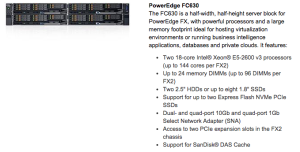

Carol Pflueger, Servers Product Manager, introduces the Dell PowerEdge
FX architecture

First off I would like say that Carol was top notch on this
presentation. As always it is awesome to see women in tech breaking it
all down; and that she did. I would highly recommend that you check out
her [presentation](https://www.youtube.com/watch?v=0SjPvplOzmE) if you can.

<https://www.youtube.com/watch?v=0SjPvplOzmE>

Right off of the top of my head being part of this presentation was
"OMG the possibilities with this platform are endless". Thinking to
myself hyper-converged in a blade footprint rocks. I know there are
other platforms that are similar, but... The reason this was so
appealing to me is that I was literally in a discussion the week prior
to this and discussing the options of using Dell blades in an M1000e
chassis and providing DAS (Direct Attached Storage) would be awesome as
we move forward to such things as OpenStack (Ephemeral storage), vSAN
and etc. That discussion ended up being that maybe going away from
blades to pizza box servers might be the best choice. I love blades and
what they provide so I was not too keen on this idea but if that is what
it takes to get us where we need to go then that is what we will do. The
reason behind not being able to do DAS in an M1000e chassis is because
the only storage blade option in that footprint is an Equalogic storage
blade but it provides iSCSI in the chassis only. This will not work
because we want DAS provisioned to each blade.

So fast forward to this presentation that Carol did on the new Dell FX2
Architecture. Now things start to get very interesting.

FX2 = Flexible 2U

What you get from a Dell FX2 Architecture is a 2U blade enclosure
(PowerEdge FX2 Enclosure) that can contain up to four PowerEdge FC630
blades, eight PowerEdge FC430 (Coming Soon) blades, two PowerEdge FC830
(Coming Soon) blades, four PowerEdge FM120x4 blades or three PowerEdge
FD332 (Coming Soon) storage blades.

PowerEdge FX2 Enclosure

PowerEdge FC630

PowerEdge FC430 (Coming Soon)

PowerEdge FC830 (Coming Soon)

PowerEdge FM120x4

PowerEdge FD332 (Coming Soon)

Also while going through this presentation I wondered about being able
to use these blades or storage blades in an M1000e chassis (That would
be too easy right?) but they are not interchangeable because the blades
used in the FX2 Architecture have been shaved down to fit the footprint
of the FX2 enclosure (and vice versa). OK no biggie.

##### **Compute**

For compute based on the FC630 blades at this time you can get up to
2x18-core CPU's (No Turbo or Hyper-Threading). This is the only
shortfall that I see at this time (Maybe not so much?). This can get
tricky when coming up with a memory to CPU formula (I know you are
thinking...But you should not account for hyper-threading...Well it
does play a part in the way we are trying to build our scaled out
model). Monster VMs can skew the design going this route but for most
this is not an issue. There are also still daughter cards that can be
leveraged in this architecture (Fabric-A maps to the passthru modules
and the Mezz slot maps to a Gen.3 PCI switch).

##### **Networking**

As for networking on the FX2 Architecture they have you covered. You can
use 1Gb passthru's (16x1Gbe) or you can use an FN IO Aggregator (max of
2/enclosure) which gives you eight internal 10Gbps connections
downstream and Four 10G SFP+, four 10GBASE-T, or two Fibre Channel3 plus
two SFP+ external ports upstream. This allows for LAG's and VLT up to
your TOR (Top Of Rack) switch. You can then run L2 up to your TOR. And
there was also mention of FTOS (Force10 Operating System) coming to be
integrated into the IO Aggregator itself (Now that will be cool).
Hmmmmm.....Wonder how creative things might get then... 40Gb is coming
soon!!!

FN IO Aggregator

##### **Storage**

And for the PowerEdge FD332 storage nodes you can attach to a single
blade or they can be split between FC630 blades ultimately splitting the
storage in half (8 drives to each compute node). Also if you insert an
FD332 below a PowerEdge FC630 the PCI slots for the bay where the
storage node is placed are handed over to the FC630 Blade so you gain an
additional four PCI slots on the compute node.

##### **Management**

All components are managed through CMC. CMC can manage currently up to
20 FX2 Chassis stacks. It will look very similar to looking at CMC for
an M1000e blade chassis.

Some screenshots of the presentation (Snagged from the youtube
presentation).

A theoretical design for Compute and Storage for a virtual environment
MIGHT look a little something like this. (Yes I included CIFS for those
interested in Hyper-V)

For me personally this presentation was one of the best technical deep
dives on any of the new products. Of course this is mainly due to
because I am an architect by nature and these sorts of talks resonate
well for me.

> DISCLAIMER:
> All meals, travel and entertainment was provided by Gestalt IT. However
> Gestalt IT nor the Vendor have provided any type of compensation to
> write-up any portion of this article. The information contained within
> this article are solely my views and take aways.
