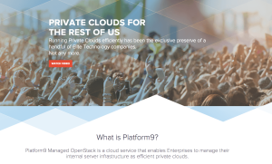
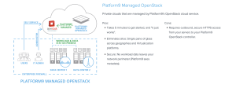
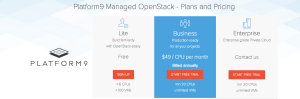

Last week at Tech Field Day - #VFD4 in Austin, TX I had the pleasure of
seeing [Platform9](http://platform9.com/ "http\://platform9.com/") for
the first time and I was extremely impressed on what they bring to the
table. So what exactly is it that Platform9 delivers? Well the following
is directly quoted from their website.

> **Platform9 makes OpenStack Based Private Clouds Easy**
>
> Platform9 is the simplest way for Enterprises to implement an
> OpenStack based, agile, self-service Private Cloud. With Platform9,
> Enterprises can go from having a sprawl of virtualized or
> non-virtualized servers to a fully operational private cloud in
> minutes.

**So what does this all mean?**
It means that what they are offering is a managed OpenStack solution.
This is not a hosted solution but rather they deliver the **core of
OpenStack, including keystone, nova and glance, as a cloud
service**. Horizon (OpenStack's default portal) is replaced by Platform9's own
version of a portal which looks amazing. And you host the infrastructure
(compute, storage and networking) in your datacenter. Sounds pretty cool right?
Of course it does but why would you want to do this? The answer is fairly simple.
Suppose you are a company that has determined that going down the
OpenStack (DevOPS) route is for you, but you do not have anyone on staff
who can handle; the sometimes complex and complicated setup involved in
an OpenStack deployment (unless you have ninjas in the closet). Or maybe
you just want to give OpenStack a run in your environment for a POC
(proof of concept) and again not have the hassle of the initial setup
and be up in running within a short period of time. Then this would be a
great solution for you. Did I mention? The cool thing is that all of the
physical infrastructure remains inside the walls of your datacenter.
Multi-Data centers are supported as well so you can setup availability
zones.

**How does this work?**
Platform9 provides an installable agent for KVM based hypervisor
environments or an OVA for vSphere hypervisor environments. Once the
agent or appliance is deployed the infrastructure begins to be
discovered after adding your hypervisors to the Platform9 portal within
your account. All communications between your environment and Platform9
is transferred via SSL using the agents or OVA deployed into your
environment (concerned security folks - They got this OK). For vSphere
hypervisor deployments; a vCenter server IS required as it is the entry
point from Platform9 to your ESXi hosts. There was mention of possibly
interacting directly with ESXi hosts in the future but not at this time
(Free ESXi with that too?). So this means a license will be required for
vSphere deployments currently. Another really cool thing is that all
existing VMs and templates can be discovered and imported into the
Platform9 OpenStack catalog allowing you to use your existing templates
to deploy in an OpenStack environment. You can also continue to manage
your infrastructure as you always have prior to Platform9.

**What about OpenStack upgrades?**
All OpenStack upgrades are handled by Platform9 leaving you without the
hassle of going through sometimes tedious upgrades. They roll out the
2nd most recent versions of OpenStack (currently Havana, Juno is coming
soon). When an upgrade is due they will notify you in advance to let you
know that an upgrade is due and they are willing to reschedule if the
timing is not good for you. During your upgrade window the only thing
that will be impacted is your Platform9 portal meanwhile all of your
existing VMs and infrastructure remain running.

**Pricing (at the time of this post)**
I personally feel their pricing is extremely fair given what you gain
from this solution. They even have a free tier (for life). Below is a
screen grab from their website on pricing. And
[this](http://platform9.com/product/pricing.html "http\://platform9.com/product/pricing.html")
link will take you to their pricing page to see what all you get with
each tier.

**Ending thoughts**
I personally see many use cases for this model and will be checking out
more about Platform9 and giving them a test drive. In which I will also
be providing additional write-ups around my own personal experiences. I
really feel they have a compelling model to provide for any company
ready to delve into OpenStack without a lot of overhead initially.
Allowing for your users to start experiencing an open private cloud
offering meanwhile giving you the time to start digging deep into
OpenStack and learning it for yourself (if you don't already know your
way around). So I would really encourage you to have a look for yourself
and give it a test drive.

And what would any new offering around OpenStack and Devops be without
Docker support? Well Docker support is coming soon as well.

> DISCLAIMER:
> All meals, travel and entertainment was provided by Gestalt IT. However
> Gestalt IT nor the Vendor have provided any type of compensation to
> write-up any portion of this article. The information contained within
> this article are solely my views and take aways.
