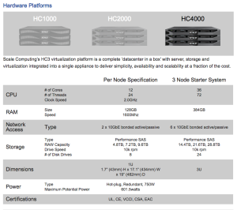
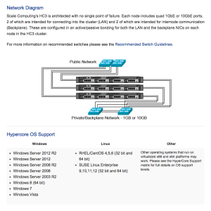

Scale Computing was the last and final vendor to do a presentation last
week at Tech Field Day - VFD4 (Virtualization Field Day 4) in Austin,
TX. I really appreciated their style of presenting. Very laid back and
deep knowledge of their product. Below is a snippet from their website
that explains what Scale Computing is about....

> "
>
> Scale Computing integrates storage, servers, and virtualization
> software into an all-in-one appliance based system that is scalable,
> self-healing and as easy to manage as a single server. Using industry
> standard components, the HC3™ appliances install in under an hour, and
> can be expanded and upgraded with no downtime. High availability
> insulates the user from any disk or server failure and a unified
> management capability driven by the patented HyperCore Software™,
> efficiently integrates all functionality. The result is a data center
> solution that reduces operational complexity, allows a faster response
> to business issues, and dramatically reduces costs.
>
> "

Scale Computing has been around as a Hyper-Converged platform since 2009.
So they were an early adopter of this sort of platform (before it was cool).

Scale Computing is extremely focused on who their target customer is,
which is the SMB market. They are not in business to get into the
enterprise and their goal is to put VMware out of business (Their words,
not mine :) ). Their design is built to allow SMB shops to deploy VMs
and clone existing VMs without much effort. However you may
not necessarily get all of the bells and whistles that you would get
with a VMware solution but what they do, they do very well. They have
built their converged design based around KVM (QEMU) hypervisor and
their storage design is built around SCRIBE, which was built by Phil
White, Chief Software Architect for Scale Computing. For a great
demonstration of what SCRIBE is head over to
[this](https://www.youtube.com/watch?v=00XAj7PMyzY "https\://www.youtube.com/watch?v=00XAj7PMyzY")
presentation from Storage Field Day 4. SCRIBE is very interesting and
has a very elaborate snapshot mechanism. I highly recommend checking out
the presentation above as well as
[this](https://www.youtube.com/watch?v=9Z-sYQeE160&index=37&list=PLinuRwpnsHadWJ56n0hB40nJDQkkm5y2U "https\://www.youtube.com/watch?v=9Z-sYQeE160&index=37&list=PLinuRwpnsHadWJ56n0hB40nJDQkkm5y2U")
one.

The user interface to some may seem a little lacking but that is by
design to keep the interface simple. Again, this is not a solution that
is built to be in the enterprise (even though it could be). Their
solution is cluster based and can grow as your needs increase. The
initial setup requires 3-nodes to build the initial cluster and each
node provides storage and compute to the cluster and then additional
nodes can be added to the cluster at a later time. You can also mix and
match the different model types that they sell within a cluster. The
ability to live motion VMs between nodes in the cluster works extremely
well and being that their solution is based on KVM (QEMU) the issues
between different instruction sets (EVC mode in VMware) is not as much
of a problem.

Potential use cases that come to mind with this outside of ROBO would be
potentially a retail POS back-office scenario. This could be an easy
deployment model for retail chains to use if the need for their POS
systems is to remain in the store itself and not be ran from the
datacenter. You could have a centralized Scale Computing cluster in your
datacenter which could be a replication target for all of your retail
stores providing DR/BC for each store. Another use case that was
discussed was a VDI type environment running on Scale Computing. This is
not a supported solution at this time and they do not currently have a
broker for VDI but services could be provided via RDP and RemoteFX for
Windows.

All support for Scale Computing platforms is provided through Scale
Computing. This is important because their hardware platform is based on
Dell servers and SuperMicro. Remote support via the internet is
available for all solutions assuming that the customer allows this into
their environment. So this allows support to directly connect into the
customers environment to troubleshoot and resolve any issues.

Scale Computing's pricing model is very compelling and they provide a
very simple pricing model. So no additional SKU's for additional
features and such. Very nice!

I fully intend on reaching out to Scale Computing and requesting some
lab time and get my hands into their product a little more in depth and
provide some additional posts in the future.

> DISCLAIMER:
> All meals, travel and entertainment was provided by Gestalt IT. However
> Gestalt IT nor the Vendor have provided any type of compensation to
> write-up any portion of this article. The information contained within
> this article are solely my views and take aways.
