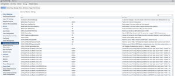
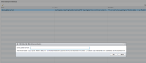
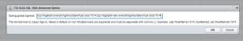
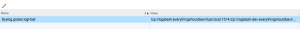
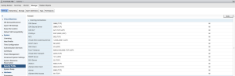
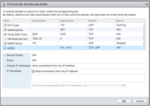
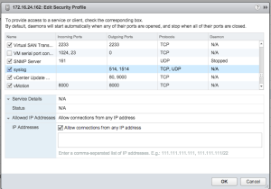
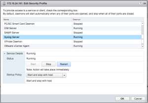
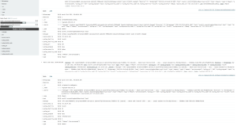

So in setting up a new ELK Stack from scratch (more on this later) and
also standing up the GA release of vSphere 6.0 I had to go through
setting up syslog from the hosts once again. Pretty much the same as
before but for those that would like to know if there is anything
special in regards to sending to
[logstash](https://everythingshouldbevirtual.com/highly-available-elk-elasticsearch-logstash-kibana-setup "Highly Available ELK (Elasticsearch, Logstash and Kibana) Setup")
I thought that I would share this. There is nothing special at all.

First thing to do is open up the UI using your favorite browser and
select your host(s) from the hosts and clusters home page. Now select
manage and advanced settings.

In the search bar enter the following 'syslog.global.logHost' and you
will see the setting to add your global syslog servers. Highlight the
setting and click the edit icon (pencil).

Now enter your syslog servers to send to. In my case I will be setting
the following
'tcp://logstash.everythingshouldbevirtual.local:1514,tcp://logstash-dev.everythingshouldbevirtual.local:1514'.

Click ok and the setting should now look similar to below.

Now you will need to go to the next advanced setting which is 'security
profile' and enable syslog. Click edit on the 'firewall' settings.

Click ok.

Now you need to restart the 'syslog' service. Scroll down in the
'security profile' settings and click edit on the 'services'
section. Now scroll down until you see 'Syslog Server', highlight it
and click 'restart'.

Click ok.

At this point you should be good to and start seeing some messages
showing up in your syslog server.

And there you have it. Happy syslogging and remember "Log all things!!!!".

Enjoy!
