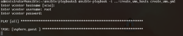
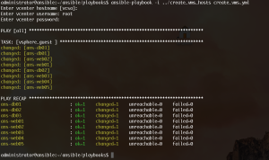
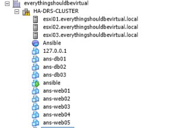

I am putting this out here in case anyone else may be interested in
spinning up some VM's using Ansible. I am doing this with Ansible 1.8.4
and connecting to vCenter 6.0 GA. I will be adding to this post as I add
more functionality. Currently with Ansible 1.8.4 you cannot spin up
VM's using templates but that is added in 1.9 which is currently only
available from GitHub in the dev branch. Not what I want to use for this
right now as I like to use products that are release versions for
stability and consistency. :) What I will be doing in this post is
spinning up 8 VM's ( 3 CentOS DB and 5 Ubuntu64 Web). Once they are
spun up you will need to install the OS on them (for now).

We first need to create an inventory list of the servers along with some
variables to be passed to our Ansible playbook which will create the
VM's for us. You could easily run this from Jenkins if you want a webUI
driven way to do this as well ( more on this later ).

Let's create our inventory list which in this example I will be calling
create_vms_hosts.

```bash
nano create_vms_hosts
```

Now copy and paste the following or create your own

```bash
[web-vms]
ans-web[01:05] disk='10' datastore='SSD-Pool_ELKStack_dev (NAS01)' network='vSS-OpenStack_Default' memory='256' cpucount='1' osid='ubuntu64Guest'

[db-vms]

ans-db[01:03] disk='20' datastore='SSD-Pool_ELKStack_dev (NAS01)' network='vSS-OpenStack_Default' memory='1024' cpucount='2' osid='rhel6_64Guest'
```

What we are specifying here is the group names (web-vms and db-vms) to
specify different variables for each group of servers to build. I will
breakdown each variable below to put some meaning to them.
`ans-web[01:05]` and `ans-db[01:03]` ---- These are the actual VM
names that we will be creating. Ansible has the ability to use regex
type values to represent a group of items...in this case VM names...So
Ansible will be creating ans-web01 - answeb05 and ans-db01 - ans-db03
for us.

disk= --- is the size in GB to create for each VM
datastore= --- name of the datastore to create the VMs on
network= --- name of network (portgroup) to place the VMs on
memory= --- the amount of memory in MB to allocate to the VMs
cpucount= --- the number of vCPU's to allocate to the VMs
osid= --- the OS Identifier to specify for the OS type.... reference
[this](https://www.vmware.com/support/developer/vc-sdk/visdk41pubs/ApiReference/vim.vm.GuestOsDescriptor.GuestOsIdentifier.html "https\://www.vmware.com/support/developer/vc-sdk/visdk41pubs/ApiReference/vim.vm.GuestOsDescriptor.GuestOsIdentifier.html")
guide for OSID's

Now we need to create the actual ansible playbook to run to create the
VMs for us. In this case I will be calling it create_vms.yml

```bash
nano create_vms.yml
```

Now copy and paste the below and modify to suit your requirements.



```yaml
---
- hosts: all
  gather_facts: false
  connection: local
  user: remote
  sudo: true

  vars_prompt:
    - name: "vcenter_hostname"
      prompt: "Enter vcenter hostname"
      private: no
      default: "vcsa"
    - name: "vcenter_user"
      prompt: "Enter vcenter username"
      private: no
    - name: "vcenter_pass"
      prompt: "Enter vcenter password"
      private: yes

  vars:
    datacenter: 'everythingshouldbevirtual'
    esxi_host: 'esxi01.everythingshouldbevirtual.local'
    notes: 'Created by Ansible'

  tasks:
    - vsphere_guest:
        vcenter_hostname: "{{ vcenter_hostname }}"
        username: "{{ vcenter_user }}"
        password: "{{ vcenter_pass }}"
        guest: "{{ inventory_hostname }}"
        state: present
        vm_extra_config:
          notes: "{{ notes }}"
        vm_disk:
          disk1:
            size_gb: "{{ disk }}"
            type: thin
            datastore: "{{ datastore }}"
        vm_nic:
          nic1:
            type: vmxnet3
            network: "{{ network }}"
            network_type: standard
        vm_hardware:
          memory_mb: "{{ memory }}"
          num_cpus: "{{ cpucount }}"
          osid: "{{ osid }}"
          scsi: paravirtual
        esxi:
          datacenter: "{{ datacenter }}"
          hostname: "{{ esxi_host }}"
```



This method will prompt for the vCenter hostname to connect to, username
and password to connect to vCenter. You will want to modify the section
under vars: to meet your specific requirements and naming of datacenter
and esxi_host. The esxi_host is just a placeholder to initially create
your VMs.

So with this all setup you will need to do one more thing before running
this playbook and that is installing the python module for vSphere.

```bash
sudo pip install pysphere
```

Once this is installed you are now ready to run your playbook.

```bash
ansible-playbook -i create_vms_hosts create_vms.yml
```







And there you have it...You have now successfully created some VMs
using Ansible :)

**_Updated!!! 01/13/2015_**

Here is a newer updated playbook to create VMs.



```yaml
---
- name: create some vms
  hosts: localhost
  connection: local
  vars_prompt:
    - name: "vcenter_host"
      prompt: "Enter vcenter host"
      private: no
      default: "vcsa"
    - name: "vcenter_user"
      prompt: "Enter vcenter username"
      private: no
    - name: "vcenter_pass"
      prompt: "Enter vcenter password"
      private: yes
  vars:
    esxi_host: 'esxi01.{{ pri_domain_name }}'
    vcenter_datacenter: 'LAB'
    vcenter_datastore: 'Tier-3 (NAS01)'
    vcenter_folder: 'ansible-builds'
    vms:
      - guest: 'test01'
        state: 'powered_on'
        vcpu_hotadd: 'no'
        mem_hotadd: 'no'
        notes: 'Ansible Created'
        num_disks: 1
        disks:
          disk1:
            size: 10
            type: 'thin'
        network: 'vSS-Green-Servers-VLAN101'
        memory: 1024
        cpus: 1
        osid: 'ubuntu64Guest'
      - guest: 'test02'
        state: 'powered_on'
        vcpu_hotadd: 'no'
        mem_hotadd: 'no'
        notes: 'Ansible Created'
        num_disks: 2
        disks:
          disk1:
            size: 10
            type: 'thin'
          disk2:
            size: 20
            type: 'thin'
        network: 'vSS-Green-Servers-VLAN101'
        memory: 1024
        cpus: 1
        osid: 'ubuntu64Guest'
      - guest: 'test03'
        state: 'powered_on'
        vcpu_hotadd: 'no'
        mem_hotadd: 'no'
        notes: 'Ansible Created'
        num_disks: 3
        disks:
          disk1:
            size: 10
            type: 'thin'
          disk2:
            size: 20
            type: 'thin'
          disk3:
            size: 30
            type: 'thin'
        network: 'vSS-Green-Servers-VLAN101'
        memory: 1024
        cpus: 1
        osid: 'ubuntu64Guest'
    pri_domain_name: 'everythingshouldbevirtual.local'
  tasks:
    - name: create vms (Single Disk)
      vsphere_guest:
        vcenter_hostname: "{{ vcenter_host }}"
        username: "{{ vcenter_user }}"
        password: "{{ vcenter_pass }}"
        guest: "{{ item['guest'] }}"
        state: "{{ item['state'] }}"
        vm_extra_config:
          vcpu.hotadd: "{{ item['vcpu_hotadd']|default(omit) }}"
          mem.hotadd: "{{ item['mem_hotadd']|default(omit) }}"
          notes: "{{ item['notes']|default(omit) }}"
          folder: "{{ vcenter_folder }}"
        vm_disk:
          disk1:
            size_gb: "{{ item['disks']['disk1']['size'] }}"
            type: "{{ item['disks']['disk1']['type'] }}"
            datastore: "{{ vcenter_datastore }}"
            folder: "{{ vcenter_folder }}"
        vm_nic:
          nic1:
            type: "vmxnet3"
            network: "{{ item['network'] }}"
            network_type: "standard"
        vm_hardware:
          memory_mb: "{{ item['memory'] }}"
          num_cpus: "{{ item['cpus'] }}"
          osid: "{{ item['osid'] }}"
          scsi: "paravirtual"
        esxi:
          datacenter: "{{ vcenter_datacenter }}"
          hostname: "{{ esxi_host }}"
      with_items: vms
      when: item['num_disks'] == 1

    - name: create vms (Multi Disk - 2 Disks)
      vsphere_guest:
        vcenter_hostname: "{{ vcenter_host }}"
        username: "{{ vcenter_user }}"
        password: "{{ vcenter_pass }}"
        guest: "{{ item['guest'] }}"
        state: "{{ item['state'] }}"
        vm_extra_config:
          vcpu.hotadd: "{{ item['vcpu_hotadd']|default(omit) }}"
          mem.hotadd: "{{ item['mem_hotadd']|default(omit) }}"
          notes: "{{ item['notes']|default(omit) }}"
          folder: "{{ vcenter_folder }}"
        vm_disk:
          disk1:
            size_gb: "{{ item['disks']['disk1']['size'] }}"
            type: "{{ item['disks']['disk1']['type'] }}"
            datastore: "{{ vcenter_datastore }}"
            folder: "{{ vcenter_folder }}"
          disk2:
            size_gb: "{{ item['disks']['disk2']['size'] }}"
            type: "{{ item['disks']['disk2']['type'] }}"
            datastore: "{{ vcenter_datastore }}"
            folder: "{{ vcenter_folder }}"
        vm_nic:
          nic1:
            type: "vmxnet3"
            network: "{{ item['network'] }}"
            network_type: "standard"
        vm_hardware:
          memory_mb: "{{ item['memory'] }}"
          num_cpus: "{{ item['cpus'] }}"
          osid: "{{ item['osid'] }}"
          scsi: "paravirtual"
        esxi:
          datacenter: "{{ vcenter_datacenter }}"
          hostname: "{{ esxi_host }}"
      with_items: vms
      when: item['num_disks'] == 2

    - name: create vms (Multi Disk - 3 DIsks)
      vsphere_guest:
        vcenter_hostname: "{{ vcenter_host }}"
        username: "{{ vcenter_user }}"
        password: "{{ vcenter_pass }}"
        guest: "{{ item['guest'] }}"
        state: "{{ item['state'] }}"
        vm_extra_config:
          vcpu.hotadd: "{{ item['vcpu_hotadd']|default(omit) }}"
          mem.hotadd: "{{ item['mem_hotadd']|default(omit) }}"
          notes: "{{ item['notes']|default(omit) }}"
          folder: "{{ vcenter_folder }}"
        vm_disk:
          disk1:
            size_gb: "{{ item['disks']['disk1']['size'] }}"
            type: "{{ item['disks']['disk1']['type'] }}"
            datastore: "{{ vcenter_datastore }}"
            folder: "{{ vcenter_folder }}"
          disk2:
            size_gb: "{{ item['disks']['disk2']['size'] }}"
            type: "{{ item['disks']['disk2']['type'] }}"
            datastore: "{{ vcenter_datastore }}"
            folder: "{{ vcenter_folder }}"
          disk3:
            size_gb: "{{ item['disks']['disk3']['size'] }}"
            type: "{{ item['disks']['disk3']['type'] }}"
            datastore: "{{ vcenter_datastore }}"
            folder: "{{ vcenter_folder }}"
        vm_nic:
          nic1:
            type: "vmxnet3"
            network: "{{ item['network'] }}"
            network_type: "standard"
        vm_hardware:
          memory_mb: "{{ item['memory'] }}"
          num_cpus: "{{ item['cpus'] }}"
          osid: "{{ item['osid'] }}"
          scsi: "paravirtual"
        esxi:
          datacenter: "{{ vcenter_datacenter }}"
          hostname: "{{ esxi_host }}"
      with_items: vms
      when: item['num_disks'] == 3
```



Enjoy!
