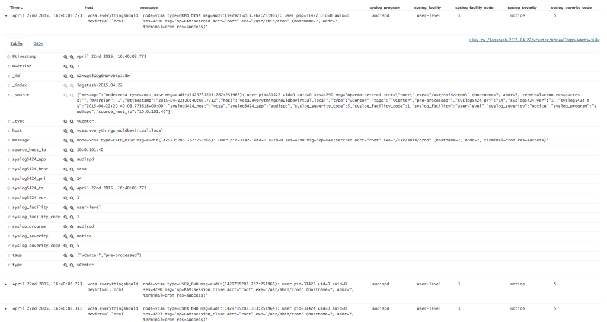
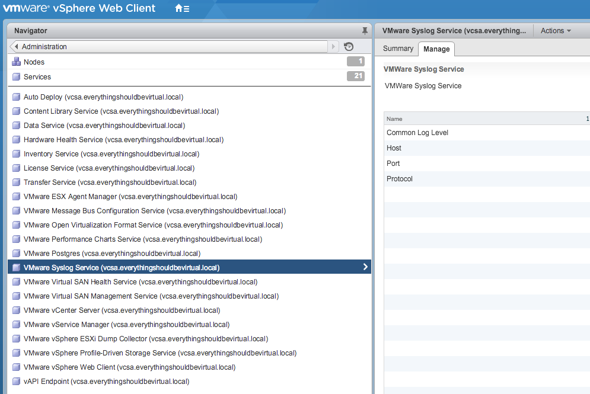
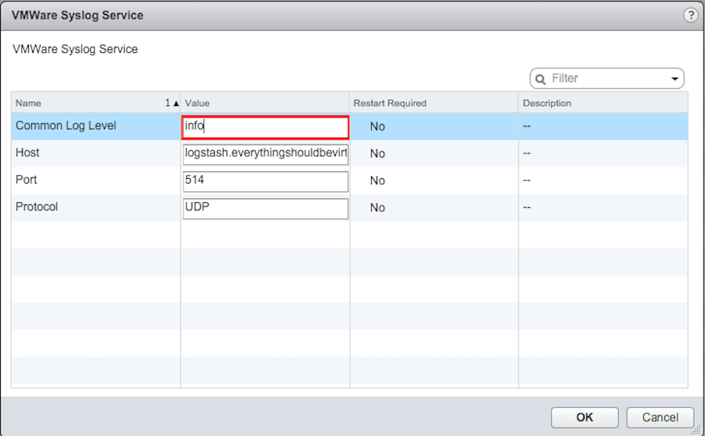
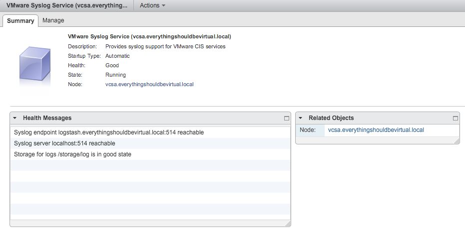

As I have begun upgrading portions of my lab to vSphere 6.x I came
across the difference in parsing syslog messages from the new VCSA which
was different than previous versions. I was basically getting
grokparsefailure on every message coming into logstash. So I wanted to
share a new parsing rule for logstash that seems to be working almost
100% of the time. The **bold** lines are what I have added new to my
logstash parsing rules.

```json
filter {
  if "vCenter" in [tags] {
    multiline {
      pattern => "-->"
      what => "previous"
    }
    grok {
      break_on_match => true
      match => [
        "message", "<%{INT:syslog_pri}>%{SYSLOGTIMESTAMP:timestamp} %{IPORHOST:syslog_hostname} %{TIMESTAMP_ISO8601:syslog_timestamp} (?(?(?:\[%{DATA:message_thread_id} %{DATA:syslog_level}
%{DATA:message_service}
\ ?%{DATA:message_opID}])) \[%{DATA:message_service_info}]\ (?(%{GREEDYDATA})))",
        "message", "<%{INT:syslog_pri}>%{SYSLOGTIMESTAMP:timestamp} %{IPORHOST:syslog_hostname} %{TIMESTAMP_ISO8601:syslog_timestamp} (?(?(?:\[%{DATA:message_thread_id} %{DATA:syslog_level}
%{DATA:message_service}
\ ?%{DATA:message_opID}])) (?(%{GREEDYDATA})))",
        "message", "<%{INT:syslog_pri}>%{SYSLOGTIMESTAMP:timestamp} %{IPORHOST:syslog_hostname} (?:\[%{TIMESTAMP_ISO8601:syslog_timestamp} %{NOTSPACE} %{DATA:syslog_level} %{NOTSPACE:message_service}]) %{GREEDYDATA:syslog_message}",
        "message", "<%{INT:syslog_pri}>%{SYSLOGTIMESTAMP:timestamp} %{IPORHOST:syslog_hostname} %{TIMESTAMP_ISO8601:syslog_timestamp} %{GREEDYDATA:syslog_message}",
        "message", "<%{INT:syslog_pri}>%{SYSLOGTIMESTAMP:timestamp} %{IPORHOST:syslog_hostname} %{GREEDYDATA:syslog_message}",
        "message", "%{SYSLOG5424BASE}.?.%{GREEDYDATA:syslog_message}"
      ]
    }
    syslog_pri { }
    date {
      #match => [ "syslog_timestamp", "YYYY-MM-ddHH:mm:ss,SSS", "YYYY-MM-dd HH:mm:ss,SSS", "ISO8601" ] #For vCenter Appliance 5.x
      match => [ "syslog5424_ts", "YYYY-MM-ddHH:mm:ss,SSS", "YYYY-MM-dd HH:mm:ss,SSS", "ISO8601" ] #For vCenter Appliance 6.x
      #match => [ "timestamp", "MMM d HH:mm:ss", "MMM dd HH:mm:ss" ]
      timezone => "UTC" #For vCenter Appliance
      #timezone => "America/New_York"
    }
    if "_grokparsefailure" not in [tags] {
      mutate {
        replace => [ "host", "%{syslog_hostname}" ]
      }
    }
    if "syslog5424_host" {
      mutate {
        replace => [ "host", "%{syslog5424_host}" ]
      }
    }
    if "syslog5424_app" {
      mutate {
        add_field => [ "syslog_program", "%{syslog5424_app}" ]
      }
    }
    mutate {
      add_tag => [ "pre-processed" ]
    }
  }
}
```

Example Kibana view.



To configure the VCSA for logging to a remote syslog server is as easy
going to Home|Administration|System Configuration|Services and then
VMWare Syslog Service. Now click manage and edit to configure.





After setting the above and clicking OK you can view the summary page to
ensure that your new remote syslog server shows up as below.



If it does not then you can select restart from the Actions drop-down
and restart the syslog server and all should be good.

Enjoy!
