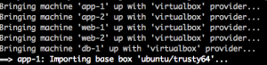
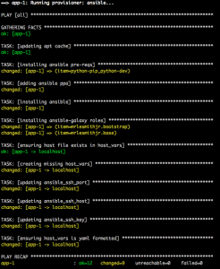
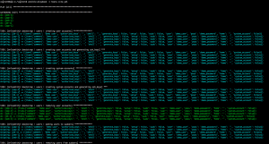

After attending Tech Field Day (#NFD10) there was a great deal of
discussion around using Vagrant and Ansible for building out
environments and provisioning for testing. After realizing that not
everyone was familiar with using either of these so I figured that I
would throw together something in hopes of helping out those who are
interested in learning about Vagrant and Ansible. My goal in this post
is to show how easy it is to spin up a few nodes and begin learning
either tool.

> NOTE: Non-Windows HostOS generally results in a better user experience IMHO...

First head over to the VirtualBox website and install
[VirtualBox](https://www.virtualbox.org/wiki/Downloads) for your HostOS
of choice.

Now head over to the Vagrant site and install
[Vagrant](https://www.vagrantup.com/downloads.html) for your HostOS of
choice.

Next you will need to install
[GIT](https://git-scm.com/book/en/v2/Getting-Started-Installing-Git) in
order to pull the packages required from GitHub.

Now with each of the above installed you are ready to pull down the
GitHub repo that I created for learning Vagrant and Ansible. This repo
will of course be updated as the need arises. And of course as others
consume this and provide feedback.

```bash
git clone https://github.com/mrlesmithjr/vagrant-ansible-template.git
cd vagrant-ansible-template.git
```

Now edit the nodes.yml file to define the nodes to spin up for testing.
The include nodes.yml is as below.

```yaml
---
- name: node-1
  box: ubuntu/trusty64
  mem: 512
  cpus: 1
  priv_ip: 192.168.250.101
- name: node-2
  box: ubuntu/trusty64
  mem: 512
  cpus: 1
  priv_ip: 192.168.250.102
```

An example of defining a much different scenario may look like below.

```yaml
---
- name: app-1
  box: ubuntu/trusty64
  mem: 512
  cpus: 1
  priv_ip: 192.168.250.101
- name: app-2
  box: ubuntu/trusty64
  mem: 512
  cpus: 1
  priv_ip: 192.168.250.102
- name: web-1
  box: ubuntu/trusty64
  mem: 512
  cpus: 1
  priv_ip: 192.168.250.103
- name: web-2
  box: ubuntu/trusty64
  mem: 512
  cpus: 1
  priv_ip: 192.168.250.104
- name: db-1
  box: ubuntu/trusty64
  mem: 1024
  cpus: 1
  priv_ip: 192.168.250.105
```

Now that you have modified and saved out your new nodes.yml file you are
ready to spin it all up.
And this whole environment is as easy as running **_ONE_** command.

```bash
vagrant up
```

Sit back and watch your nodes deploy now.





As you can see above the nodes are brought up one by one and an initial
Ansible bootstrap (bootstrap.yml) playbook is executed on each node.
This playbook is doing a few things for us.

-   Installs Ansible on each node
-   Installs a few Ansible Galaxy roles (To learn how they can be
    leveraged in learning)
-   creates our host_vars/node vars file (So that we can also run
    ansible on each of our nodes from within the Vagrant node as well)

An example of a host_vars file created will look like below.

```yaml
---
ansible_ssh_port: 22
ansible_ssh_host: 192.168.250.101
ansible_ssh_private_key_file: .vagrant/machines/app-1/virtualbox/private_key
```

To validate the status of our multi-node environment you run the
following.

```bash
vagrant status
```

And you would see something similar to below.

```bash
Current machine states:

app-1                     running (virtualbox)
app-2                     running (virtualbox)
web-1                     running (virtualbox)
web-2                     running (virtualbox)
db-1                      running (virtualbox)
```

An example site.yml playbook using Ansible Galaxy roles is included from
the GitHub Repo as well.

```yaml
---
- hosts: all
  remote_user: vagrant
  sudo: true
  vars:
  tasks:
  roles:
    - mrlesmithjr.bootstrap
    - mrlesmithjr.base
```

Now if you wanted to run the included site.yml playbook which leverages
Ansible Galaxy roles from one of our newly provisioned Vagrant nodes we
would do the following.
Connect to one of the newly provisioned nodes. (app-1 in this example)

```bash
vagrant ssh app-1
```

Now there is a synced folder between our HostOS and our Vagrant nodes
(/vagrant). This allows us to either modify or create new Ansible
roles/plays or tasks which will be synced back and forth.
So to now run our example site.yml we will do the following.

```bash
cd /vagrant
ansible-playbook -i hosts site.yml
```

And again sit back and watch these roles be applied to each node we just
spun up.



So there you have it. An easily deployed multi-node environment ready to
play in and the sky is the limit on what you can do now to begin your
journey learning both of these awesome tools.

And when you are all done you can tear down the environment without
losing all of your modifications and/or new Ansible Playbooks. This is
now a skeleton structure for you to share with others in order to do
some validation or additional tasks.

Tear it down.

```bash
vagrant destroy
```

Enjoy!

[#nfd10 Tweets](https://twitter.com/hashtag/nfd10)
