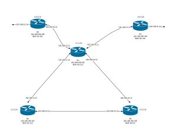

This will be the introduction to a multi-post series on some different
methodologies that you too can use everyday either to learn, test or
develop your going forward strategies on your network designs. Why is
the buzzword DevOPS relevant here? The answer is in the methodologies
and more so than anything else is the culture. Let me state that I am
not someone to jump on bandwagons nor am I much of a fanboy. But I can
completely relate with culture as being a main focus of DevOPS. I find
it rather pleasing that a culture is driving this new way of doing
things because it has been a long road of saying things such as "It is
not my job", "My environment is fine so it must be someone else's"
or just general finger pointing. I have been a huge proponent of
accountability and driving towards a solution for most of my career
(Read about it
[here](https://everythingshouldbevirtual.com/a-journey-to-modern-day-it-relevance)).
I am also notorious for accepting blame when no one else is willing to
because I know that I will push forward and get the results required to
solve an issue as well as ensure it's repeatability. I know, I know I
am pitching what everyone says as the reasoning behind DevOPS but I am
living this day in and day out. I enjoy being one to float between silos
in hopes of bridging the gaps to ensure that open communication is in
order. So enough about this thing on DevOPS and onto what this series of
posts will be about.

As stated above this will be a multi-post series on how you can leverage
a few open source projects brought together to learn networking skills,
test networking philosophies or continued development of your
current/future networking environment. The focus will be to start from
scratch and leverage technologies such as Vagrant, Ansible and Quagga to
build out this environment (You can find a primer on Vagrant and Ansible
[here](https://everythingshouldbevirtual.com/learning-vagrant-and-ansible-provisioning)).
And we will also be using GIT for our version controlling of our code. I
will be publishing each phase of this series as I finish each section so
there will be some lapse between posts, but I will make sure to tie them
all together.

Below is a drawing of the environment that we will be creating in this
series.

So sit back and enjoy!

Up next...[Prep-Work](https://everythingshouldbevirtual.com/hey-i-can-devops-my-network-too-prep-work-part-1)
