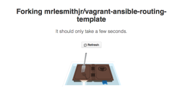
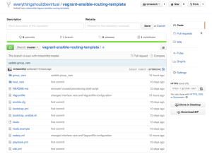
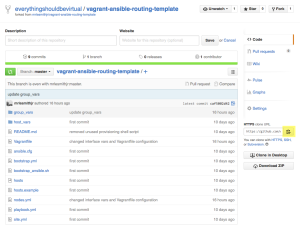
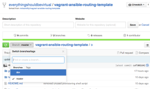

In the previous
[post](http://everythingshouldbevirtual.com/hey-i-can-devops-my-network-too-intro)
we went over the intro on what we will be setting up by going through
each of these posts. In this post we will be setting up our environment
and getting everything ready to begin our journey of network
development.

First head over to the VirtualBox website and install
[VirtualBox](https://www.virtualbox.org/wiki/Downloads) for your HostOS
of choice.

Now head over to the Vagrant site and install
[Vagrant](https://www.vagrantup.com/downloads.html) for your HostOS of
choice.

Next you will need to install
[GIT](https://git-scm.com/book/en/v2/Getting-Started-Installing-Git) in
order to pull the packages required from GitHub.

Now that we have all of the above installed we are ready to pull down
GitHub repo that we will be using in this series. And because we will be
learning how to put some version control around our code we will
actually be forking the actual repo so we can make changes to our own
repo. This also means that some of the cli commands will need to be
modified to fit your naming.

Login to [GitHub](https://github.com/) with your existing account or
create a new one. Once logged in head over to
[here](https://github.com/mrlesmithjr/vagrant-ansible-routing-template) which
is where we will fork from.


Click Fork on the top right.



And now you should have your own copy of my GitHub repo for you to
modify all that you would like to.



You are now ready to clone your copy of the repo to your laptop to begin
using and modifying to make it your very own.

Click the button highlighted below to copy the clone url.



I will be cloning into a folder that I have created called projects.

> NOTE: Remember your git clone command should point to your URL
> for your forked branch.

```bash
mkdir projects
cd projects
git clone https://github.com/everythingshouldbevirtual/vagrant-ansible-routing-template.git
cd vagrant-ansible-routing-template
```

Now to show the status of our git repository.

```bash
git status
On branch master
Your branch is up-to-date with 'origin/master'.
nothing to commit, working directory clean
```

Now as you can see above we have our Master branch. We do not want to
make changes or develop against Master but rather we will create a dev
branch in which we will be doing all of our testing and developing on.
At the very end of the complete series we will merge dev into Master
once we are all completed.

So in order to create a dev branch do the following.

```bash
git checkout -b dev
Switched to a new branch 'dev'
```

If you would like to see which branches you have available locally run
the following.

```bash
git branch
* dev
  master
```

As you can the branch name with the asterisk is the one we have
currently checked out for manipulating.

This concludes the pre-work required to get us ready to begin our next
steps into our multi-post learning. But before you end here for now
let's go ahead and commit out dev branch to GitHub so we have it ready
and saved as well.

```bash
git push origin dev
Username for 'https://github.com': everythingshouldbevirtual
Password for 'https://everythingshouldbevirtual@github.com':
Total 0 (delta 0), reused 0 (delta 0)
To https://github.com/everythingshouldbevirtual/vagrant-ansible-routing-template.git
 * [new branch]      dev -> dev
```

And now if you were to go back to your browser and look at the repo we
just forked and click on the drop-down for Branch you will see our new
dev branch.



Now one last thing in regards to forking our project. If you would like
to stay in sync with any upstream changes to the
original [repo](https://github.com/mrlesmithjr/vagrant-ansible-routing-template) we
will need to add this to our local repo. What this will do is add the
original repo to our remotes and allow us to sync changes from our
forked upstream repo all the way down to us. You may or may not want to
do this depending on your use case. But for the sake of learning here
along with that I have made some changes upstream we will do this. Read
more about syncing forks
[here](https://help.github.com/articles/syncing-a-fork/).

So if I want to view my current remote locations I would do the
following.

```bash
git remote -v
....
origin  https://github.com/everythingshouldbevirtual/vagrant-ansible-routing-template.git (fetch)
origin  https://github.com/everythingshouldbevirtual/vagrant-ansible-routing-template.git (push)
```

As you can see I only have my forked repo configured for fetch/push. Now if I
would like to add the original repo as an upstream source I would do the following.

```bash
git remote add upstream https://github.com/mrlesmithjr/vagrant-ansible-routing-template.git
```

And now if I view my remote locations again.

```bash
git remote -v
....
origin  https://github.com/everythingshouldbevirtual/vagrant-ansible-routing-template.git (fetch)
origin  https://github.com/everythingshouldbevirtual/vagrant-ansible-routing-template.git (push)
upstream    https://github.com/mrlesmithjr/vagrant-ansible-routing-template.git (fetch)
upstream    https://github.com/mrlesmithjr/vagrant-ansible-routing-template.git (push)
```

Now if I would like to check for any upstream changes I would do the
following.

```bash
git fetch upstream
....
remote: Counting objects: 7, done.
remote: Compressing objects: 100% (3/3), done.
remote: Total 7 (delta 4), reused 6 (delta 3), pack-reused 0
Unpacking objects: 100% (7/7), done.
From https://github.com/mrlesmithjr/vagrant-ansible-routing-template
 * [new branch]      master     -> upstream/master
```

As you can see I have detected upstream changes since I first forked my
repo. So let's now merge those changes to my dev branch locally.\
First ensure we have dev checked out

```bash
git checkout dev
....
Already on 'dev'
Your branch is up-to-date with 'origin/dev'.
```

Now let's merge our upstream/master with our local dev branch.

```bash
git merge upstream/master
```

Your local editor will open which will look like the following.

```bash
Merge remote-tracking branch 'upstream/master' into dev


# Please enter a commit message to explain why this merge is necessary,
# especially if it merges an updated upstream into a topic branch.
#
# Lines starting with '#' will be ignored, and an empty message aborts
# the commit.
```

Save the file and you will see the following.

```bash
Merge made by the 'recursive' strategy.
 README.md                 | 141 +++++++++++++++++++++++++++++++++++++++++++++++++++++++++++++++++++++++++++++++++++++++++++++++++++++++++++++++++++++------------------------
 group_vars/quagga-routers |   6 +++---
 2 files changed, 120 insertions(+), 27 deletions(-)
```

And to validate that our merge was successful.

```bash
git status
....
On branch dev
Your branch is ahead of 'origin/dev' by 3 commits.
  (use "git push" to publish your local commits)
nothing to commit, working directory clean
```

And as you can see, our local dev branch is ahead of our remote dev
branch so we must push those changes.

```bash
git push
....
Counting objects: 9, done.
Delta compression using up to 8 threads.
Compressing objects: 100% (8/8), done.
Writing objects: 100% (9/9), 1.62 KiB | 0 bytes/s, done.
Total 9 (delta 5), reused 0 (delta 0)
To https://github.com/everythingshouldbevirtual/vagrant-ansible-routing-template.git
   2ca4703..1f2dc96  dev -> dev
```

So there you have it. All synced up.
Up Next....[Modifying our nodes configuration file to provision our nodes with Vagrant](http://everythingshouldbevirtual.com/hey-i-can-devops-my-network-too-define-nodes-part-2).
