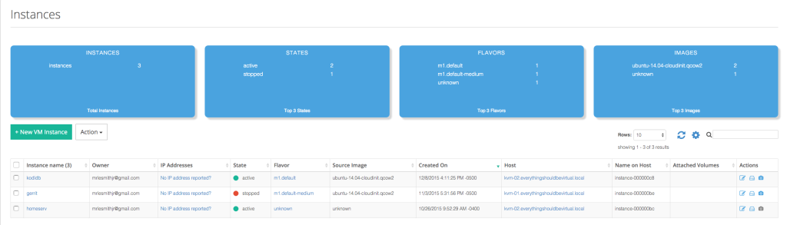
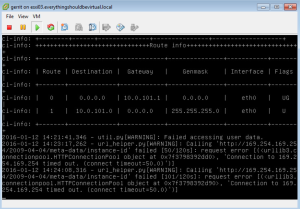

I have been doing some testing over the past few months of Platform9
running on top of KVM and I have to admit that it has been a very good
experience. However because my lab is a little resource lacking I wanted
to begin converting my KVM hosts back into ESXi hosts to begin some
additional testing coming soon. But before I could do this I wanted to
migrate some of the VMs that I have been using for a while over to ESXi.
How can I accomplish this I was thinking to myself. Luckily it is a
fairly easy process and works very well.

First thing is first. You must have an existing ESXi host. I have one
that was already running while my other two hosts were running KVM so I
am good here.

The below process will be performed on an Ubuntu 14.04 LTS VM as an
example. And I am using NFS for my datastores on ESXi and KVM as well so
we need to make sure that both ESXi and KVM are attached to the same NFS
mounts in order to do this in this example.

Log onto your KVM host and perform the following in the directory in
which your PF9 images are stored. In my case I would do the following.
Obviously we need to somehow determine which UUID is the correct one for
the VM we want to manipulate.

Within your PF9 instances view identify the VM to obtain the instance
name.



The instance name for gerrit is **instance-000000be** and make sure to
shut it down.

```bash
ssh kvm-01
sudo virsh list --all

 Id    Name                           State
----------------------------------------------------
 -     instance-000000be              shut off
```

And sure enough they match and it is shut off as we wanted.

Now we need to obtain the UUID of this instance.

```bash
remote@kvm-01:~$ sudo virsh dominfo instance-000000be
Id:             -
Name:           instance-000000be
UUID:           91ecc01f-41f8-4f1d-a5a6-e25c0e558246
OS Type:        hvm
State:          shut off
CPU(s):         1
Max memory:     1048576 KiB
Used memory:    1048576 KiB
Persistent:     yes
Autostart:      disable
Managed save:   no
Security model: none
Security DOI:   0
```

From the above we determine that the UUID is **91ecc01f-41f8-4f1d-a5a6-e25c0e558246**.

Now we need to cd into the directory where this VM resides. In my case
my PF9 data directory is **/mnt/pf9/data/instances**.

```bash
cd /mnt/pf9/data/instances/91ecc01f-41f8-4f1d-a5a6-e25c0e558246
```

And now we are ready to convert our KVM instance disk from QCOW2 to
VMDK. We are converting to a temp VMDK because we will be doing one
additional conversion after this but that will performed on our ESXi
host.

```bash
sudo qemu-img convert -f qcow2 gerrit.qcow2 -O vmdk gerrit.tmp.vmdk -o compat6
```

The -o compat6 ensures that we do not split into 2GB disk chunks.

Now we will actually import the VMDK using VMWare tools. _(You do not
have to do this but in order to convert from an IDE disk to a SCSI disk
I found this next step important.)_

So ssh to your ESXi host and change to the directory where you want to
create a new VM.

```raw
~ # cd /vmfs/volumes
/vmfs/volumes # ls
5078649c-69230922-3c11-d48564578160     ESXi03-Boot                             Tier-3 (NAS01)                          e8b09192-70615910
507864a7-76cd6a9d-db0e-d48564578160     HD-Pool (KVM)                           Veeam (NAS02)                           ff03567d-152e321f-c407-7f3bdcf49b3b
5196d286-1fb87f99                       HD-Pool (PF9)                           ab435954-c62a44e9                       vsan:52a59308860999bb-a80c6ed5bd953476
5249f964-a2e71f7f-510b-001cc447c615     ISO's (NAS01)                           ca8a927c-6c75b16e-17d4-621d9b25fc79     vsanDatastore
663e335e-dcaeabe2                       Templates (NAS01)                       e863b35d-c9134f70
99b256e8-309ffc2e                       Tier-2 (NAS01)                          e8938b46-d28efa89
/vmfs/volumes #
```

I will be using Tier-3 (NAS01) here.

```bash
cd Tier-3\ \(NAS01\)/
mkdir gerrit
cd gerrit
```

Now we are ready to import our temp VMDK.

And from the output above from our directory listing we will be
importing from our **HD-Pool (PF9) datastore**.

```bash
vmkfstools -i /vmfs/volumes/HD-Pool\ \(PF9\)/91ecc01f-41f8-4f1d-a5a6-e25c0e558246/gerrit.tmp.vmdk -d thin gerrit.vmdk
```

After performing the above step you should now have two VMDK files in
the current directory.

```bash
/vmfs/volumes/663e335e-dcaeabe2/gerrit # ls -l *.vmdk
-rw-------    1 root     root     38654705664 Jan 12 19:29 gerrit-flat.vmdk
-rw-------    1 root     root           554 Jan 12 19:27 gerrit.vmdk
/vmfs/volumes/663e335e-dcaeabe2/gerrit #
```

Now in order to change from IDE to SCSI we will do the following and
change IDE to lsilogic. Settings to change are in **bold**.

```bash
vi gerrit.vmdk
```

Original:

```bash
# Disk DescriptorFile
version=1
CID=05e9aba7
parentCID=ffffffff
isNativeSnapshot="no"
createType="vmfs"

# Extent description
RW 75497472 VMFS "gerrit-flat.vmdk"

# The Disk Data Base
#DDB

ddb.adapterType = "ide"
ddb.deletable = "true"
ddb.encoding = "UTF-8"
ddb.geometry.cylinders = "74898"
ddb.geometry.heads = "16"
ddb.geometry.sectors = "63"
ddb.longContentID = "8124c2c9cf1609f2921a6b6705e9aba7"
ddb.thinProvisioned = "1"
ddb.toolsVersion = "2147483647"
ddb.uuid = "60 00 C2 90 d1 69 8c d2-f6 65 3b 98 be 64 04 5e"
ddb.virtualHWVersion = "6"
```

Change to:

```bash
# Disk DescriptorFile
version=1
CID=05e9aba7
parentCID=ffffffff
isNativeSnapshot="no"
createType="vmfs"

# Extent description
RW 75497472 VMFS "gerrit-flat.vmdk"

# The Disk Data Base
#DDB

ddb.adapterType = "lsilogic"
ddb.deletable = "true"
ddb.encoding = "UTF-8"
ddb.geometry.cylinders = "74898"
ddb.geometry.heads = "16"
ddb.geometry.sectors = "63"
ddb.longContentID = "8124c2c9cf1609f2921a6b6705e9aba7"
ddb.thinProvisioned = "1"
ddb.toolsVersion = "2147483647"
ddb.uuid = "60 00 C2 90 d1 69 8c d2-f6 65 3b 98 be 64 04 5e"
ddb.virtualHWVersion = "6"
```

Now we are ready to use our new VMDK for a newly created ESXi VM. So
follow your normal process of creating a new VM but specify custom and
when you get to the disk selection choose use existing VMDK and browse
to the datastore where we did our final import on our ESXi host.

Once completed on creating a new VM called gerrit in this case. Boot it
up and all should be good.

When booting up the first time cloud-init will kick in like the
screenshot below.



Once the VM is completely booted up we can fix the cloud-init. And we
will do this by actually just uninstalling cloud-init as it is no longer
needed.

```bash
sudo apt-get purge cloud-init
```

Now reboot and all should be good.

And that concludes this short exercise.

Enjoy!
