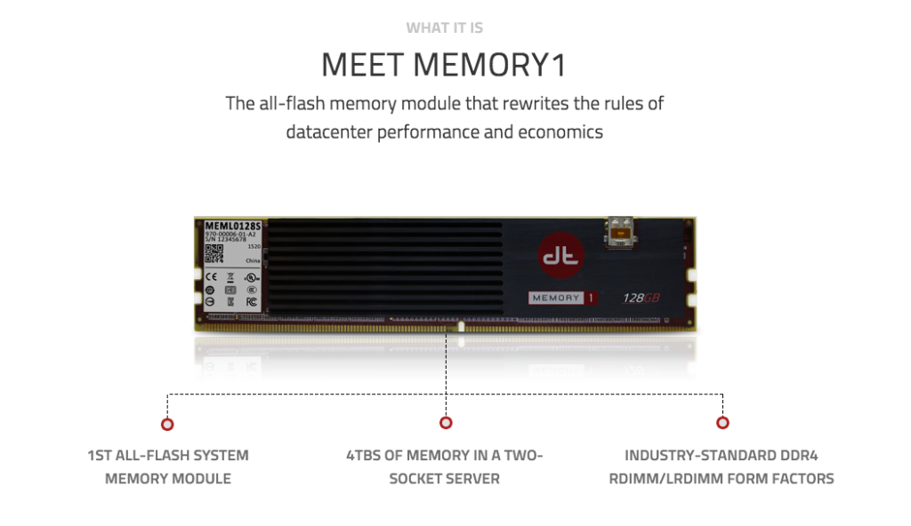

While attending Tech Field Day 10 a little over a week ago one of the
presenters was [Diablo Technologies](http://www.diablo-technologies.com/) and
they spoke about their product [Memory1](http://www.diablo-technologies.com/memory1/).
I found this product to be rather interesting and is very much a new
market being tapped into. After some great conversation (debates) and
getting a better understanding that this is [volatile memory](https://en.wikipedia.org/wiki/Volatile_memory) (DRAM) but using
flash memory and is NOT storage :). It became clear that the idea
behind this product is that you can use Memory1 in place of purchasing
actual expensive DRAM for your servers (assuming that the BIOS supports
their product). They claim that you can save anywhere between 30-40% of
the cost of DRAM. So what does this mean actually? Take for instance
large memory intensive workloads (Redis, Memcache, RabittMQ, Apache
Spark, and other no-SQL) you can leverage the reduced cost of using
Memory1 to stack these servers full of memory capacity. Or maybe you
want to load up some bare-metal servers to run Docker containers on at a
fraction of the cost it would be to purchase expensive DRAM. The options
could be very wide open however and depending on the use-case. They do
claim that the performance is not that of DRAM but is it good-enough
(their motto). With this said you could argue one way or the other on
whether the speed is fast enough for your workloads but chances are it
COULD be good-enough. I am actually very interested in seeing where this
product goes and what other vendors bring to the market based on that
this is a new un-tapped market.

Below is an image (taken from their website) which shows what Memory1
looks like.

And below are the #TFD10 presentations for your viewing.

[Diablo Technologies Introduction and Overview](https://youtu.be/8U7s3OOyO6A)

[Diablo Technologies Memory1 Performance Benchmarking](https://youtu.be/dyv9dgJc0gY)

[Diablo Technologies Memory1 Large Scale Spark Deployments](https://youtu.be/mGVkked91jA)

[Diablo Technologies Memory1 Advanced Media Management](https://youtu.be/eenkaIxjU2Y)

> Disclaimer:
> All meals, travel and entertainment was provided by Gestalt IT. However
> Gestalt IT nor the Vendor have provided any type of compensation to
> write-up any portion of this article. The information contained within
> this article are solely my views and take aways.\*
