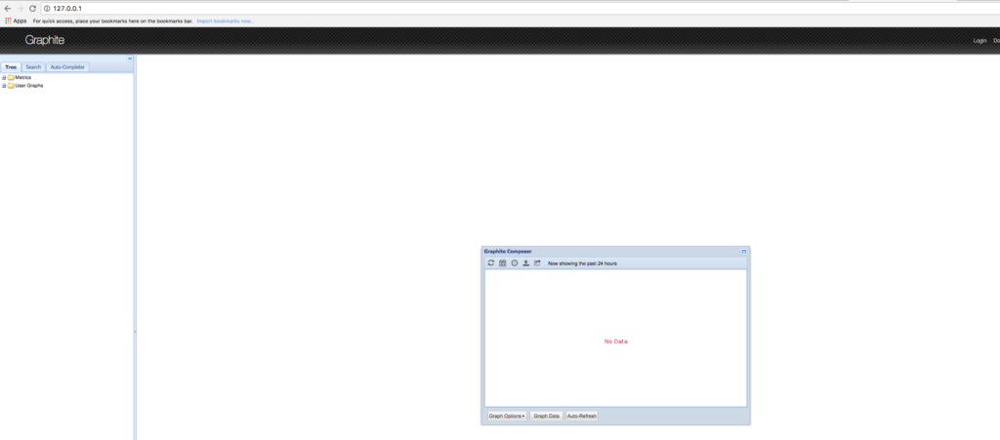
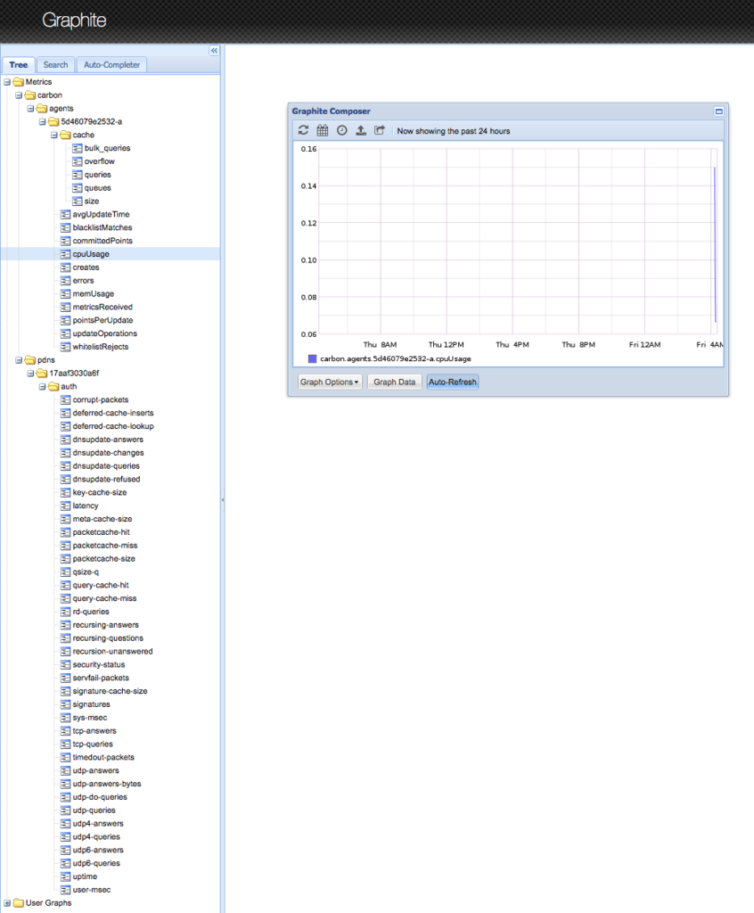

As I am working through some testing methodologies for
Infrastructure/app testing I wanted to throw together a usable Graphite image
that I could easily spin up in order to capture metrics during testing. So I am
throwing this together to show how you can also spin up a usable Graphite container.

The assumption here is that you already know how to use Graphite as well as
configure devices to send StatsD/CollectD/Graphite metrics. So with that being
said let's spin up our Graphite container:

```bash
docker run -d --name graphite -p 80:80 -p 2003:2003 -p 2003:2003/udp \
-p 2004:2004 -p 7002:7002 mrlesmithjr/graphite
```

And once that spins up let's make sure that our container is running:

```bash
docker ps
CONTAINER ID        IMAGE                  COMMAND                  CREATED             STATUS              PORTS                                                                                                           NAMES
4a27f74fbd19        mrlesmithjr/graphite   "/docker-entrypoint.s"   4 seconds ago       Up 2 seconds        0.0.0.0:80->80/tcp, 0.0.0.0:2003-2004->2003-2004/tcp, 0.0.0.0:7002->7002/tcp, 443/tcp, 0.0.0.0:2003->2003/udp   graphite
```

As you can see we have our usable Graphite container running. And we can
now connect to the [WebUI](http://IPorHostName).



If we spun up our container as above once we destroy that container the Graphite
data will be gone as well. So let's spin up our container with persistent storage
in order to retain our metrics data. But first we need to stop our existing
container:

```bash
docker stop graphite

mkdir ~/docker-containers/graphite
cd ~/docker-containers/graphite
docker rm graphite
docker run -d --name graphite -p 80:80 -p 2003:2003 -p 2003:2003/udp \
-p 2004:2004 -p 7002:7002 -v $PWD/.data:/var/lib/graphite/whisper \
mrlesmithjr/graphite
```

And to validate that our persistent volume exists we can do the
following:

```bash
ls -la
total 0
drwxr-xr-x   3 larrysmithjr  staff  102 Sep 23 00:10 .
drwxr-xr-x  18 larrysmithjr  staff  612 Sep 22 23:59 ..
drwxr-xr-x   3 larrysmithjr  staff  102 Sep 23 00:11 .data
```

As you can see our .data folder exists which is mounted inside our container at
`/var/lib/graphite/whisper` and if we had data already coming into our Graphite
container we would see that by:

```bash
ls -la .data
total 0
drwxr-xr-x  4 larrysmithjr  staff  136 Sep 23 00:11 .
drwxr-xr-x  3 larrysmithjr  staff  102 Sep 23 00:10 ..
drwxr-xr-x  3 larrysmithjr  staff  102 Sep 23 00:11 carbon
drwxr-xr-x  3 larrysmithjr  staff  102 Sep 23 00:11 pdns
```

And if you pulled up the webUI again you should see data flowing in...



So there you have it. You know have a usable Graphite Docker container ready for
receiving metrics from devices that you have configured.

Enjoy!

Looking for the code to these tools?

-   [ansible-collectd](https://github.com/mrlesmithjr/ansible-collectd)
-   [docker-ansible-graphite](https://github.com/mrlesmithjr/docker-ansible-graphite)
