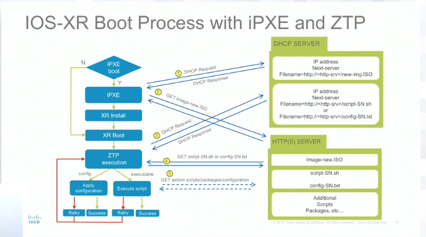
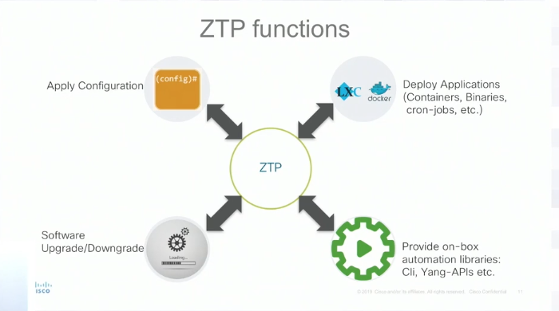



Recently, I attended the [NFD Exlusive with Cisco Service Provider](https://techfieldday.com/event/nfdxcsp1/)
in Silicon Valley, as part of Tech Field Day. One of the segments which was
discussed was around Cisco IOS XR, which I wrote about last year
[Bringing DevOps to Routing -- Cisco XR](https://everythingshouldbevirtual.com/bringing-devops-to-routing-cisco-xr/).
And as I was last year, I am still very interested in this platform. There are
so many possibilities. This article highlights some ZTP functionality
discussed. And hands down, [Akshat Sharma](https://twitter.com/irakshat) did an
outstanding job presenting.

## ZTP

This time around it seemed like the focus was around ZTP (Zero Touch Provisioning),
which they also discussed last year. As we all know, ZTP is not anything new. One
thing that is new, is that ZTP is supported over the management, data, and
production ports. This allows ZTP to function without an out of band network if
needed. They are definitely adding a lot more functionality in this area for sure.

The diagram below outlines the IOS-XR Boot Process with iPXE and ZTP:

The diagram below outlines the available ZTP functions:

### GISO

Golden ISO (GISO) workflows.

With GISO you are able to create custom built ISO's which can include base
configurations and packages to be installed. Third party applications are also
supported. This functionality allows the similar ZTP workflows to be accomplished
by using the ISO to boot the device from. One thing that was not discussed or
asked was whether the boxes can boot remotely from an ISO to make this process
not such a manual one. I need to dig into this a bit more to understand the
possibilities here.

The GISO tool can be found [here](https://github.com/ios-xr/gisobuild)

### Model-Driven ZTP Automation

#### Yang API hooks

In the upcoming release of 7.0.1, Yang-APIs using netconf client local to the box.
No port is required to be opened up on the box because everything is done from
localhost. Typically when you configure switches using NetConf, ports are required
to be opened when starting up the NetConf agent. Cisco is calling this "transport
free" due to the fact that no ports are needed to be opened up. I have to be
honest, I am still not clear on the benefit of this from an automation
perspective. I need to dig into this a bit more as well. I assume, that you
can SSH to the box and leverage the NetConf client locally, but...

#### gNMI/gRPC

gNMI is coming soon in which you will be able to use gNMI clients local to the
box to perform configurations.

### Access Deployments

Access deployment security considerations were covered in fairly good detail.
Due to the nature of the deployments being performed over unsecure networks for
the most part, validations of the ZTP workflows are absolutely crucial. The
last thing one would want, is your fleet of IOS-XR devides to get owned. So,
ensure to implement as many validations that you possibly can to ensure that
an image you are pulling down via ZTP, is 100% valid.

## Conclusion

Overall, this session was great, as this is the most exciting networking
platform for me from Cisco. There are just so many possibilities that this
platform provides.

> DISCLAIMER: I have been invited to Network Field Day Exclusive with Cisco
> Service Provider by Gestalt IT who paid for travel, hotel, meals and
> transportation. I did not receive any compensation to attend NFD and I am
> under no obligation whatsover to write any content related to NFD. The
> contents of these blog posts represent my personal opinions about the
> products and solutions presented during NFD.
