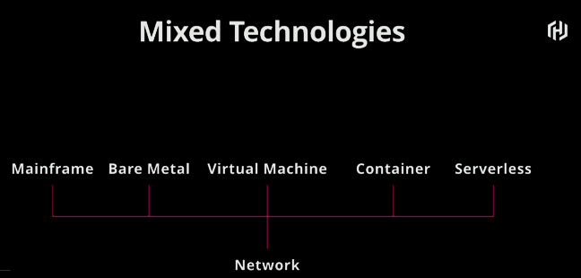
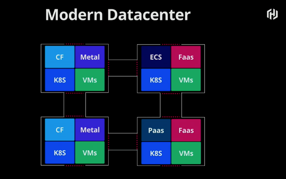
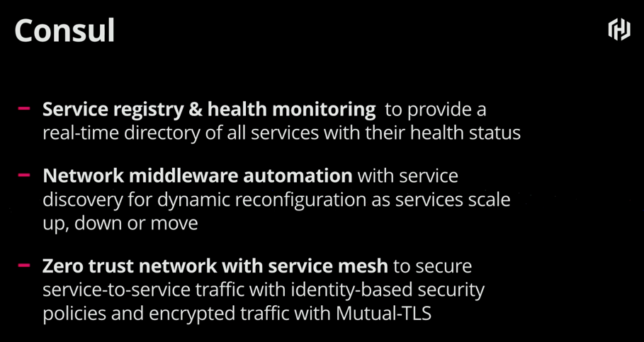
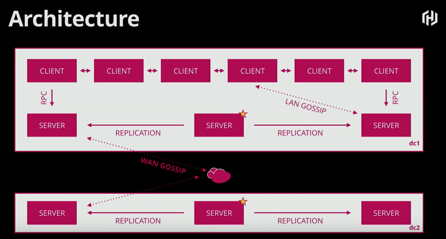
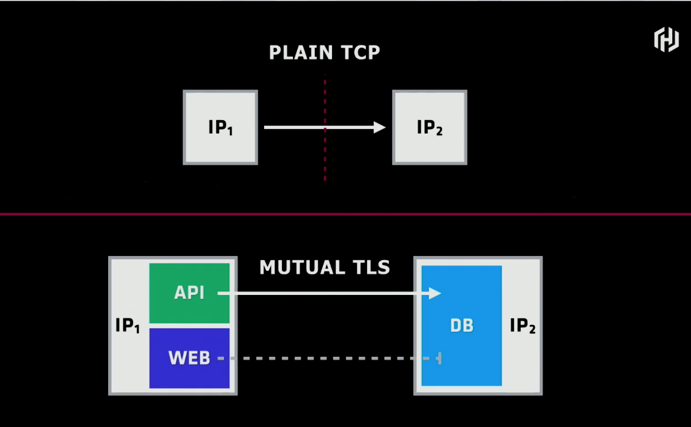
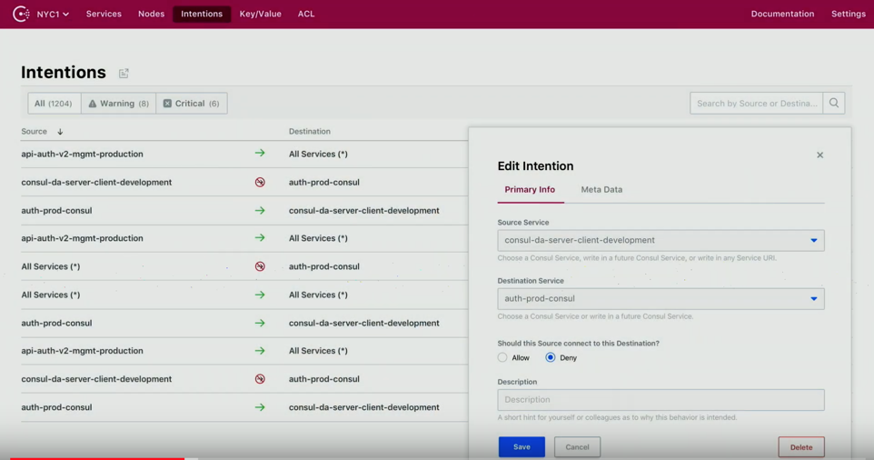
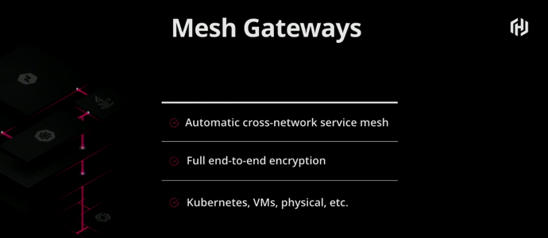

Recently while attending Cloud Field Day 6, one of the companies presenting just so happened to be Hashicorp. Now Hashicorp is one of my
personal favorite companies in the open-source world. So, to say that I
was extremely excited to hear them would be an understatement. Luckily
for us, Mitchell Hashimoto was the one who presented to all of us delegates as
I am sure everyone was excited about this.

Hashicorp spent a bit of time highlighting some of their products but their main focus for the presentation was around Consul. Why Consul? Because as Mitchell mentioned, networking has a huge bullseye on it's back and cloud is coming for
you! :) Which is where Consul comes into play.



## Consul For Service Networking



### Multi-Cloud (Multiple Technologies) - Call Me When You Have a Good Idea

In the beginning of this segment Mitchell talks about a multi-cloud conversation
he had with an analyst a few years ago and they said for him to call them back
when he had a good idea. Ummmm...Someone **SHOULD** have listened to him!

As Mitchell explains in regards to the diagram below, the technologies defined
are reality and with TCP, they can all co-exist. Makes sense obviously.

And through organic growth in a datacenter, things begin to get complex as seen
in the diagram below.

### What Is Consul

Hashicorp follows the crawl, walk, run strategy with Consul as with all of their
other products. For example, a service mesh seems like a big bang effort but
not needed initially. Service mesh functionality in Consul was added last year whereas the top two bullets have been in place four to five years. I have
leveraged Consul for the top two bullets across large-scale data centers. From an architecture perspective, the diagram below outlines a multi-data center Consul architecture. The open-source version requires full network connectivity
between data centers, whereas, the paid for version can function in
hub-spoke model.

Consul does require an agent on hosts to handle membership, etc. But in instances where the agent may not be an option, services for hosts can be registered via
the Consul API as an external resource. When running in a container platform (Kubernetes, Docker Swarm, etc.) the agent runs on the container host not
within the container images. The real benefit for service resiliency does require
an agent to ensure the health of all nodes and services. The agent is very light
weight and is a single binary written in Go. This binary is the same for Consul
servers and Consul clients, however the argument passed determines the mode in
which the agent executes. You can find more on the Consul agent [here](https://www.consul.io/docs/agent/basics.html).

## Consul Connect



Now what they really wanted to cover around Consul was what they are now calling
Consul connect. Consul connect provides secure communications between services
with TLS encryption and identity-based authorization that works anywhere (VMs,
containers, edge switches, etc.).

### Consul Connect - Instead of Traditional Firewall Access Methods

One concept that Consul connect addresses is how traditional firewalls work
based on a static IP address being the identity in which access is allowed. With
Consul Connect, you can use a service identity within Consul to control access
to services.

### Consul Connect - Service Access Graph

Because all services are known within Consul, service access graphs can be
created to allow service level access to services rather than IP based access.
Service access graphs can be created in advance prior to any services being
deployed which makes the approval process much simpler and can be in place by
the time services are deployed.

Mitchell also mentioned that Hashicorp made an announcement around [VMware NSX Service Mesh Federation](https://www.hashicorp.com/blog/hashicorp-consul-enterprise-supports-vmware-nsx-service-mesh-federation). I'd
definitely recommend reading about this functionality.

### Consul Connect - Certificate Authority

Consul connect implements it's own certificate authority which leverages Hashicorp
Vault. As Mitchell explains, this makes it easy to get going but realistically
no one will use this. Most will leverage an external CA for certs. This means
that the CA system within Consul connect is pluggable.

### Consul Connect - Pluggable Data Plane

Consul connect is a control plane solution (pluggable API) that integrates with
[Envoy](https://www.envoyproxy.io/) and [HAProxy](https://www.haproxy.com/products/haproxy-kubernetes-ingress-controller/) currently. More vendor support is underway.

### Consul Connect - Mesh Gateways

Based on a question from the group in regard to controlling access to services
from cloud to on-prem. Mitchell discussed Consul connect mesh gateways. This
was definitely one topic that I didn't grasp immediately and I will definitely
need to do some deeper review of. However, if you are interested, check
out more about this [here](https://www.consul.io/docs/connect/mesh_gateway.html).

## Conclusion

As I mentioned earlier, I worked on a large project across data centers
a few years ago in which we used Consul in each data center which also included
WAN replication. We had a tremendous amount of success with Consul. However, I
would say that with the recent amount of new functionality, there is so much
that you can do and the features seem to shine massively.

With this all being said, I guess it is time for me to freshen up [this](https://github.com/mrlesmithjr/vagrant-vault-consul-docker-monitoring) project I was
working on quite some time ago!

As always, enjoy!

> DISCLAIMER: I have been invited to Cloud Field Day Exclusive by Gestalt IT who paid for travel, hotel, meals and transportation. I did not receive any compensation to attend CFD and I am under no obligation whatsoever to write any content related to CFD. The contents of these blog posts represent my personal opinions about the products and solutions presented during CFD.
