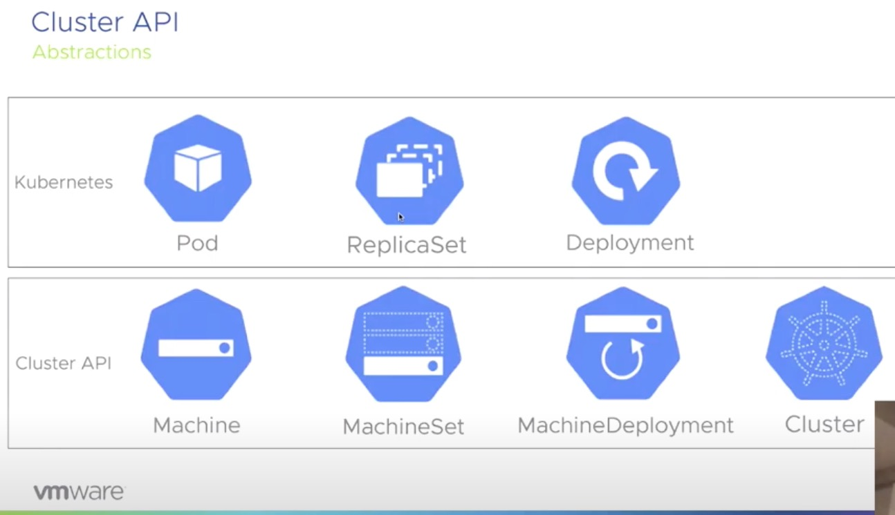
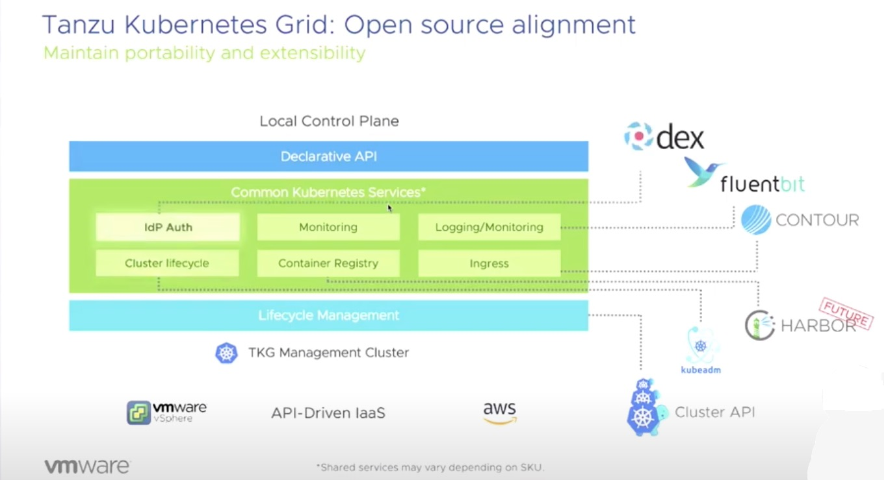
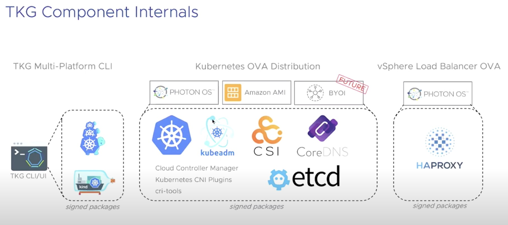
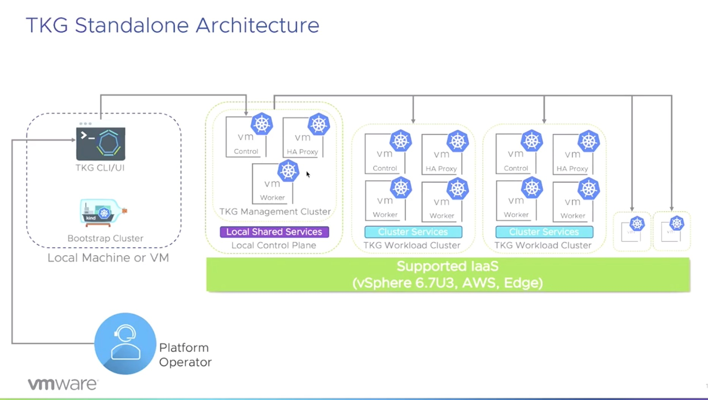
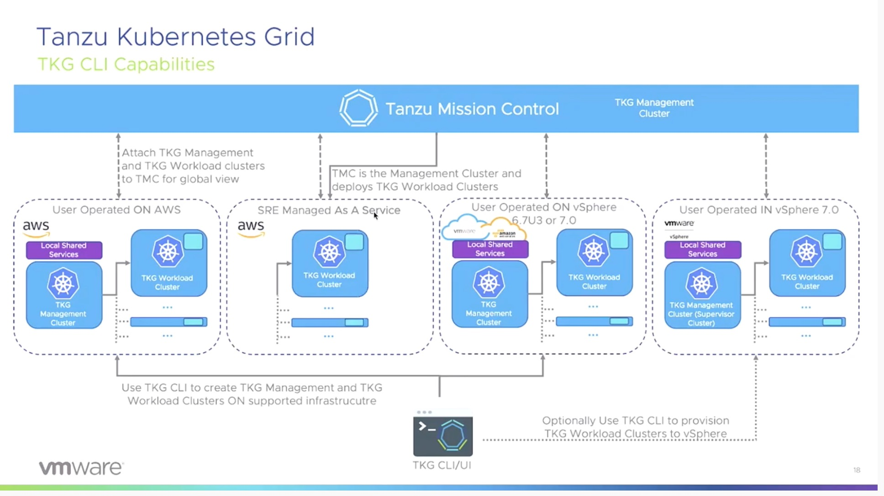

Recently I had the pleasure to attend [#CFD7](https://techfieldday.com/event/cfd7/)
in which VMware presented [VMware Tanzu Kubernetes Grid](https://tanzu.vmware.com/kubernetes-grid). Our friend, [Kendrick Coleman](https://twitter.com/kendrickcoleman) did a great job presenting TKG to us. Even squashed a few
questions/concerns along the way. Of course, not all of them were squashed but..

> NOTE: Current version of Kubernetes supported as of #CFD7 - 1.17.3

## What Is TKG

Directly from the VMware TKG docs, TKG can be summed up as:

`VMware Tanzu™ Kubernetes Grid™ provides organizations with a consistent, upstream-compatible, regional Kubernetes substrate across software-defined datacenters (SDDC) and public cloud environments, that is ready for end-user workloads and ecosystem integrations. Tanzu Kubernetes Grid builds on trusted upstream and community projects and delivers a Kubernetes platform that is engineered and supported by VMware, so that you do not have to build your Kubernetes environment by yourself.`

TKG is the core component of Kubernetes deployments. This component applies to
all implementations. TKG uses Kubernetes to deploy Kubernetes. Ummm What? Yep,
you heard that! WOW! I can hear the comments of how complex this sounds. However,
it does sound like it. But it actually makes sense to ensure a consistent deployment
across all implementations. But, it is very complex and not for the faint at
heart. The reality is, if they never showed TKG CLI and the underlying constructs,
no one would likely question the complexity. But here we are!

TKG extends core Kubernetes by using a Custom Resource Definition(CRD). This CRD defines specific resources that native Kubernetes does not know about by using [Cluster API](https://github.com/kubernetes-sigs/cluster-api).

`The Cluster API is a Kubernetes project to bring declarative, Kubernetes-style APIs to cluster creation, configuration, and management. It provides optional, additive functionality on top of core Kubernetes.`



## Architecture

When it comes to the architecture of TKG, we can see that there is a lot of
bingo going on here. But hey, it takes a lot to make this work!



Core Components:

- idP Auth - [dex](https://github.com/dexidp/dex)
- Monitoring
- Logging/Monitoring - [Fluentbit](https://fluentbit.io/)
- Cluster Lifecycle - [kubeadm](https://kubernetes.io/docs/reference/setup-tools/kubeadm/kubeadm/)
- Container Registry - [Harbor](https://goharbor.io/)
- Ingress - [Contour](https://projectcontour.io/)
- Lifecycle Management - [Cluster API](https://github.com/kubernetes-sigs/cluster-api)

Additional Components:

- Runtime - [Containerd](https://containerd.io/)
- Networking CNI - [Calico](https://docs.projectcalico.org/getting-started/kubernetes/)
- Crash Diagnostics
- Provided OVA and AMI Images



## Implementations

VMware TKG comes in three different flavors (personas):

- [Standalone Tanzu Kubernetes Grid](https://docs.vmware.com/en/VMware-Tanzu-Kubernetes-Grid/1.0/vmware-tanzu-kubernetes-grid-10/GUID-index.html)
- [VMware Tanzu™ Kubernetes Grid™ service for vSphere](https://docs.vmware.com/en/VMware-vSphere/7.0/vmware-vsphere-with-kubernetes/GUID-7E00E7C2-D1A1-4F7D-9110-620F30C02547.html)
- [VMware Tanzu™ Mission Control™](https://docs.vmware.com/en/VMware-Tanzu-Mission-Control/index.html)

## Standalone Tanzu Kubernetes Grid

At the core of TKG, we get TKG CLI.

> NOTE: You can download TKG CLI from [here](https://www.vmware.com/go/get-tkg).

Creating new TKG clusters is as simple (Not tested) as executing:

```bash
tkg create cluster [name] --plan=production
```



The following platforms are supported to deploy to:

- vSphere 6.7u3
- vSphere 7.0 (see below)
- Amazon EC2

### vSphere 7.0

With vSphere 7.0, you do not need to deploy TKG management clusters if you
enabled the vSphere with Kubernetes feature. This is because you can use the TKG
CLI to connect directly to the Supervisor Cluster available when this feature
is enabled.

However, if the Kubernetes feature is not enabled. You can use TKG CLI to deploy
a management cluster, but it is not supported. The process to do so will be
identical to vSphere 6.7u3.

## VMware Tanzu™ Kubernetes Grid™ service for vSphere

TKG for vSphere was originally called Project Pacific when announced at VMworld 2019. A Tanzu Kubernetes Grid cluster, runs as virtual machines at the Supervisor
layer of vSphere. This service is enabled as a feature on vSphere 7.0 (see above).

TKG for vSphere makes a lot of sense for the standard vSphere admin. As it brings
the Kubernetes constructs into vCenter in traditional-ish ways. I personally
feel this will likely be where we see a lot of deployments occuring. But, we
shall see over time of course.

## VMware Tanzu™ Mission Control™

What is Tanzu Mission Control? Well the following pretty much sums that up:

`Tanzu Mission Control helps organizations to overcome the challenge of managing a fleet of Kubernetes clusters on-premises, in the cloud and from multiple vendors.`



Tanzu Mission Control was under development by Heptio prior to their aquisition
by VMware.

## Conclusion

So, in conclusion here. I wanted to just quickly note some of the elements that
were touched on during the short 30 minute session we had. I'll likely very soon
be exploring more in depth, the various TKG concepts. But until then, I'll continue
to handle my own automated Kubernetes deployments as I've done for a few years now.

## Follow UP

One question I asked during the session was, how does TKG CLI function in a
CI/CD pipeline. After watching back the session, I don't think where I was
going was very clear. So, I'll attempt to add a bit more context here.

My question came from the perspective of understanding that TKG CLI can perform
a one time provisioning of a management cluster with no issues. However, if
I am managing my complete infrastructure as code. And leveraging pipelines that
continously run. I need to ensure that when a management cluster is required. I
do not attempt this on each iteration of pipeline executions. My question was
asked from an idempotent context, which made absolutely no sense :( Because after
listening back and digging into TKG more, the process follows the declarative
manner of Kubernetes already.

So, if I were to answer my question on where I was headed. I'd answer with,
You need to first check whether the management cluster is already available and
functional. If it is not, then provision. However, if it is already available,
skip. I know this sounds ridiculous, but for whatever reason when I listen to
things like this. I automatically jump to, how does this look from a holistic
view when doing full datacenter automation.

## Additional CFD7 Resources

- [https://www.eigenmagic.com/2020/05/11/vmware-makes-kubernetes-even-more-so-with-tanzu/](https://www.eigenmagic.com/2020/05/11/vmware-makes-kubernetes-even-more-so-with-tanzu/)

> DISCLAIMER: I have been invited to Cloud Field Day Exclusive by Gestalt IT who
> paid for travel, hotel, meals and transportation. I did not receive any
> compensation to attend CFD and I am under no obligation whatsoever to write any
> content related to CFD. The contents of these blog posts represent my personal
> opinions about the products and solutions presented during CFD.
